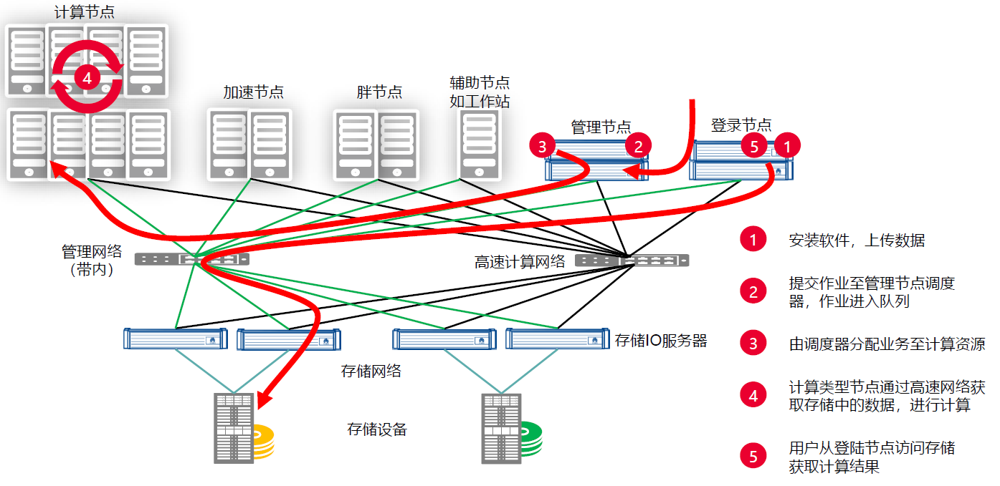

# HPC

[TOC]

## 概述

HPC（High Performance Computing）高性能计算机群。

高性能计算中最为重要的核心技术就是并行计算（Parallel Computing）。

开展并行计算的基本条件：

1. 具备并行计算机。
2. 应用问题具有并行度。
3. 并行编程。

## 概念

1. FLOPS

   浮点运算次数/秒，例如1GFLOPS即10亿次浮点运算，1E=1000P，1P=1000T，1T=1000G。

2. 理论浮点峰值

   计算机理论上能达到的每秒钟能完成的浮点计算最大次数，主要由CPU的主频、数量和类型决定。

3. 实测浮点峰值

   计算机实际测试中达到的每秒钟能完成的浮点计算最大次数。

4. 集群效率
   $$
   集群效率= \frac{实测浮点峰值}{理论浮点峰值}\times 100 \%
   $$

5. Linpack

   国际上最流行的用于测试高性能计算机系统浮点性能的benchmark（基准测试程序）指标，通过对高性能计算机采用高斯消元法求解一元N次稠密线性代数方程组的测试。

6. HPCG（高性能共轭梯度）

   HPCG所使用的计算模式与HPL相比，更符合当前实际应用业务的特点，给出的测试结论对于HPC的发展更有参考价值。

##  组成

| 组成 | 说明 |
|----|----|
| 应用 | CAE/CAD,CFD,生命科学,气象,动漫，图像跟踪 |
| 存储系统 | XFS,Lustre,StorNext,Panasas,DDN |
| 集群管理系统 | Platform,Rocks,Chess,COMS |
| 操作系统 | Windows,Linux,ScaleMP |
| 网络 | 计算网络，数据网络，管理网络 |
| 节点 | 计算节点，管理节点，GPU节点，登录节点，存储节点 |

## 业务流程

## 应用领域

1. 科学计算
2. 能源领域
3. 气象领域
4. 工程仿真
5. 基因测序研究
6. 证券指数计算
7. 动漫渲染
8. 互联网与深度学习

## 异构计算（Heterogeneous Computing）

主要是指使用不同类型指令集和体系架构的计算单元组成系统的计算方式。常见的计算单元类别包括CPU、GPU等协处理器、DSP、ASIC、FPGA等。

### 计算单元

CPU

GPU

NPU

DSP

NP

FPGA

ASIC

### 主流技术路线

| 技术路线   | CPU+FPGA               | CPU+GPU     | CPU+ASIC                                |
| ---------- | ---------------------- | ----------- | --------------------------------------- |
| 灵活适用性 | ***                    | **          | *                                       |
| 性能       | *                      | **          | ***                                     |
| 性能/功耗  | **                     | *           | ***                                     |
| 性能/成本  | **                     | *           | ***                                     |
| 应用生态   | **                     | ***         | *                                       |
| 典型厂商   | Xilinx，Intel / Altera | Nvidia、AMD | Intel / Nervana  Google  TUP  Graphcore |

