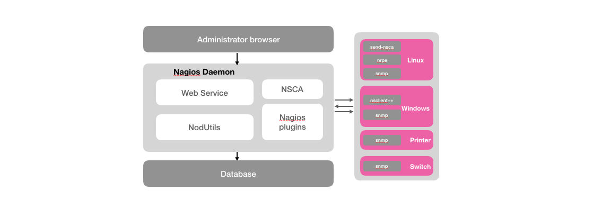

# Nagios Core

一个自由开源的网络和警报引擎，用于监控各种设备，例如网络设备和网络中的服务器。



### 安装 LAMP

```bash
dnf install httpd mariadb-server php-mysqlnd php-fpm
```

启用并启动 Apache 服务器：

```bash
systemctl start httpd
systemctl enable httpd
```

启用并启动 MariaDB 服务器：

```bash
systemctl start mariadb
systemctl enable mariadb
```

保护服务器，请运行以下命令：

```bash
mysql_secure_installation
```

### 安装必需的软件包：

```bash
dnf install gcc glibc glibc-common wget gd gd-devel perl postfix
```

### 创建 Nagios 用户帐户

为 Nagios 创建一个用户帐户。

```bash
adduser nagios
passwd nagios
```

为 Nagios 创建一个组，并将 Nagios 用户添加到该组中。

```bash
groupadd nagios
```

现在添加 Nagios 用户到组中：

```bash
usermod -aG nagios nagios
```

将 Apache 用户添加到 Nagios 组：

```bash
usermod -aG nagios apache
```

### 下载并安装 Nagios Core

下载 tarball 文件：

```bash
wget https://assets.nagios.com/downloads/nagioscore/releases/nagios-4.4.5.tar.gz
```

解压缩：

```bash
tar -xvf nagios-4.4.5.tar.gz
```

接下来，进入文件夹：

```bash
cd nagios-4.4.5
```

运行以下命令：

```bash
./configure --with-command-group=nagcmd
make all
make install
make install-init
make install-daemoninit
make install-config
make install-commandmode
make install-exfoliation
```

要配置 Apache，运行以下命令：

```bash
make install-webconf
```

### 配置 Apache Web 服务器身份验证

为用户 `nagiosadmin` 设置身份验证。

要设置身份验证，请运行以下命令：

```bash
htpasswd -c /usr/local/nagios/etc/htpasswd.users nagiosadmin
```

重新启动 Web 服务器：

```bash
systemctl restart httpd
```

### 下载并安装 Nagios 插件

要下载插件的 tarball 文件，请运行以下命令：

```bash
wget https://nagios-plugins.org/download/nagios-plugins-2.2.1.tar.gz
```

解压 tarball 文件并进入到未压缩的插件文件夹：

```bash
tar -xvf nagios-plugins-2.2.1.tar.gz
cd nagios-plugins-2.2.1
```

要安装插件，请编译源代码，如下所示：

```bash
./configure --with-nagios-user=nagios
--with-nagios-group=nagios
make
make install
```

### 验证和启动 Nagios

成功安装 Nagios 插件后，验证 Nagios 配置以确保一切良好，并且配置中没有错误：

```bash
/usr/local/nagios/bin/nagios -v /usr/local/nagios/etc/nagios.cfg
```

启动 Nagios 并验证其状态：

```bash
systemctl start nagios
systemctl status nagios
```

如果系统中有防火墙，那么使用以下命令允许 ”80“ 端口：

```bash
firewall-cmd --permanent --add-port=80/tcp
firewall-cmd --reload
```

### 通过 Web 浏览器访问 Nagios 面板

要访问 Nagios，请打开服务器的 IP 地址，如下所示：http://server-ip/nagios 。