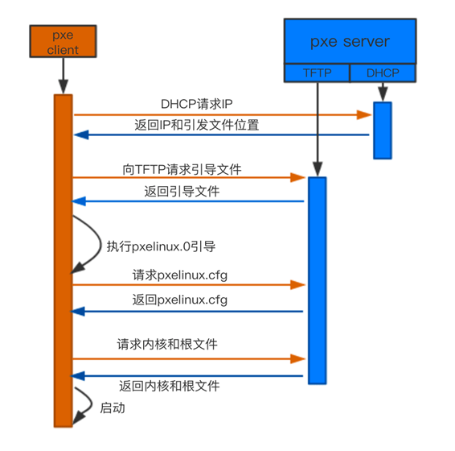

# PXE

[TOC]

## 概述

PXE（Preboot eXecute  Environment，预启动执行环境）是由 Intel 公司开发的技术，工作于 Client / Server 的网络模式，能够让计算机通过网络来从远端服务器下载映像，并由此支持通过网络启动操作系统（必要前提是计算机上安装的网卡支持 PXE 技术，即网卡 ROM 中必须要有 PXE Client），主要用于在无人值守安装系统中引导客户端主机安装Linux操作系统。

严格来说，PXE 并不是一种安装方式，而是一种引导方式。运行 PXE 协议需要设置 DHCP 服务器和 TFTP 服务器。DHCP 服务器会给 PXE Client（将要安装系统的主机）分配一个 IP 地址，由于是给 PXE Client 分配 IP 地址，所以在配置 DHCP 服务器时需要增加相应的 PXE 设置。此外，在 PXE Client 的 ROM 中，已经存在了 TFTP Client，可以通过 TFTP 协议到 TFTP Server 上下载所需的文件。

## 工作过程

1. 当计算机引导时，BIOS 把 PXE Client 调入内存中执行。
2. Client 向 PXE Server 上的 DHCP 发送 IP 地址请求消息，DHCP 检测 Client 是否合法（主要是检测 Client 的网卡 MAC 地址），如果合法则返回 Client 的 IP 地址，同时将启动文件 pxelinux.0 的位置信息一并传送给 Client 。
3. Client 向 PXE  Server 上的 TFTP 发送获取 pxelinux.0 请求消息，TFTP 接收到消息之后再向 Client 发送pxelinux.0 大小信息，试探 Client 是否满意，当 TFTP 收到 Client 发回的同意大小信息之后，正式向 Client 发送 pxelinux.0 。
4. Client 执行接收到的 pxelinux.0 文件。
5. Client 向 TFTP  Server 发送针对本机的配置信息文件（在 TFTP 服务的 pxelinux.cfg 目录下，这是系统菜单文件，格式和 isolinux.cfg 格式一样，功能也是类似），TFTP 将配置文件发回 Client ，继而 Client 根据配置文件执行后续操作。
6. Client 向 TFTP 发送 Linux 内核（vmlinuz）请求信息，TFTP 接收到消息之后将内核文件发送给 Client 。
7. Client 向 TFTP 发送根文件（initramfs）请求信息，TFTP 接收到消息之后返回 Linux 根文件系统。
8. Client 启动 Linux 内核。
9. Client 下载安装源文件，读取自动化安装脚本。

 

## 实现

* iPXE
* gPXE
