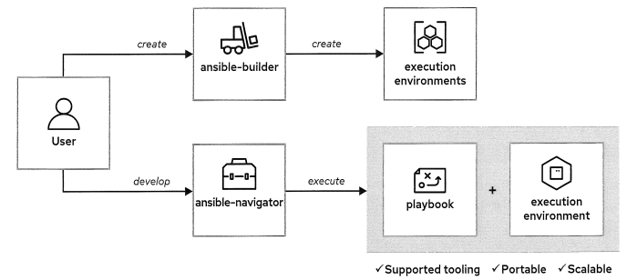

# 红帽 Ansible 自动化平台

[TOC]

## 概述
红帽 Ansible 自动化平台 2 包含多个不同的组件，共同提供了一整套集成的自动化工具和资源。

* Ansible Core

  Ansible Core 提供用于运行 Ansible Playbook 的基本功能。它定义了用于在 YAML 文本文件中编写 Ansible Playbook 的自动化语言。它提供了自动化代码所需的关键功能，如循环、条件和其他 Ansible 命令。还提供了驱动自动化所需的框架和基本命令行工具。

  红帽 Ansible 自动化平台 2.2 在 ansible-core RPM 软件包中及其 ee-minimal-rhel8 和 ee-supported-rhel8 自动化执行环境中提供 Ansible Core 2.13 。

* Ansible 内容集合

  在过去，Ansible 提供了大量模块作为核心软件包的一部分；这种方法在 Ansible 社区中被称为“自带电池”。不过，随着 Ansible 取得成功并快速发展，Ansible 中包含的模块数量呈指数级增长。这导致了支持方面的一些挑战，特别是因为用户有时希望使用比 Ansible 特定版本中附带模块版本更早或更高的模块。

  上游开发人员决定将大多数模块重新整理为单独的 Ansible 内容集合，这些资源集合相关的模块角色和插件构成，由同一组开发人员提供支持。Ansible Core本身仅限于由 ansible.builtin Ansible 内容集合提供的一小组模块，该集合始终是 Ansible Core 的一部分。

  订阅红帽 Ansible 自动化平台 2 后，可获得红帽提供的 120 多个认证内容集合的访问权限。另外还可通过 Ansible Galaxy 获得很多受社区支持的集合。

* 自动化内容导航器

  红帽 Ansible 自动化平台 2 还可提供新的顶级工具(即自动化内容导航 (ansible-navigator) )来开发和测试 Ansible Plavbook 。该工具可取代并扩展多个命令行实用程序的功能，包括 ansible-playbook、ansible-inventory、ansible-config 等。

  此外，它通过在容器中运行您的 playbook ，将运行 Ansible 的控制节点与运行它的自动化执行环境分隔开来。这样一来，您可以更轻松地为自动化代码提供完整的工作环境，以部署到生产环境中。

* 自动化执行环境

  自动化执行环境是一种容器镜像，其包含 AnsibleCore、Ansible 内容集合，以及运行 playbook 所需的任何 Python 库、可执行文件或其他依赖项。使用 ansible-navigator 运行 playbook 时，可以选择用于运行该 playbook 的自动化执行环境。当代码运行时，可以向自动化控制器提供 playbook 和自动化执行环境，并且也知道其具有正确运行 playbook 所需的一切。

* 自动化控制器

  自动化控制器以前称为红帽 Ansible Tower ，是红帽 Ansible 自动化平台的一个组件，提供中央控制点来运行企业自动化代码。此外还提供 WebUI 和 RESTAPI 用于配置、运行和评估自动化作业。

* 自动化中心

  可通过 console.redhat.com 上的公共服务访问红帽 Ansible 认证内容集合，可以将这些内容集合下载下来与 ansible-galaxy (适用于 ansible-navigator )和自动化控制器结合使用。

 

## 安装

要运行 Ansible Playbook，需在控制节点安装自动化内容导航器(ansible-navigator)，然后下载执行环境。由 Ansible 托管的主机无需安装 ansible-navigator ；该工具只需安装在运行 Ansible Playbook 的控制节点上。

安装 ansible-core 软件包前，先要在控制节点上安装 Python 3.8 或更高版本。

需要有效的红帽 Ansible 自动化平台订阅，才能在控制节点上安装自动化内容导航器。如果已在红帽客户门户中为您的组织激活了简单内容访问，则您无需再将订阅连接到您的系统。

在控制节点上安装自动化内容导航器。

```bash
dnf install ansible-navigator
```

验证系统上是否已安装自动化内容导航器。

```bash
ansible-navigator --version
ansible-navigator 2.1.0
```

登录容器镜像仓库。

```bash
podman login registry.redhat.io
Username:your-registry-username
Password:your-registry-password
Login Succeeded!
```

下载您准备与自动化内容导航器搭配使用的执行环境的容器镜像。(自动化内容导航器可能还会在您运行 ansible-navigator 命令时，自动下载默认的执行环境。)

```bash
podman pull registry,redhat,io/ansible-automation-platform-22/ee-supported-rhel8:latest
```

显示本地可用容器镜像的列表，验证镜像是否已下载。

```bash
ansible-navigator images
Image					Tag			Execution environment	Created			Size
0ee-supported-rhel8		latest		True					5 weeks ago		1.32 GB
```

> 注意：
>
> 如需访问以您的控制节点为执行环境(而不使用基于容器的执行环境)的 ansible-playbook 命令，您也可以安装 ansible-core 软件包：
>
> ```
> dnf install ansible-core
> ```
>
> 但是，ansible-navigator 通常可提供更好的开发体验，让您可以更轻松地开发 Ansible Playbook ，以便后续迁移到自动化控制器，供组织中的其他成员使用。