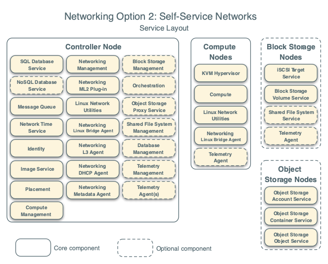
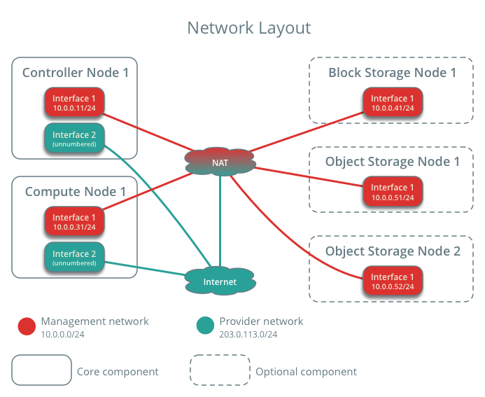

# 配置要求

[TOC]

## 硬件配置

### 控制器

控制器节点至少需要两个网络接口。

### 计算

可以部署多个计算节点。每个节点至少需要两个网络接口。

### 块设备存储

可以部署多个块存储节点。每个节点至少需要一个网络接口。

### 对象存储

此服务需要两个节点。每个节点至少需要一个网络接口。可以部署两个以上的对象存储节点。

## 网络

从下面的虚拟网络选项中选择一种。

### 选项1：提供商网络 Provider networks

提供商网络选项以最简单的方式部署 OpenStack 网络服务，主要使用第2层（桥接 / 交换）服务和 VLAN 网络分段。本质上，它将虚拟网络桥接到物理网络，并依靠物理网络基础设施提供第 3 层（路由）服务。此外，DHCP 服务向实例提供 IP 地址信息。

OpenStack 用户需要有关底层网络基础设施的更多信息，以创建与基础设施完全匹配的虚拟网络。

> 警告:
>
> 此选项不支持自助服务（专用）网络、第 3 层（路由）服务以及 LBaaS 和 FWaaS 等高级服务。如果需要这些功能，请考虑下面的自助服务网络选项。

 

### 选项2：自助服务网络 Self-service networks

自助服务网络选项通过第 3 层（路由）服务增强了提供商网络选项，该服务支持使用覆盖分割方法（如 VXLAN ）的自助服务网络。本质上，它使用 NAT 将虚拟网络路由到物理网络。此外，该选项为 LBaaS 和 FWaaS 等高级服务提供了基础。

OpenStack 用户可以在不了解数据网络基础设施的情况下创建虚拟网络。如果相应地配置了第 2 层插件，这也可以包括 VLAN 网络。

                                              

## 环境

介绍如何使用示例架构配置控制器节点和一个计算节点。

必须用有管理员权限的帐号来配置每个节点。

> 注意：
>
> 当服务使用 SysV Init 脚本而不是原生 systemd 文件时，openSUSE 上的 **systemctl enable** 调用会输出一条警告消息。可以忽略此警告。

为了获得最佳性能，建议环境满足或超过硬件要求中的硬件要求。以下最小需求支持概念验证环境，使用核心服务和几个 CirrOS 实例:

- 控制节点: 1 处理器, 4GB 内存, 及 5GB 存储
- 计算节点: 1 处理器, 2GB 内存, 及 10GB 存储

随着 OpenStack 服务和虚拟机数量的增加，对最佳性能的硬件要求也在增加。如果启用其他服务或虚拟机后性能下降，请考虑将硬件资源添加到环境中。

为了最大程度地减少混乱并为 OpenStack 提供更多资源，建议对 Linux 发行版进行最小化安装。此外，必须在每个节点上安装 64 位版本的发行版。

每个节点配置一个磁盘分区满足大多数的基本安装。但是，对于有额外服务的安装，如块存储服务，应该考虑采用 Logical Volume Manager (LVM)  进行安装。

出于首次安装和测试目的，许多用户选择将每个主机构建为虚拟机 （VM）。VM 的主要优势包括：

- 一台物理服务器可以支持多个节点，每个节点具有几乎任意数量的网络接口。
- 能够在整个安装过程中定期进行“快照”，并在出现问题时“回滚”到工作配置。

但是，虚拟机会降低实例的性能，particularly if your hypervisor and/or processor lacks support for hardware acceleration of nested VMs.尤其是在虚拟机管理程序和/或处理器不支持嵌套虚拟机的硬件加速的情况下。

> 注意：
>
> 如果选择在 VM 上安装，请确保虚拟机监控程序提供了在提供商网络接口上禁用 MAC 地址筛选的方法。

## 安全

OpenStack 服务支持多种安全方式，包括密码 password、策略 policy 和加密 encryption 。此外，包括数据库服务器和消息代理（message broker）在内的支持服务也支持密码安全。

为了简化安装过程，本指南只包含了可适用的密码安全。可以手动创建安全密码，但服务配置文件中的数据库连接字符串不能接受特殊字符，如“@”。建议使用 `pwgen <http://sourceforge.net/projects/pwgen/>` 工具生成密码或者运行下面的命令：

```bash
openssl rand -hex 10
```

对 OpenStack 服务而言，本指南使用 `SERVICE_PASS` 表示服务帐号密码，使用 `SERVICE_DBPASS` 表示数据库密码。

下面的表格给出了需要密码的服务列表以及它们在指南中的关联关系：

| 密码名称                 | 描述                                           |
| ------------------------ | ---------------------------------------------- |
| 数据库密码（不使用变量） | 数据库的 root 密码                             |
| `ADMIN_PASS`             | `admin` 用户密码                               |
| `CINDER_DBPASS`          | 块存储服务的数据库密码                         |
| `CINDER_PASS`            | 块存储服务 `cinder` 用户密码                   |
| `DASH_DBPASS`            | Dashboard 的数据库密码                         |
| `DEMO_PASS`              | `demo` 用户密码                                |
| `GLANCE_DBPASS`          | Image 服务的数据库密码                         |
| `GLANCE_PASS`            | Image 服务 `glance` 用户密码                   |
| `KEYSTONE_DBPASS`        | Identity 服务的数据库密码                      |
| `METADATA_SECRET`        | Secret for the metadata proxy 元数据代理的机密 |
| `NEUTRON_DBPASS`         | 网络服务的数据库密码                           |
| `NEUTRON_PASS`           | 网络服务 `neutron` 用户的密码                  |
| `NOVA_DBPASS`            | 计算服务的数据库密码                           |
| `NOVA_PASS`              | 计算服务 `nova` 用户密码                       |
| `PLACEMENT_PASS`         | Placement 服务 `placement` 用户的密码          |
| `RABBIT_PASS`            | RabbitMQ  `openstack` 用户密码                 |

OpenStack 和配套服务在安装和操作过程中需要管理员权限。在某些情况下，服务会对主机执行修改，这可能会干扰部署自动化工具，例如 Ansible、Chef 和 Puppet。例如，some OpenStack services add a root wrapper to `sudo` that can interfere with security policies. 一些 OpenStack 服务添加了一个根包装器 `sudo` ，这可能会干扰安全策略。

网络服务采用内核网络参数的默认值，并修改防火墙规则。为避免在初始安装期间出现大多数问题，我们建议using a stock deployment of a supported distribution on your hosts在主机上使用受支持发行版的库存部署。但是，如果选择自动部署主机，请先查看应用于主机的配置和策略，然后再继续操作。

## 主机网络

建议禁用自动化网络管理工具，并手动编辑相应的配置文件。

所有节点都需要 Internet 访问才能进行管理，例如软件包安装、安全更新、DNS 和 NTP。在大多数情况下，节点应通过管理网络接口访问 Internet 。为了突出网络隔离的重要性，示例体系结构对管理网络使用专用地址空间，并假设物理网络基础结构通过 NAT 或其他方法访问 Internet 。示例体系结构对提供程序（外部）网络使用可路由的 IP 地址空间，并假定物理网络基础结构提供直接的 Internet 访问。

在提供者网络架构中，所有实例直接连接到提供者网络。在自服务（私有）网络架构，实例可以连接到自服务或提供者网络。自服务网络可以完全在 openstack 环境中或者通过外部网络使用 NAT 提供某种级别的外部网络访问。

 

示例架构假设使用如下网络：

- 管理使用 10.0.0.0/24 带有网关 10.0.0.1

  此网络需一个网关为所有节点提供内部的管理目的的访问，例如包的安装、安全更新、DNS 和 NTP 。

- 提供者网段 203.0.113.0/24，网关 203.0.113.1

  此网络需一个网关来为环境中的内部实例提供 Internet 访问。

可以修改这些范围和网关以使用您的特定网络基础结构。

网络接口名称因发行版而异。传统上，接口使用 `eth` 后跟一个序列号。为了涵盖所有变体，将第一个接口称为数字最低的接口，将第二个接口称为数字最高的接口。

> Note：
>
> Ubuntu 更改了网络接口命名概念。

除非打算使用此示例体系结构中提供的确切配置，否则必须修改此过程中的网络以匹配您的环境。每个节点除了 IP 地址之外，还必须能够解析其他节点的名称。例如，controller 这个名称必须解析为 10.0.0.11，即控制节点上的管理网络接口的 IP  地址。

> Note：
>
> 重新配置网络接口将中断网络连接。对于这些过程，我们建议使用本地终端会话。
>
> 默认情况下，RHEL、CentOS 和 SUSE 发行版会启用限制性防火墙。Ubuntu 没有。

### 控制节点

#### 配置网络接口

1. 将第一个接口配置为管理接口：

   IP 地址: 10.0.0.11

   子网掩码: 255.255.255.0 (/24)

   默认网关: 10.0.0.1

2. 提供者网络接口使用一个特殊的配置，不分配 IP 地址。配置第二块网卡作为提供者网络：

   将其中的 `INTERFACE_NAME` 替换为实际的接口名称。例如，*eth1* 或者 *ens224*。

   - 对于 Ubuntu ，编辑 `/etc/network/interfaces` 文件以包含以下内容：

     ```bash
     # The provider network interface
     auto INTERFACE_NAME
     iface INTERFACE_NAME inet manual
     up ip link set dev $IFACE up
     down ip link set dev $IFACE down
     ```
     
   - 对于 RHEL 或 CentOS ，编辑 `/etc/sysconfig/network-scripts/ifcfg-INTERFACE_NAME` 文件包含以下内容：

     不要改变 `HWADDR` 和 `UUID` 。

     ```bash
     DEVICE=INTERFACE_NAME
     TYPE=Ethernet
     ONBOOT="yes"
     BOOTPROTO="none"
     ```
     
   - 对于 SUSE ，编辑 `/etc/sysconfig/network/ifcfg-INTERFACE_NAME` 文件以包含以下内容：

     ```bash
     STARTMODE='auto'
     BOOTPROTO='static'
     ```

3. 重启系统以激活修改。

#### 配置域名解析

2. 设置节点主机名为 `controller` 。

2. 编辑 `/etc/hosts` 文件包含以下内容：

   ```bash
   # controller
   10.0.0.11       controller
   # compute1
   10.0.0.31       compute1
   # block1
   10.0.0.41       block1
   # object1
   10.0.0.51       object1
   # object2
   10.0.0.52       object2
   ```

   > **警告:**
   >
   > 一些发行版本在 `/etc/hosts` 文件中添加了附加条目解析实际主机名到另一个 IP 地址如 `127.0.1.1`。为了防止域名解析问题，必须注释或者删除这些条目。**不要删除 127.0.0.1 条目。**        
   >

### 计算节点

#### 配置网络接口

1. 将第一个接口配置为管理网络接口：

   IP 地址：10.0.0.31

   子网掩码: 255.255.255.0 (/24)

   默认网关: 10.0.0.1

2. 提供者网络接口使用一个特殊的配置，不分配 IP 地址。配置第二块网卡作为提供者网络：

   将其中的 `INTERFACE_NAME` 替换为实际的接口名称。例如，*eth1* 或者 *ens224* 。

   - 对于 Ubuntu ，编辑 `/etc/network/interfaces` 文件以包含以下内容：

     ```bash
     # The provider network interface
     auto INTERFACE_NAME
     iface  INTERFACE_NAME inet manual
     up ip link set dev $IFACE up
     down ip link set dev $IFACE down
     ```
     
   - 对于 RHEL 或 CentOS ，编辑 `/etc/sysconfig/network-scripts/ifcfg-INTERFACE_NAME` 文件以包含以下内容：

     不要改变 `HWADDR` 和 `UUID`  。

     ```bash
     DEVICE=INTERFACE_NAME
     TYPE=Ethernet
     ONBOOT="yes"
     BOOTPROTO="none"
     ```
     
   - 对于 SUSE ，编辑 `/etc/sysconfig/network/ifcfg-INTERFACE_NAME` 文件包含以下内容：

     ```bash
     STARTMODE='auto'
     BOOTPROTO='static'
     ```

3. 重启系统以激活修改。

#### 配置域名解析

1. 设置节点主机名为 `compute1` 。

2. 编辑 `/etc/hosts` 文件包含以下内容：

   ```bash
   # controller
   10.0.0.11       controller
   # compute1
   10.0.0.31       compute1
   # block1
   10.0.0.41       block1
   # object1
   10.0.0.51       object1
   # object2
   10.0.0.52       object2
   ```

   > **警告：**
   >
   > 一些发行版本在 `/etc/hosts` 文件中添加了附加条目解析实际主机名到另一个IP地址如 `127.0.1.1` 。为了防止域名解析问题，你必须注释或者删除这些条目。**不要删除127.0.0.1条目。**                    
   >

### 块存储节点（可选）

#### 配置网络接口

- 配置管理网络接口：
  - IP 地址： 10.0.0.41
  - 掩码： 255.255.255.0 (/24)
  - 默认网关： 10.0.0.1

#### 配置域名解析

1. 设置节点主机名为 `block1` 。

2. 编辑 `/etc/hosts` 文件包含以下内容：

   ```bash
   # controller
   10.0.0.11       controller
   # compute1
   10.0.0.31       compute1
   # block1
   10.0.0.41       block1
   # object1
   10.0.0.51       object1
   # object2
   10.0.0.52       object2 
   ```

   >**警告:**
   >一些发行版本在 `/etc/hosts` 文件中添加了附加条目解析实际主机名到另一个IP地址如 `127.0.1.1` 。为了防止域名解析问题，你必须注释或者删除这些条目。**不要删除127.0.0.1条目。**
   
3. 重启系统以激活修改。               

### 对象存储节点（可选）

#### 第一个节点

**配置网络接口**

- 配置管理网络接口：
  - IP 地址：10.0.0.51
  - 掩码： 255.255.255.0 (/24)
  - 默认网关： 10.0.0.1

**配置域名解析**

1. 设置节点主机名为 `object1`。

2. 编辑 `/etc/hosts` 文件包含以下内容：

   ```bash
   # controller
   10.0.0.11       controller
   # compute1
   10.0.0.31       compute1
   # block1
   10.0.0.41       block1
   # object1
   10.0.0.51       object1
   # object2
   10.0.0.52       object2
   ```

   > **警告：**
   >
   > 一些发行版本在``/etc/hosts``文件中添加了附加条目解析实际主机名到另一个IP地址如 `127.0.1.1`。为了防止域名解析问题，你必须注释或者删除这些条目。
   > **不要删除127.0.0.1条目。**

3. 重启系统以激活修改。

#### 第二个节点

**配置网络接口**

- 配置管理网络接口：
  - IP地址：10.0.0.52
  - 掩码： 255.255.255.0 (/24)
  - 默认网关： 10.0.0.1

**配置域名解析**

1. 设置节点主机名为 `object2`。

2. 编辑 `/etc/hosts` 文件包含以下内容：

   ```bash
   # controller
   10.0.0.11       controller
   # compute1
   10.0.0.31       compute1
   # block1
   10.0.0.41       block1
   # object1
   10.0.0.51       object1
   # object2
   10.0.0.52       object2
   ```

   > **警告:**
   >
   > 一些发行版本在``/etc/hosts``文件中添加了附加条目解析实际主机名到另一个IP地址如 `127.0.1.1`。为了防止域名解析问题，你必须注释或者删除这些条目。
   > **不要删除127.0.0.1条目。**


3. 重启系统以激活修改。

## 网络时间协议(NTP)

安装 Chrony 。建议配置控制器节点引用更准确的 (lower stratum) NTP 服务器，然后其他节点引用控制节点。

### 控制节点

1. 安装软件包：

   ```bash
   # Ubuntu
   apt install chrony
   # RHEL CentOS
   yum install chrony
   # SUSE
   zypper install chrony
   ```

2. 编辑 `chrony.conf` 文件，按照环境的要求，对下面的键进行添加，修改或者删除：

   ```bash
   # RHEL CentOS SUSE    /etc/chrony.conf
   # Ubuntu              /etc/chrony/chrony.conf
   server NTP_SERVER iburst
   ```

   使用 NTP 服务器的主机名或者 IP 地址替换 `NTP_SERVER` 。配置支持设置多个 `server` 值。

3. 为了允许其他节点可以连接到控制节点的 chrony 后台进程，在 `chrony.conf` 文件添加下面的键：

   ```bash
   allow 10.0.0.0/24
   ```

4. 启动 NTP 服务并将其配置为随系统启动：

   ```bash
   systemctl enable chronyd.service
   systemctl start chronyd.service
   ```

### 其它节点


其他节点会连接控制节点同步时间。


1. 安装软件包：

   ```bash
   # Ubuntu
   apt install chrony
   # RHEL CentOS
   yum install chrony
   # SUSE
   zypper install chrony
   ```

2. 编辑 `chrony.conf` 文件并注释除 `server` 值外的所有内容。修改它引用控制节点：

   ```bash
   server controller iburst
   ```

3. 注释掉该 `pool 2.debian.pool.ntp.org offline iburst` 行。

4. 启动 NTP 服务并将其配置为随系统启动：

   ```bash
   systemctl enable chronyd.service
   systemctl start chronyd.service                      
   ```

### 验证操作

1. 在控制节点上执行这个命令：

   ```bash
   chronyc sources
   
     210 Number of sources = 2
     MS Name/IP address       Stratum Poll Reach LastRx Last sample
     ===========================================================================
     ^- 192.0.2.11            2   7    12   137  -2814us[-3000us] +/-   43ms
     ^* 192.0.2.12            2   6   177    46    +17us[  -23us] +/-   68ms
   ```

   `Name/IP address` 列中的内容指示一个或多个 NTP 服务器的主机名或 IP 地址。`MS` 列中的内容 `*` 表示 NTP 服务当前同步到的服务器。

2. 在所有其他节点执行相同命令：

   ```bash
   chronyc sources
   
     210 Number of sources = 1
     MS Name/IP address        Stratum Poll Reach LastRx Last sample
     ===========================================================================
     ^* controller             3    9   377   421    +15us[  -87us] +/-   15ms
   ```

## OpenStack 软件包

由于发布计划不同，发行版将 OpenStack 软件包作为发行版的一部分发布，或者使用其他方法发布。在所有节点上执行这些过程。

>  **注:**
>
>  在继续操作之前，主机必须包含可用于您的发行版的基本安装包的最新版本。
>
>  禁用或移除所有自动更新的服务，因为它们会影响到您的 OpenStack 环境。

### 先决条件

> **警告:**
>
> 当使用 RDO 包时，推荐禁用 EPEL，原因是 EPEL 中的更新破坏向后兼容性。或者使用 `yum-versionlock` 插件指定包版本号。

### 启用 OpenStack 库

- SUSE

  启用 Open Build Service 存储库：

  ```bash
  # openSUSE		OpenStack Ussuri:
  zypper addrepo -f obs://Cloud:OpenStack:Ussuri/openSUSE_Leap_15.1 Ussuri
  
  # openSUSE		OpenStack Train:
  zypper addrepo -f obs://Cloud:OpenStack:Train/openSUSE_Leap_15.0 Train
  
  # openSUSE		OpenStack Stein:
  zypper addrepo -f obs://Cloud:OpenStack:Stein/openSUSE_Leap_15.0 Stein
  
  # openSUSE		OpenStack Rocky:
  zypper addrepo -f obs://Cloud:OpenStack:Rocky/openSUSE_Leap_15.0 Rocky
  
  # openSUSE		OpenStack Queens:
  zypper addrepo -f obs://Cloud:OpenStack:Queens/openSUSE_Leap_42.3 Queens
  
  # openSUSE		OpenStack Pike:
  zypper addrepo -f obs://Cloud:OpenStack:Pike/openSUSE_Leap_42.3 Pike
  
  # Note：
  # openSUSE 发行版使用模式的概念来表示软件包的集合。如果您在初始安装期间选择了 “Minimal Server Selection (Text Mode)”，那么当尝试安装 OpenStack 软件包时，可能会遇到依赖冲突。为避免这种情况，请删除 minimal_base-conflicts 包：
  # zypper rm patterns-openSUSE-minimal_base-conflicts
  
  # SLES		OpenStack Ussuri:
  zypper addrepo -f obs://Cloud:OpenStack:Ussuri/SLE_15_SP2 Ussuri
  
  # SLES		OpenStack Train:
  zypper addrepo -f obs://Cloud:OpenStack:Train/SLE_15_SP1 Train
  
  # SLES		OpenStack Stein:
  zypper addrepo -f obs://Cloud:OpenStack:Stein/SLE_15 Stein
  
  # SLES		OpenStack Rocky:
  zypper addrepo -f obs://Cloud:OpenStack:Rocky/SLE_12_SP4 Rocky
  
  # SLES		OpenStack Queens:
  zypper addrepo -f obs://Cloud:OpenStack:Queens/SLE_12_SP3 Queens
  
  # SLES		OpenStack Pike:
  zypper addrepo -f obs://Cloud:OpenStack:Pike/SLE_12_SP3 Pike
   
  # Note：
  # 软件包由 GPG 密钥 D85F9316 签名。在使用导入的 GPG 密钥之前，应该验证它的指纹。
  #	Key Name:         Cloud:OpenStack OBS Project <Cloud:OpenStack@build.opensuse.org>
  #	Key Fingerprint:  35B34E18 ABC1076D 66D5A86B 893A90DA D85F9316
  #	Key Created:      2015-12-16T16:48:37 CET
  #	Key Expires:      2018-02-23T16:48:37 CET
  ```

- 在 CentOS 中，extras 仓库提供用于启用 OpenStack 仓库的 RPM 包。 CentOS 默认启用 extras 仓库，因此可以直接安装用于启用 OpenStack 仓库的包。对于 CentOS 8，还需要启用 PowerTools 存储库。

  ```bash
  # Victoria
  yum install centos-release-openstack-victoria
  yum config-manager --set-enabled powertools
  
  # Ussuri
  yum install centos-release-openstack-ussuri
  yum config-manager --set-enabled powertools
  
  # Train
  yum install centos-release-openstack-train
  
  # Stein
  yum install centos-release-openstack-stein
  
  # Rocky
  yum install centos-release-openstack-rocky
  
  # Queens
  yum install centos-release-openstack-queens
  
  # Pike
  yum install centos-release-openstack-pike
  ```

- 在 RHEL 上，下载和安装 RDO repository RPM 来启用 OpenStack 仓库。

  ```bash
  # RHEL 7
  yum install https://rdoproject.org/repos/rdo-release.rpm
  
  # RHEL 8
  dnf install https://www.rdoproject.org/repos/rdo-release.el8.rpm
  
  # RDO repository RPM 安装最新的可用 OpenStack 版本。
  ```

### 完成安装

1. 在主机上升级包（如果升级过程包含新内核，请重新启动主机以激活它）：

   ```bash
   # SUSE OpenSUSE
   zypper refresh && zypper dist-upgrade
   
   # CentOS RHEL
   yum upgrade
   
   
   ```


2. 安装 OpenStack 客户端：

   ```bash
   # SUSE	OpenSUSE
   zypper install python-openstackclient
   
   # CentOS 7 / RHEL 7
   yum install python-openstackclient
   
   # CentOS 8 / RHEL 8
   yum install python3-openstackclient
   
   
   ```

3. RHEL 和 CentOS 默认启用了 SELinux 。安装 `openstack-selinux` 软件包以便自动管理 OpenStack 服务的安全策略:

   ```bash
   yum install openstack-selinux                      
   ```

## 操作系统

- openSUSE 和 SUSE Linux Enterprise Server （Open Build Service Cloud repository）

  * openSUSE Leap 42.3
  * openSUSE Leap 15
  * SUSE Linux Enterprise Server 12 SP4
  * SUSE Linux Enterprise Server 15

- Red Hat Enterprise Linux 和 CentOS  （RDO repository）

  * Red Hat Enterprise Linux 7

  * Red Hat Enterprise Linux 8

  > Note:
  >
  > OpenStack Wallaby is available for CentOS Stream 8.
  >
  > OpenStack Ussuri and Victoria are available for both CentOS 8 and RHEL 8. 
  >
  > OpenStack Train and earlier are available on both CentOS 7 and RHEL 7.

- Ubuntu  （Canonical’s Ubuntu Cloud archive repository）

  * Ubuntu 16.04+ (LTS).
  
  > Note
  >
  > The Ubuntu Cloud Archive pockets for Pike and Queens provide OpenStack packages for Ubuntu 16.04 LTS; 
  >
  > OpenStack Queens is installable direct using Ubuntu 18.04 LTS;
  >
  > the Ubuntu Cloud Archive pockets for Rocky and Stein provide OpenStack packages for Ubuntu 18.04 LTS;
  >
  > the Ubuntu Cloud Archive pocket for Victoria provides OpenStack packages for Ubuntu 20.04 LTS.