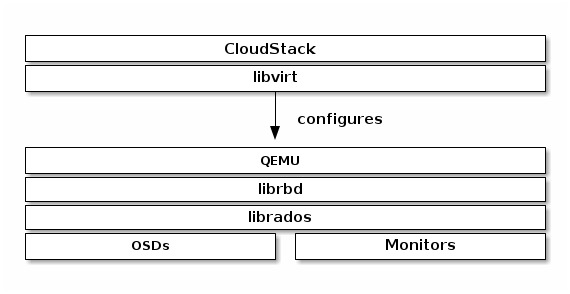

# CloudStack

You may use Ceph Block Device images with CloudStack 4.0 and higher through `libvirt`, which configures the QEMU interface to `librbd`. Ceph stripes block device images as objects across the cluster, which means that large Ceph Block Device images have better performance than a standalone server!

To use Ceph Block Devices with CloudStack 4.0 and higher, you must install QEMU, `libvirt`, and CloudStack first. We recommend using a separate physical host for your CloudStack installation. CloudStack recommends a minimum of 4GB of RAM and a dual-core processor, but more CPU and RAM will perform better. The following diagram depicts the CloudStack/Ceph technology stack.

 

Important

To use Ceph Block Devices with CloudStack, you must have access to a running Ceph Storage Cluster.

CloudStack integrates with Ceph’s block devices to provide CloudStack with a back end for CloudStack’s Primary Storage. The instructions below detail the setup for CloudStack Primary Storage.

Note

We recommend installing with Ubuntu 14.04 or later so that you can use package installation instead of having to compile libvirt from source.

Installing and configuring QEMU for use with CloudStack doesn’t require any special handling. Ensure that you have a running Ceph Storage Cluster. Install QEMU and configure it for use with Ceph; then, install `libvirt` version 0.9.13 or higher (you may need to compile from source) and ensure it is running with Ceph.

Note

Ubuntu 14.04 and CentOS 7.2 will have `libvirt` with RBD storage pool support enabled by default.


## Create a Pool

By default, Ceph block devices use the `rbd` pool. Create a pool for CloudStack NFS Primary Storage. Ensure your Ceph cluster is running, then create the pool.

```
ceph osd pool create cloudstack
```

See [Create a Pool](https://docs.ceph.com/en/latest/rados/operations/pools#createpool) for details on specifying the number of placement groups for your pools, and [Placement Groups](https://docs.ceph.com/en/latest/rados/operations/placement-groups) for details on the number of placement groups you should set for your pools.

A newly created pool must be initialized prior to use. Use the `rbd` tool to initialize the pool:

```
rbd pool init cloudstack
```

## Create a Ceph User

To access the Ceph cluster we require a Ceph user which has the correct credentials to access the `cloudstack` pool we just created. Although we could use `client.admin` for this, it’s recommended to create a user with only access to the `cloudstack` pool.

```
ceph auth get-or-create client.cloudstack mon 'profile rbd' osd 'profile rbd pool=cloudstack'
```

Use the information returned by the command in the next step when adding the Primary Storage.

See [User Management](https://docs.ceph.com/en/latest/rados/operations/user-management) for additional details.

## Add Primary Storage

To add a Ceph block device as Primary Storage, the steps include:

1. Log in to the CloudStack UI.
2. Click **Infrastructure** on the left side navigation bar.
3. Select **View All** under **Primary Storage**.
4. Click the **Add Primary Storage** button on the top right hand side.
5. Fill in the following information, according to your infrastructure setup:
   - Scope (i.e. Cluster or Zone-Wide).
   - Zone.
   - Pod.
   - Cluster.
   - Name of Primary Storage.
   - For **Protocol**, select `RBD`.
   - For **Provider**, select the appropriate provider  type (i.e. DefaultPrimary, SolidFire, SolidFireShared, or CloudByte).   Depending on the provider chosen, fill out the information pertinent to  your setup.
6. Add cluster information (`cephx` is supported).
   - For **RADOS Monitor**, provide the IP address of a Ceph monitor node.
   - For **RADOS Pool**, provide the name of an RBD pool.
   - For **RADOS User**, provide a user that has sufficient rights to the RBD pool. Note: Do not include the `client.` part of the user.
   - For **RADOS Secret**, provide the secret the user’s secret.
   - **Storage Tags** are optional. Use tags at your own discretion. For more information about storage tags in CloudStack, refer to [Storage Tags](http://docs.cloudstack.apache.org/en/latest/adminguide/storage.html#storage-tags).
7. Click **OK**.

## Create a Disk Offering

To create a new disk offering, refer to [Create a New Disk Offering](http://docs.cloudstack.apache.org/en/latest/adminguide/service_offerings.html#creating-a-new-disk-offering). Create a disk offering so that it matches the `rbd` tag. The `StoragePoolAllocator` will choose the  `rbd` pool when searching for a suitable storage pool. If the disk offering doesn’t match the `rbd` tag, the `StoragePoolAllocator` may select the pool you created (e.g., `cloudstack`).

## Limitations

- CloudStack will only bind to one monitor (You can however create a Round Robin DNS record over multiple monitors)