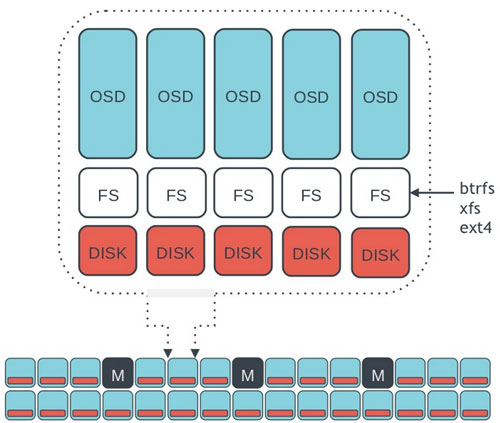
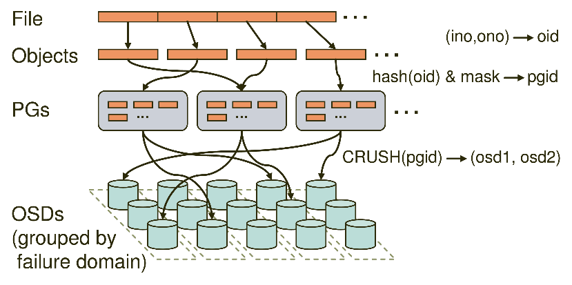
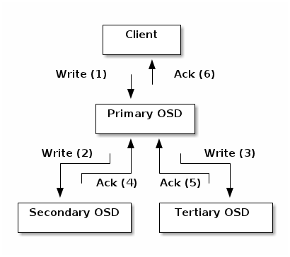

# Ceph
Ceph提供了对象、块和文件存储功能。

## Ceph对象存储
>* REST风格的接口
>* 与S3和Swift兼容的API
>* S3风格的子域
>* 统一的S3/Swift命名空间
>* 用户管理
>* 利用率跟踪
>* 条带化对象
>* 云解决方案集成
>* 多站点部署
>* 灾难恢复

## Ceph块设备
>* 瘦接口支持
>* 映像尺寸最大 16EB
>* 条带化可定制
>* 内存缓存
>* 快照
>* 写时复制克隆
>* 支持内核级驱动
>* 支持KVM和libvirt
>* 可作为云解决方案的后端
>* 增量备份

## Ceph文件系统
>* 与POSIX兼容的语义
>* 元数据独立于数据
>* 动态重均衡
>* 子目录快照
>* 可配置的条带化
>* 有内核驱动支持
>* 有用户空间驱动支持
>* 可作为NFS/CIFS部署
>* 可用于Hadoop(取代HDFS)

## Ceph架构
**Rados**  
核心组件，提供高可靠、高可扩展、高性能的分布式对象存储架构，利用本地文件系统存储对象。 

**Client**  
RBD  
Radosgw  
Librados  
Cephfs  


## Ceph组件
最简的 Ceph 存储集群至少要一个监视器和两个 OSD 守护进程，只有运行 Ceph 文件系统时,元数据服务器才是必需的。  
**OSD(对象存储守护进程)**  
存储数据，处理数据复制、恢复、回填、重均衡，并向监视器提供邻居的心跳信息。 


**Monitor**  
维护着各种集群状态图，包括监视器图、OSD图、归置组(PG)图和CRUSH图。  
**MDS(元数据服务器)**  
存储元数据。缓存和同步元数据，管理名字空间。
## 硬件配置

### CPU
元数据服务器对CPU敏感，CPU性能尽可能高。 
OSD需要一定的处理能力，CPU性能要求较高。
监视器对 CPU 不敏感。

### 内存
元数据服务器和监视器对内存要求较高，至少每进程1GB。  
OSD对内存要求较低，至少每进程500MB。但在恢复期间占用内存比较大（如每进程每 TB 数据需要约 1GB  内存）。通常内存越多越好。  

### 数据存储
建议用容量大于1TB的硬盘。  
每个OSD守护进程占用一个驱动器。  
分别在单独的硬盘运行操作系统、OSD数据和OSD日志。  
SSD顺序读写性能很重要。  
SSD可用于存储OSD的日志。 `osd journal` 选项的默认值是 `/var/lib/ceph/osd/$cluster-$id/journal` ，可以把它挂载到一个 SSD 或 SSD 分区。

不顾分区而在单个硬盘上运行多个OSD，这样**不明智**！
不顾分区而在运行了OSD的硬盘上同时运行监视器或元数据服务器也**不明智**！

### 其他注意事项

可以在同一主机上运行多个 OSD ，但要确保 OSD 硬盘总吞吐量不超过为客户端提供读写服务所需的网络带宽；还要考虑集群在每台主机上所存储的数据占总体的百分比，如果一台主机所占百分比太大而它挂了，就可能导致诸如超过 `full ratio` 的问题，此问题会使 Ceph 中止运作以防数据丢失。

如果每台主机运行多个 OSD ，也得保证内核是最新的。

OSD 数量较多（如 20 个以上）的主机会派生出大量线程，尤其是在恢复和重均衡期间。很多 Linux 内核默认的最大线程数较小（如 32k 个），如果遇到了这类问题，可以把 `kernel.pid_max` 值调高些。理论最大值是 4194303 。例如把下列这行加入 `/etc/sysctl.conf` 文件：

```
kernel.pid_max = 4194303
```

### Ceph网络
建议每台服务器至少两个千兆网卡，分别用于公网(前端)和集群网络(后端)。集群网络用于处理有数据复制产生的额外负载，而且可用防止拒绝服务攻击。考虑部署万兆网络。


### 最低硬件推荐(小型生产集群及开发集群)

#### Ceph-osd
**CPU:**  
>* 1x 64-bit AMD-64
>* 1x 32-bit ARM dual-core or better
>* 1x i386 dual-core  

**RAM:**  
~1GB for 1TB of storage per daemon  
**Volume Storage:**  
1x storage drive per daemon  
**Journal:**  
1x SSD partition per daemon (optional)  
**Network:**  
2x 1GB Ethernet NICs

#### Ceph-mon
**CPU:**  
>* 1x 64-bit AMD-64/i386
>* 1x 32-bit ARM dual-core or better
>* 1x i386 dual-core  

**RAM:**  
1GB per daemon  
**Disk Space:**  
10GB per daemon  
**Network:**  
2x 1GB Ethernet NICs

#### Ceph-mds
**CPU:**  
>* 1x 64-bit AMD-64 quad-core
>* 1x 32-bit ARM quad-core
>* 1x i386 quad-core  

**RAM:**  
1GB minimum per daemon  
**Disk Space:**  
1MB per daemon  
**Network:**  
2x 1GB Ethernet NICs
### 生产集群
#### Dell PowerEdge R510
**CPU：**  
2x 64-bit quad-core Xeon CPUs  
**RAM:**  
16GB  
**Volume Storage:**  
8x 2TB drives.1 OS,7 Storage  
**Client Network:**  
2x 1GB Ethernet NICs  
**OSD Network:**  
2x 1GB Ethernet NICs  
**Mgmt. Network:**  
2x 1GB Ethernet NICs
#### Dell PowerEdge R515
**CPU：**  
1x hex-core Opteron CPU  
**RAM:**  
16GB  
**Volume Storage:**  
12x 3TB drives.Storage  
**OS Storage:**  
1x 500GB drive. Operating System.  
**Client Network:**  
2x 1GB Ethernet NICs  
**OSD Network:**  
2x 1GB Ethernet NICs  
**Mgmt. Network:**  
2x 1GB Ethernet NICs
## 推荐操作系统
### Ceph 依赖
#### Linux内核
**Ceph内核态客户端：**  
>* v3.16.3 or later (rbd deadlock regression in v3.16.[0-2])  
>* NOT v3.15.* (rbd deadlock regression)  
>* V3.14.*  
>* v3.6.6 or later in the v3.6 stable series  
>* v3.4.20 or later in the v3.4 stable series  

**btrfs:**  
v3.14或更新
### 系统平台(FIREFLY 0.80)
| Distro | Release | Code Name | Kernel | Notes | Testing |
|--------|---------|-----------|--------|-------|---------|
| Ubuntu | 12.04 | Precise Pangolin | linux-3.2.0 | 1,2 | B,I,C |
| Ubuntu | 14.04 | Trusty Tahr | linux-3.13.0 |  | B,I,C |
| Debian | 6.0 | Squeeze | linux-2.6.32 | 1,2,3 | B |
| Debian | 7.0 | Wheezy | linux-3.2.0 | 1,2 | B |
| CentOS | 6 | N/A | linux-2.6.32 | 1,2 | B,I |
| RHEL | 6 |  | linux-2.6.32 | 1,2 | B,I,C |
| RHEL | 7 |  | linux-3.10.0 |  | B,I,C |
| Fedora | 19.0 | Schrodinger's Cat | linux-3.10.0 |  | B |
| Fedora | 20.0 | Heisenbug | linux-3.14.0 |  | B |

Note:  

>* 1:默认内核btrfs版本较老，不推荐用于ceph-osd存储节点；要升级到推荐的内核，或者改用xfs,ext4
>* 2:默认内核带的 Ceph 客户端较老，不推荐做内核空间客户端（内核 RBD 或 Ceph 文件系统），请升级到推荐内核。
>* 3:默认内核或已安装的 glibc 版本若不支持 syncfs(2) 系统调用，同一台机器上使用 xfs 或 ext4 的 ceph-osd 守护进程性能不会如愿。  

测试版：

>* B: 我们持续地在这个平台上编译所有分支、做基本单元测试；也为这个平台构建可发布软件包。
>* I: 我们在这个平台上做基本的安装和功能测试。
>* C: 我们在这个平台上持续地做全面的功能、退化、压力测试，包括开发分支、预发布版本、正式发布版本。

## 数据流向
Data-->obj-->PG-->Pool-->OSD



## 数据复制



## 数据重分布
### 影响因素
OSD  
OSD weight  
OSD crush weight
## Ceph应用
**RDB**  
为Glance Cinder提供镜像存储  
提供Qemu/KVM驱动支持  
支持openstack的虚拟机迁移  

**RGW**  
替换swift  
网盘  

**Cephfs**  
提供共享的文件系统存储  
支持openstack的虚拟机迁移
## 部署工具
Ceph-deploy