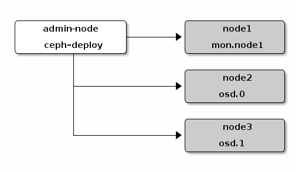

# Ceph 安装
结构图：

## Ceph 部署工具的安装
### Debian/Ubuntu
1.添加发布密钥：

    wget -q -O- 'https://ceph.com/git/?p=ceph.git;a=blob_plain;f=keys/release.asc' | sudo apt-key add -  
2.添加Ceph软件包源，用稳定版Ceph（如 cuttlefish 、 dumpling 、 emperor 、 firefly 等等）替换掉 {ceph-stable-release} 。  

    echo deb http://ceph.com/debian-{ceph-stable-release}/ $(lsb_release -sc) main | sudo tee /etc/apt/sources.list.d/ceph.list

3.更新你的仓库，并安装 ceph-deploy ：  

    sudo apt-get update && sudo apt-get install ceph-deploy

### RedHat/CentOS/Fedora
把软件包源加入软件库，用文本编辑器创建一个 YUM (Yellowdog Updater, Modified) 库文件，其路径为 /etc/yum.repos.d/ceph.repo 。例如：

    sudo vim /etc/yum.repos.d/ceph.repo

把如下内容粘帖进去，用最新稳定版 Ceph 名字替换 {ceph-stable-release} （如 firefly ）、用你的发行版名字替换 {distro} （如 el6 为 CentOS 6 、 rhel6.5 为 Red Hat 6 .5、 fc19 是 Fedora 19 、 fc20 是 Fedora 20 。最后保存到 /etc/yum.repos.d/ceph.repo 文件。

    [ceph-noarch]
    name=Ceph noarch packages
    baseurl=http://ceph.com/rpm-{ceph-release}/{distro}/noarch
    enabled=1
    gpgcheck=1
    type=rpm-md
    gpgkey=https://ceph.com/git/?p=ceph.git;a=blob_plain;f=keys/release.asc

更新软件库并安装 ceph-deploy ：

    sudo yum update && sudo yum install ceph-deploy

## Ceph 节点安装
管理节点必须能够通过 SSH 无密码地访问各 Ceph 节点。
### 安装 NTP
建议把 NTP 服务安装到所有 Ceph 节点上（特别是 Ceph 监视器节点），以免因时钟漂移导致故障。

在 CentOS / RHEL 上可执行：

    sudo yum install ntp ntpdate ntp-doc

在 Debian / Ubuntu 上可执行：

    sudo apt-get install ntp

确保在各 Ceph 节点上启动了 NTP 服务，并且要使用同一个 NTP 服务器。
### 安装 SSH 服务器

在所有 Ceph 节点上执行如下步骤：

    sudo apt-get install openssh-server

或者

    sudo yum install openssh-server

确保所有 Ceph 节点上的 SSH 服务器都在运行。

### 创建 Ceph 用户

ceph-deploy 工具必须以普通用户登录，且此用户拥有无密码使用 sudo 的权限，因为它需要安装软件及配置文件，中途不能输入密码。

较新版的 ceph-deploy 支持用 --username 选项提供可无密码使用 sudo 的用户名（包括 root ，虽然不建议这样做）。要用 ceph-deploy --username {username} 命令，指定的用户必须能够通过无密码 SSH 连接到 Ceph 节点，因为 ceph-deploy 不支持中途输入密码。

我们建议在集群内的所有 Ceph 节点上都创建一个 Ceph 用户，全集群统一的用户名会简化操作（非必需），然而你应该避免使用知名用户名，因为黑帽子们会用它做暴力破解（如 root 、 admin 、 {productname} ）。后续步骤描述了如何创建无 sudo 密码的用户，你要用自己取的名字取代 {username} 。

在各 Ceph 节点创建用户。

    ssh user@ceph-server
    sudo useradd -d /home/{username} -m {username}
    sudo passwd {username}

确保各 Ceph 节点上所创建的用户都有 sudo 权限。

    echo "{username} ALL = (root) NOPASSWD:ALL" | sudo tee /etc/sudoers.d/{username}
    sudo chmod 0440 /etc/sudoers.d/{username}

允许无密码 SSH 登录

正因为 ceph-deploy 不支持输入密码，你必须在管理节点上生成 SSH 密钥并把其公钥散布到各 Ceph 节点。
生成 SSH 密钥对，但不要用 sudo 或 root 用户。口令为空：

    ssh-keygen

    Generating public/private key pair.
    Enter file in which to save the key (/ceph-admin/.ssh/id_rsa):
    Enter passphrase (empty for no passphrase):
    Enter same passphrase again:
    Your identification has been saved in /ceph-admin/.ssh/id_rsa.
    Your public key has been saved in /ceph-admin/.ssh/id_rsa.pub.

把公钥拷贝到各 Ceph 节点，把下列命令中的 {username} 替换成前面创建 Ceph 用户里的用户名。

    ssh-copy-id {username}@node1
    ssh-copy-id {username}@node2
    ssh-copy-id {username}@node3

    （ 推荐做法）修改 ceph-deploy 管理节点上的 ~/.ssh/config 文件，这样 ceph-deploy 就能用你所建的用户名登录 Ceph 节点了，无需每次执行 ceph-deploy 都指定 --username {username} 。这样做同时也简化了 ssh 和 scp 的用法。把 {username} 替换成你创建的用户名。

    Host node1
       Hostname node1
       User {username}
    Host node2
       Hostname node2
       User {username}
    Host node3
       Hostname node3
       User {username}

### 引导时联网

Ceph 的各 OSD 进程通过网络互联并向监视器集群报告，如果网络默认为 off ，那么 Ceph 集群就不能在启动时就上线，直到打开网络。

某些发行版（如 CentOS ）默认关闭网络接口，故此需确保网卡在系统启动时都能启动，这样 Ceph 守护进程才能通过网络互联。例如，在 Red Hat 和 CentOS 上，需进入 /etc/sysconfig/network-scripts 目录并确保 ifcfg-{iface} 文件中的 ONBOOT 设置成了 yes 。
确保联通性

用 ping 短主机名（ hostname -s ）的方式确认网络没问题，解决掉可能存在的主机名解析问题。

Note

主机名应该解析为网络 IP 地址，而非回环接口 IP 地址（即主机名应该解析成非 127.0.0.1 的IP地址）。如果你的管理节点同时也是一个 Ceph 节点，也要确认它能正确解析主机名和 IP 地址（即非回环 IP 地址）。
放通所需端口

Ceph 监视器之间默认用 6789 端口通信， OSD 之间默认用 6800:7810 这个范围内的端口通信。详情见网络配置参考。 Ceph OSD 能利用多个网络连接与客户端、监视器、其他副本 OSD 、其它心跳 OSD 分别进行通信。

某些发行版（如 RHEL ）的默认防火墙配置非常严格，你得调整防火墙，允许相应的入栈请求，这样客户端才能与 Ceph 节点通信。

对于 RHEL 7 上的 firewalld ，要对公共域放通 Ceph 监视器所使用的 6789 端口、以及 OSD 所使用的 6800:7100 ，并且要配置为永久规则，这样重启后规则仍有效。例如：

sudo firewall-cmd --zone=public --add-port=6789/tcp --permanent

若用 iptables 命令，要放通 Ceph 监视器所用的 6789 端口和 OSD 所用的 6800:7100 端口范围，命令如下：

sudo iptables -A INPUT -i {iface} -p tcp -s {ip-address}/{netmask} --dport 6789 -j ACCEPT

配置好 iptables 之后要保存配置，这样重启之后才依然有效。例如：

/sbin/service iptables save

终端（ TTY ）

在 CentOS 和 RHEL 上执行 ceph-deploy 命令时，如果你的 Ceph 节点默认设置了 requiretty 那就会遇到报错。可以这样禁用它，执行 sudo visudo ，找到 Defaults requiretty 选项，把它改为 Defaults:ceph !requiretty 或者干脆注释掉，这样 ceph-deploy 就可以用之前创建的用户（ 创建 Ceph 用户 ）连接了。

Note

编辑配置文件 /etc/sudoers 时，必须用 sudo visudo 而不是文本编辑器。
SELinux

在 CentOS 和 RHEL 上， SELinux 默认开启为 Enforcing 。为简化安装，我们建议把 SELinux 设置为 Permissive 或者完全禁用，也就是在加固系统配置前先确保集群的安装、配置没问题。用下列命令把 SELinux 设置为 Permissive ：

sudo setenforce 0

要使 SELinux 配置永久生效（如果它确是问题根源），需修改其配置文件 /etc/selinux/config 。

ceph1节点安装ceph-deploy工具：

    apt-get install ceph-deploy

二、安装Ceph
登录ceph1节点，新建一个工作目录ceph，后面所有操作都在此目录下进行，ceph-deploy工具会在此目录产生各个配置文件，并对所有节点进行安装配置。
执行如下命令在各个节点安装ceph软件：

    root@ceph1:~/ceph# ceph-deploy install ceph{1,2,3,4}

1、组建mon集群：

     root@ceph1:~/ceph# ceph-deploy mon create ceph{1,2,3,4}

启动mon进程：

    ceph-deploy mon create-initial

在4个节点上面使用ps命令，可以看到各个节点都启动了一个mon进程。
2、安装OSD
在每一个节点新建空白目录：/data/osd

    ceph-deploy --overwrite-conf osd prepare ceph1:/data/osd:/dev/sdb ceph2:/data/osd:/dev/sdb ceph3:/data/osd:/dev/sdb ceph4:/data/osd:/dev/sdb
    ceph-deploy --overwrite-conf osd activate ceph1:/data/osd:/dev/sdb ceph2:/data/osd:/dev/sdb ceph3:/data/osd:/dev/sdb ceph4:/data/osd:/dev/sdb

在ceph1的ceph目录下，依次执行如上两行命令。
注意，在执行如上命令之前，不要对/dev/sdb设备做任何的格式化和分区动作。deploy命令会自动格式化该硬盘设备。
上述步骤执行完成后，就可以看到在该目录下已经建立了很多文件：

    root@ceph1:~/ceph# ls -l /data/osd
    总用量 48
    -rw-r--r--   1 root root  626  3 14 15:24 activate.monmap
    -rw-r--r--   1 root root    3  3 14 15:24 active
    -rw-r--r--   1 root root   37  3 14 15:23 ceph_fsid
    drwxr-xr-x 136 root root 4096  3 14 15:30 current
    -rw-r--r--   1 root root   37  3 14 15:23 fsid
    lrwxrwxrwx   1 root root   58  3 14 15:23 journal ->;;; /dev/disk/by-partuuid/c1195388-2c15-410a-b9f8-8de90357d6c5
    -rw-r--r--   1 root root   37  3 14 15:23 journal_uuid
    -rw-------   1 root root   56  3 14 15:24 keyring
    -rw-r--r--   1 root root   21  3 14 15:23 magic
    -rw-r--r--   1 root root    6  3 14 15:24 ready
    -rw-r--r--   1 root root    4  3 14 15:24 store_version
    -rw-r--r--   1 root root   42  3 14 15:24 superblock
    -rw-r--r--   1 root root    0  3 14 15:30 upstart
    -rw-r--r--   1 root root    2  3 14 15:24 whoami

3、复制ceph和key文件到各个节点。

    ceph-deploy admin ceph1 ceph2 ceph3 ceph4

上述命令即可复制ceph目录下的配置文件和key信息到各个节点。
4、安装MDS

    ceph-deploy mds  create ceph1 ceph2

三、安装完成验证
经过第二步的安装过程，ceph集群已经准备就绪。可以使用如下命令检查集群运行状况：

    ceph –s

查询结果为：

    root@ceph1:~/ceph# ceph -s
      cluster 6febc939-2d26-4893-90ce-30fba30bc6cf
      health HEALTH_OK
      monmap e1: 4 mons at {ceph1=172.16.0.114:6789/0,ceph2=172.16.0.115:6789/0,ceph3=172.16.0.116:6789/0,ceph4=172.16.0.113:6789/0}, election epoch 10, quorum 0,1,2,3 ceph4,ceph1,ceph2,ceph3
      mdsmap e11: 1/1/1 up {0=ceph1=up:active}, 1 up:standby
      osdmap e24: 4 osds: 4 up, 4 in
      pgmap v124: 192 pgs, 3 pools, 1884 bytes data, 20 objects
                  7529 MB used, 94294 MB / 104 GB avail
                  192 active+clean
如果出现：
ALTH_WARN clock skew detected on的字样，说明各个mon节点的时间不同步。解决的办法当然是让各个节点使用同一时间源，确保时间一致，虚拟机的话，可以使用类似vmtools同步宿 主机器的时间，也可以配置ntp确保一致。实在没法解决也可以在ceph.conf中新增配置：
mon clock drift allowed = 1 // 1表示1秒钟，这里可以配置小数点。