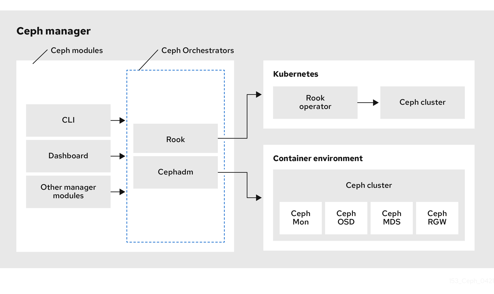

# 编排器

[TOC]

## 概述

作为存储管理员，可以使用 Ceph 编排器和 Cephadm 实用程序来发现 Ceph 存储集群中的设备和创建服务。

Ceph 存储编排器是管理器模块，主要充当 Ceph 存储集群与 Rook 和 Cephadm 等部署工具之间的桥梁，以获得统一体验。还与 Ceph 命令行界面和 Ceph 控制面板集成。

以下是 Ceph 编排器的工作流图：



## 类型

主要有三种类型：

- **编排器 CLI** 

  是编排器中使用的常见 API，包含一组可以实施的命令。这些 API 还提供通用命令行界面(CLI)，以利用外部编排服务编排 `ceph-mgr` 模块。

  以下是 Ceph 编排器所用的命名法： 				

  - Host ：这是物理主机的主机名，而不是容器内的 pod 名称、DNS 名称、容器名称或主机名。 						
  - 服务类型：这是服务的类型，如 nfs、mds、osd、mon、rgw、mgr 和 iscsi。 						
  - 服务 ：由 Ceph 存储集群提供的功能服务，如监控服务、管理器服务、OSD 服务、Ceph 对象网关服务和 NFS 服务。 						
  - 守护进程：由一个或多个主机（如 Ceph 对象网关服务）部署的服务的特定实例可以具有在三个不同的主机上运行的不同 Ceph 对象网关守护进程。 						

- **Cephadm Orchestrator**

  这是一个 Ceph 编排器模块，它不依赖于 Rook 或 Ansible 等外部工具，而是通过建立 SSH 连接并发出显式管理命令来管理集群中的节点。此模块可用于进行 天一操作和第二天操作。

  建议使用 Cephadm Orchestrator 在不利用任何部署框架（如 Ansible）的情况下安装 Ceph 存储集群。其理念是为管理器守护进程提供对 SSH  配置和密钥的访问权限，以便连接到集群中的所有节点以执行任何管理操作，例如创建存储设备清单、部署和更换 OSD，或启动和停止 Ceph  守护进程。此外，Cephadm Orchestrator 将部署由 `systemd` 管理的容器镜像，以允许独立升级并置服务。

  此编排器还可能突出显示一个工具，该工具封装了所有必要的操作，以管理基于当前主机上的容器镜像服务的部署，包括引导运行 Ceph 监控器和 Ceph 管理器的最小集群的命令。

- **rook 编排器**

  Rook 是一个编配工具，它使用 Kubernetes Rook 操作器管理 Kubernetes 集群内运行的 Ceph 存储集群。rook  模块提供 Ceph 的编排器框架和 Rook 之间的集成。rook 是 Kubernetes 的开源原生云存储操作器。

  rook 遵循"operator"模型，其中在 Kubernetes 中定义自定义资源定义 (CRD) 对象来描述 Ceph  存储集群及其所需状态，rook operator 守护进程在控制循环中运行，将当前集群状态与所需状态进行比较，并采取措施进行聚合。描述 Ceph 所需状态的主要对象是 Ceph 存储集群 CRD，其中包括有关 OSD 应使用哪些设备的信息、应运行的 monitor 数，以及应使用的  Ceph 版本的信息。rook 定义几个其他 CRD 来描述 RBD 池和 CephFS 文件系统等。

  Rook 编排器模块是在 `ceph-mgr` 守护进程中运行的粘合器模块，通过在 Kubernetes 中更改 Ceph 存储集群来描述所需的集群状态来实施 Ceph 编排 API。Rook 集群的 `ceph-mgr` 守护进程作为 Kubernetes pod 运行，因此 rook 模块可以在没有任何显式配置的情况下连接到 Kubernetes API。 				

## 放置规格

可以使用 Ceph 编排器部署 `osds、mons、mgrs、` `mds` 和 `rgw`，以及 `iSCSI` 服务。建议使用放置规则部署服务。放置规格可以作为命令行参数传递，也可以作为服务规格在 `yaml` 文件中传递。 		

使用放置规格部署服务有两种方法： 		

- 直接在命令行界面中使用放置规格。例如，如果要在主机上部署三个监视器，运行以下命令在 `host01`、host`02 和 host` `03` 上部署三个监视器。

  ```bash
  ceph orch apply mon --placement="3 host01 host02 host03"
  ```

- 使用 YAML 文件中的放置规格。例如，如果要在所有主机上部署 `node-exporter`，您可以在 `yaml` 文件中指定以下内容：

  ```yaml
  service_type: mon
  placement:
  host_pattern: '*'
  ```

## 使用 CLI 部署守护进程

利用 Ceph 编排器，您可以使用 `ceph orch` 命令部署 Ceph 管理器、Ceph 监控器、Ceph OSD 和监控堆栈等守护进程。放置规格通过 Orchestrator 命令作为 `--placement` 参数传递。

**流程**

1. 登录到 Cephadm shell：						

   ```bash
   cephadm shell
   ```

2. 使用以下方法之一在主机上部署守护进程： 				

   **方法 1**

   指定守护进程的数量和主机名：

   ```bash
   ceph orch apply SERVICE_NAME --placement="NUMBER_OF_DAEMONS HOST_NAME_1 HOST_NAME_2 HOST_NAME_3"
   
   ceph orch apply mon --placement="2 host01 host02 host03"
   ```

   **方法 2**

   将标签添加到主机，然后使用标签部署守护进程：

   在主机中添加标签：

   ```bash
   ceph orch host label add HOSTNAME_1 LABEL_1,LABEL_2
   ceph orch host label add host01 mon
   ```

   使用标签部署守护进程：

   ```bash
   ceph orch apply DAEMON_NAME label:_LABEL_1_
   ceph orch apply mon label:mon
   ```

   **方法 3**

   为主机添加标签并使用 `--placement` 参数部署：

   在主机中添加标签：

   ```bash
   ceph orch host label add HOSTNAME_1 LABEL_1,LABEL_2
   ceph orch host label add host01 mon
   ```

   使用标签放置规则部署守护进程:

   ```bash
   ceph orch apply DAEMON_NAME --placement="label:_LABEL_1_"
   ceph orch apply mon --placement="label:mon"
   ```

**验证**

- 列出服务：

  ```bash
  ceph orch ls
  ```

- 列出主机、守护进程和进程： 				

  **语法**

  ```bash
  ceph orch ps --daemon_type=DAEMON_NAME
  ceph orch ps --service_name=SERVICE_NAME
  
  ceph orch ps --daemon_type=mon
  ceph orch ps --service_name=mon
  ```

## 使用 CLI 在主机的子集上部署守护进程

可以使用 `--placement` 选项在主机子集上部署守护进程。可以使用要部署守护进程的主机名称在放置规格中指定守护进程数量。		

**流程**

1. 登录到 Cephadm shell：

   ```bash
   cephadm shell
   ```

2. 列出您要在其上部署 Ceph 守护进程的主机：

   ```bash
   ceph orch host ls
   ```

3. 部署守护进程：

   ```bash
   ceph orch apply SERVICE_NAME --placement="NUMBER_OF_DAEMONS HOST_NAME_1 _HOST_NAME_2 HOST_NAME_3"
   
   ceph orch apply mgr --placement="2 host01 host02 host03"
   ```

**验证**

- 列出主机：

  ```bash
  ceph orch host ls
  ```

## 服务规格

服务规格是一种数据结构，用于指定用于部署 Ceph 服务的服务属性和配置设置。以下是用于指定服务规格的 multi-document YAML 文件 `cluster.yml` 示例：

```yaml
service_type: mon
placement:
  host_pattern: "mon*"
---
service_type: mgr
placement:
  host_pattern: "mgr*"
---
service_type: osd
service_id: default_drive_group
placement:
  host_pattern: "osd*"
data_devices:
  all: true
```

以下列表定义了服务规格的属性的参数如下： 		

- `service_type` ：服务类型： 				
  - Ceph 服务，如 mon、crash、mds、mgr、osd、rbd 或 rbd-mirror。 						
  - 诸如 nfs 或 rgw 的 Ceph 网关. 						
  - 监控堆栈，如 Alertmanager、Prometheus、Grafana 或 Node-exporter。 						
  - 用于自定义容器的容器. 						
- `service_id` ：服务的唯一名称。 				
- `placement` ：这用于定义守护进程部署的位置和方式。 				
- `Unmanaged:` 如果设置为 `true，则` 编排器不会部署或删除与此服务关联的任何守护进程。 				

**编排器无状态服务**

无状态服务是一种服务，不需要提供状态信息。例如，要启动 `rgw` 服务，不需要额外的信息来启动或运行服务。`rgw` 服务不会创建有关此状态的信息以提供功能。无论 `rgw` 服务何时启动，其状态都是相同的。 			

## 使用服务规格部署守护进程

利用 Ceph 编排器，可以使用 YAML 文件中的服务规格部署 Ceph 管理器、Ceph 监控器、Ceph OSD 和监控堆栈等守护进程。 		

**流程**

1. 登录到 Cephadm shell:						

   ```bash
   cephadm shell
   ```

2. 进入以下目录：							

   ```bash
   cd /var/lib/ceph/DAEMON_PATH/
   
   cd /var/lib/ceph/mon/
   ```

3. 创建 `yml` 文件：

   ```bash
   touch mon.yml
   ```

4. 此文件可以通过两种不同的方式进行配置： 				

   - 编辑该文件，使其在放置规格中包含主机详情：

     ```yaml
     service_type: SERVICE_NAME
     placement:
       hosts:
         - HOST_NAME_1
         - HOST_NAME_2
     ```

     **示例**				

     ```yaml
     service_type: mon
     placement:
       hosts:
         - host01
         - host02
         - host03
     ```

   - 编辑该文件，使其在放置规格中包含标签详情：

     ```yaml
     service_type: SERVICE_NAME
     placement:
       label: "_LABEL_1"
     ```

     **示例**

     ```yaml
     service_type: mon
     placement:
       label: "mon"
     ```

5. 使用服务规格部署 Ceph 守护进程：

   ```bash
   ceph orch apply -i FILE_NAME.yml
   
   ceph orch apply -i mon.yml
   ```

**验证**

- 列出服务：

  ```bash
  ceph orch ls
  ```

- 列出主机、守护进程和进程：

  ```bash
  ceph orch ps --daemon_type=DAEMON_NAME
  
  ceph orch ps --daemon_type=mon
  ```