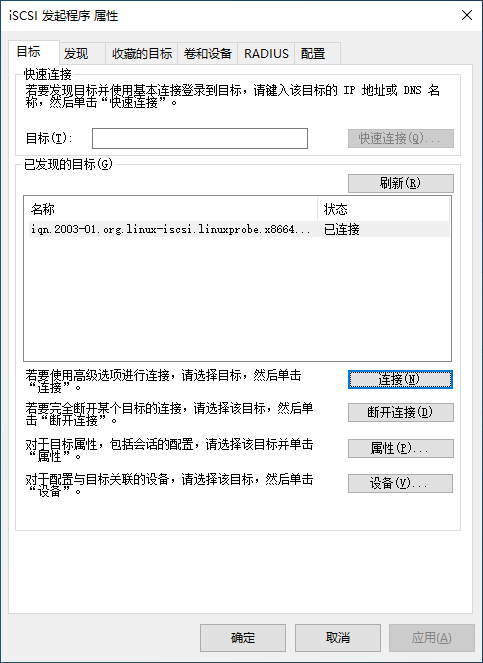

# iSCSI

[TOC]

## 概述

传统的 SCSI (Small Computer System Interface，小型计算机系统接口) 技术是存储设备最基本的标准协议，但通常需要设备互相靠近并用 SCSI 总线链接，因此受到了物理环境的限制。

iSCSI（Internet Small Computer System Interface，互联网小型计算机系统接口）是由 IBM 公司研究开发用于实现在 IP 网络上运行 SCSI 协议的新存储技术，即能够让 SCSI 接口与以太网技术相结合，使用 iSCSI 协议基于以太网传送 SCSI 命令与数据，克服了 SCSI 需要直接连接存储设备的局限性，使得可以跨越不同的服务器共享存储设备，并可以做到不停机状态下扩展存储容量。

SAN (Storage Area Network，存储区域网络技术) 便是基于 iSCSI 存储协议，采用高速光纤通道传输存储数据的服务程序。

服务器会基于 iSCSI 协议将 SCSI 设备、命令与数据打包成标准的 TCP/IP 包然后通过 IP 网络传输到目标存储设备，而远端存储设备接收到数据包后需要基于 iSCSI 协议将 TCP/IP 包解包成 SCSI 设备、命令与数据，这个过程无疑会消耗系统 CPU 资源，因此可以将 SCSI 协议的封装动作交由独立的 iSCSI HBA 卡来处理，减少了对服务器性能的影响。

与一般的网卡不同（连接网络总线和内存，供计算机上网使用），iSCSI-HBA 卡连接的是 SCSI 接口或 FC（光纤通道）总线和内存，专门用于在主机之间交换存储数据，其使用的协议也与一般网卡有本质的不同。

iSCSI技术在生产环境中的优势和劣势：

* iSCSI 存储技术非常便捷，在访问存储资源的形式上发生了很大变化，摆脱了物理环境的限制，同时还可以把存储资源分给多个服务器共同使用，因此是一种非常推荐使用的存储技术。
* iSCSI 存储技术受到了网速的制约。以往硬盘设备直接通过主板上的总线进行数据传输，现在则需要让互联网作为数据传输的载体和通道，因此传输速率和稳定性是 iSCSI 技术的瓶颈。随着网络技术的持续发展，iSCSI 技术也会随之得以改善。

## iSCSI存储
iSCSI 的工作方式分为服务端（target）与客户端（initiator）。

iSCSI 服务端即用于存放硬盘存储资源的服务器，能够为用户提供可用的存储资源。

iSCSI 客户端则是用户使用的软件，用于访问远程服务端的存储资源。

LUN (Logical Unit Number，逻辑单元) 是 iSCSI 协议中的重要概念。当客户机想要使用服务端存储设备时必需输入对应的名称 (Target ID) ，而一个服务端可能会同时提供多个可用的存储设备，便用 LUN 来详细的描述设备或对象，同时每个 LUN Device 可能代表一个硬盘或 RAID 设备。LUN的名称由用户指定。

## 配置iSCSI服务端

### 方案1  targetd

1. 准备作为 LUN 发布的存储设备。

2. 安装 iSCSI target 服务程序及配置工具，并启动服务。

   ```bash
   yum install targetd targetcli
   dnf install targetd targetcli
   
   systemctl start targetd
   systemctl enable targetd
   ```

3. 创建存储对象。

   targetcli 命令用于管理 iSCSI target 存储设备，格式为：

   ```bash
   targetcli
   ```

   查看当前的存储目录树：

   ```bash
   /> ls
   o- / ..................................................................... [...]
     o- backstores .......................................................... [...]
     | o- block .............................................. [Storage Objects: 0]
     | o- fileio ............................................. [Storage Objects: 0]
     | o- pscsi .............................................. [Storage Objects: 0]
     | o- ramdisk ............................................ [Storage Objects: 0]
     o- iscsi ........................................................ [Targets: 0]
     o- loopback ..................................................... [Targets: 0]
     
   # /backstores/block 是 iSCSI 服务端配置共享设备的位置。
   ```

   进入/backstores/block目录中：

   ```bash
   /> cd /backstores/block
   /backstores/block>
   ```

   使用/dev/md0创建设备disk0：

   ```bash
   /backstores/block> create disk0 /dev/md0
   Created block storage object disk0 using /dev/md0.
   ```

   返回到根目录中：

   ```bash
   /backstores/block> cd ..
   /backstores> cd ..
   />
   ```

   查看创建后的设备：

   ```bash
   /> ls
   o- / ................................................................... [...]
     o- backstores ........................................................ [...]
     | o- block ............................................ [Storage Objects: 1]
     | | o- disk0 ................... [/dev/md0 (40.0GiB) write-thru deactivated]
     | o- fileio ........................................... [Storage Objects: 0]
     | o- pscsi ............................................ [Storage Objects: 0]
     | o- ramdisk .......................................... [Storage Objects: 0]
     o- iscsi ...................................................... [Targets: 0]
     o- loopback ................................................... [Targets: 0]
   ```

4. 配置iSCSI target目标。

   进入到iscsi目录中：

   ```bash
   /> cd iscsi
   /iscsi>
   ```

   创建iSCSI target目标：

   ```bash
   /iscsi> create
   Created target iqn.2003-01.org.linux-iscsi.linuxprobe.x8664:sn.d497c356ad80.
   Created TPG 1.
   ```

   依次进入到target的luns目录中：

   ```bash
   /iscsi> cd iqn.2003-01.org.linux-iscsi.linuxprobe.x8664:sn.d497c356ad80/
   /iscsi/iqn.20....d497c356ad80> ls
   o- iqn.2003-01.org.linux-iscsi.linuxprobe.x8664:sn.d497c356ad80 ..... [TPGs: 1]
     o- tpg1 .............................................. [no-gen-acls, no-auth]
       o- acls ......................................................... [ACLs: 0]
       o- luns ......................................................... [LUNs: 0]
       o- portals ................................................... [Portals: 0]
   /iscsi/iqn.20....d497c356ad80> cd tpg1/
   /iscsi/iqn.20...c356ad80/tpg1> cd luns
   /iscsi/iqn.20...d80/tpg1/luns>
   ```

   创建LUN设备：

   ```bash
   /iscsi/iqn.20...d80/tpg1/luns> create /backstores/block/disk0
   Created LUN 0.
   ```

5. 设置访问控制列表。iSCSI 协议是通过客户端名称进行验证的。用户在访问存储共享资源时不需要输入密码，只要 iSCSI 客户端的名称与服务端中设置的访问控制列表中某一名称条目一致即可，因此需要在 iSCSI 服务端的配置文件中写入一串能够验证用户信息的名称。acls 参数目录用于存放能够访问 iSCSI 服务端共享存储资源的客户端名称。

   切换到acls目录中：

   ```bash
   /iscsi/iqn.20...d80/tpg1/luns> cd ..
   /iscsi/iqn.20...c356ad80/tpg1> cd acls
   ```

   创建访问控制列表：

   ```bash
   /iscsi/iqn.20...d80/tpg1/acls> create iqn.2003-01.org.linux-iscsi.linuxprobe.x8664:sn.d497c356ad80:client
   Created Node ACL for iqn.2003-01.org.linux-iscsi.linuxprobe.x8664:sn.d497c356ad80:client
   Created mapped LUN 0.
   ```

   切换到portals目录中：

   ```bash
   /iscsi/iqn.20...d80/tpg1/acls> cd ..
   /iscsi/iqn.20...c356ad80/tpg1> cd portals
   ```

   设置 iSCSI 服务端的监听 IP 地址和端口号。位于生产环境中的服务器上可能有多块网卡，可以进行选择。

   ```bash
   /iscsi/iqn.20.../tpg1/portals> create 192.168.10.10
   Using default IP port 3260
   Created network portal 192.168.10.10:3260.
   ```

   在配置文件中默认是允许所有网卡提供iSCSI服务，如果认为这有些许不安全，可以手动删除：

   ```bash
   /iscsi/iqn.20.../tpg1/portals> delete 0.0.0.0 3260
   Deleted network portal 0.0.0.0:3260
   ```

6. 查看配置概述后退出工具：

   ```bash
   /iscsi/iqn.20.../tpg1/portals> ls /
   o- / ........................... [...]
     o- backstores................. [...]
     | o- block ................... [Storage Objects: 1]
     | | o- disk0 ................. [/dev/md0 (40.0GiB) write-thru activated]
     | o- fileio .................. [Storage Objects: 0]
     | o- pscsi ................... [Storage Objects: 0]
     | o- ramdisk ................. [Storage Objects: 0]
     o- iscsi ..................... [Targets: 1]
     | o- iqn.2003-01.org.linux-iscsi.linuxprobe.x8664:sn.d497c356ad0 .. [TPGs: 1]
     |   o- tpg1 .................. [no-gen-acls, no-auth]
     |     o- acls ..................................................... [ACLs: 1]
     |     | o- iqn.2003-01.org.linux-iscsi.linuxprobe.x8664:sn.d497c356ad80:client [Mapped LUNs: 1]
     |     |   o- mapped_lun0 .......................... [lun0 block/disk0 (rw)]  
       o- luns .................... [LUNs: 1]
     |     | o- lun0 .............. [block/disk0 (/dev/md0)]
     |     o- portals ............. [Portals: 1]
     |       o- 192.168.10.10:3260  [OK]
     o- loopback .................. [Targets: 0]
   /> exit
   Global pref auto_save_on_exit=true
   Last 10 configs saved in /etc/target/backup.
   Configuration saved to /etc/target/saveconfig.json
   ```

7. 创建防火墙允许规则：

   ```bash
   firewall-cmd --permanent  --add-port=3260/tcp
   firewall-cmd --reload
   ```

## 配置iSCSI客户端

### Linux

1. 在CentOS 7/8系统中，已经默认安装了iSCSI客户端服务程序initiator。

   ```bash
   yum install iscsi-initiator-utils
   dnf install iscsi-initiator-utils
   ```

2. 编辑的iscsi客户端名称文件，该名称是initiator客户端的唯一标识。iSCSI 协议是通过客户端的名称来进行验证的，而该名称也是 iSCSI 客户端的唯一标识，而且必须与服务端配置文件中访问控制列表中的信息一致，否则客户端在尝试访问存储共享设备时，系统会弹出验证失败的保存信息。

   ```bash
   vim /etc/iscsi/initiatorname.iscsi
   InitiatorName=iqn.2003-01.org.linux-scsi.linuxprobe.x8664:sn.d497c356ad80:client
   ```

3. 重启iscsi客户端服务程序，并将iscsi客户端服务程序添加到开机启动项中：

   ```bash
   systemctl restart iscsid
   systemctl enable iscsid
   ```

4. 发现iscsi服务端的可用存储设备：

   iscsiadm 命令用于管理（插入、查询、更新或删除）iSCSI 数据库配置文件的命令行工具。

   需先使用工具扫描发现远程 iSCSI 服务端，然后查看找到的服务端上有哪些可用的共享存储资源。

   ```bash
   iscsiadm -m discovery -t st -p 192.168.10.10
   192.168.10.10:3260,1 iqn.2003-01.org.linux-iscsi.linuxprobe.x8664:sn.d497c356ad80
   
   # -m discovery      扫描并发现可用的存储资源
   # -t st             执行扫描操作的类型
   # -p 192.168.10.10  iSCSI服务端的IP地址
   ```

5. 连接iscsi服务端的可用存储设备：

   ```bash
   iscsiadm -m node -T iqn.2003-01.org.linux-iscsi.linuxprobe.x8664:sn.d497c356ad80 -p 192.168.10.10 --login
   
   # -m  node           将客户端所在主机作为一台节点服务器
   # -T                 要使用的存储资源
   # -p  192.168.10.10  对方iSCSI服务端的IP地址
   # --login 或 -l      进行登录验证
   ```

6. 由于udev 服务是按照系统识别硬盘设备的顺序来命名硬盘设备的，当客户端主机同时使用多个远程存储资源时，如果下一次识别远程设备的顺序发生了变化，则客户端挂载目录中的文件也将随之混乱。为了防止发生这样的问题，应该在 /etc/fstab 配置文件中使用设备的 UUID 进行挂载。这样，不论远程设备资源的识别顺序再怎么变化，系统也能正确找到设备所对应的目录。查看设备的UUID值：

   ```bash
   blkid | grep /dev/sdb
   /dev/sdb: UUID="eb9cbf2f-fce8-413a-b770-8b0f243e8ad6" TYPE="xfs"
   ```

7. 设置为开机后自动挂载时，因为 iSCSI 服务程序基于 IP 网络传输数据，所以必需在 fstab 文件中添加参数 `_netdev` ，代表网络联通后再挂载：

   ```bash
   vim /etc/fstab
   UUID=eb9cbf2f-fce8-413a-b770-8b0f243e8ad6 /iscsi xfs defaults,_netdev 0 0
   ```

8. 卸载

   ```bash
   iscsiadm -m node -T iqn.2003-01.org.linux-iscsi.linuxprobe.x8664:sn.d497c356ad80 -u
   ```

### Windows

1. 运行 iSCSI 发起程序。在 Windows 10 操作系统中已经默认安装了iSCSI客户端程序，只需在控制面板中找到“系统和安全”标签，然后单击“管理工具”，进入到“管理工具”页面后即可看到“ iSCSI 发起程序”图标。双击该图标，在第一次运行 iSCSI 发起程序时，系统会提示 “Microsoft iSCSI服务端未运行”，单击 “是” 按钮即可自动启动并运行 iSCSI 发起程序。

   

   

2. 扫描发现 iSCSI 服务端上可用的存储资源。运行 iSCSI 发起程序后在“目标”选项卡的“目标”文本框中写入 iSCSI 服务端的 IP 地址，然后单击“快速连接”按钮。在弹出的“快速连接”对话框中可看到共享的硬盘存储资源，此时显示“无法登录到目标”属于正常情况，单击“完成”按钮即可。

   

   

3. 回到“目标”选项卡页面，可以看到共享存储资源的名称已经出现。

   

4. 准备连接 iSCSI 服务端的共享存储资源。由于在 iSCSI 服务端程序上设置了 ACL，使得只有客户端名称与 ACL 策略中的名称保持一致时才能使用远程存储资源，因此首先需要在“配置”选项卡中单击“更改”按钮，随后在修改界面写入 iSCSI 服务器配置过的 ACL 策略名称，最后重新返回到 iSCSI 发起程序的“目标”界面。

   

   

5. 在确认 iSCSI 发起程序名称与 iSCSI 服务器 ACL 策略一致后，重新单击“连接”按钮，并单击“确认”按钮。大约1～3秒后，状态会更新为“已连接”。

   

   

6. 完成连接。

   

7. 硬盘初始化。