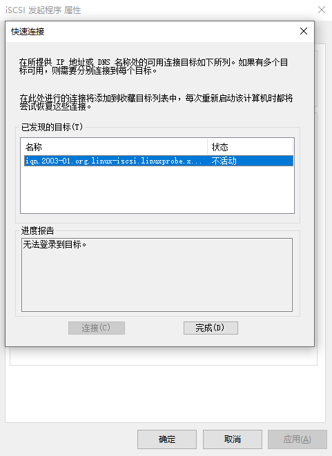
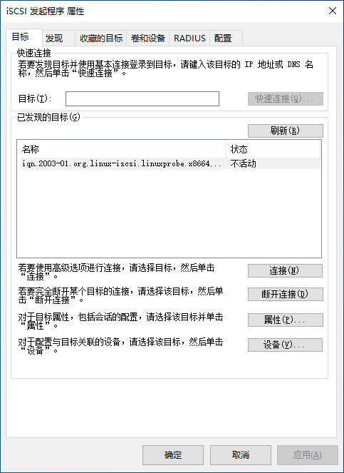
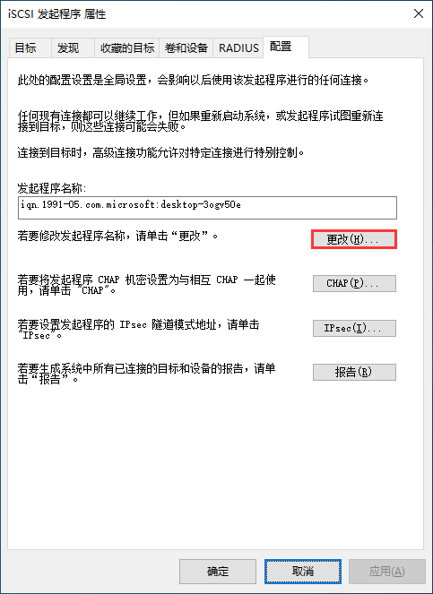
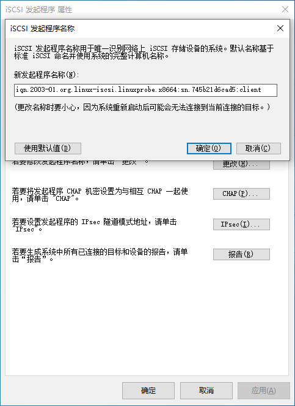
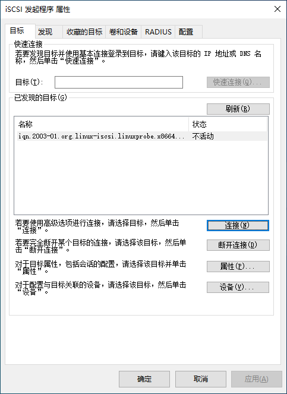

# iSCSI

[TOC]

## 概述

传统的 SCSI (Small Computer System Interface，小型计算机系统接口) 技术是存储设备最基本的标准协议，但通常需要设备互相靠近并用 SCSI 总线链接，因此受到了物理环境的限制。

iSCSI（Internet Small Computer System Interface，互联网小型计算机系统接口）是由 IBM 公司研究开发用于实现在 IP 网络上运行 SCSI 协议的新存储技术，即能够让 SCSI 接口与以太网技术相结合，使用 iSCSI 协议基于以太网传送 SCSI 命令与数据，克服了 SCSI 需要直接连接存储设备的局限性，使得可以跨越不同的服务器共享存储设备，并可以做到不停机状态下扩展存储容量。

iSCSI 是 Internet Small Computer Systems  Interface 的首字母缩写，是一种基于 Internet 协议（IP）的存储网络标准，用于链接数据存储设施。它通过 TCP/IP 网络传输  SCSI 命令，提供对存储设备的块级访问。

SAN (Storage Area Network，存储区域网络技术) 便是基于 iSCSI 存储协议，采用高速光纤通道传输存储数据的服务程序。

服务器会基于 iSCSI 协议将 SCSI 设备、命令与数据打包成标准的 TCP/IP 包然后通过 IP 网络传输到目标存储设备，而远端存储设备接收到数据包后需要基于 iSCSI 协议将 TCP/IP 包解包成 SCSI 设备、命令与数据，这个过程无疑会消耗系统 CPU 资源，因此可以将 SCSI 协议的封装动作交由独立的 iSCSI HBA 卡来处理，减少了对服务器性能的影响。

与一般的网卡不同（连接网络总线和内存，供计算机上网使用），iSCSI-HBA 卡连接的是 SCSI 接口或 FC（光纤通道）总线和内存，专门用于在主机之间交换存储数据，其使用的协议也与一般网卡有本质的不同。

iSCSI is used to facilitate data transfers over [intranets](https://en.wikipedia.org/wiki/Intranet) and to manage storage over long distances. It can be used to transmit data over [local area networks](https://en.wikipedia.org/wiki/Local_area_network) (LANs), [wide area networks](https://en.wikipedia.org/wiki/Wide_area_network) (WANs), or the [Internet](https://en.wikipedia.org/wiki/Internet) and can enable location-independent data storage and retrieval.
iSCSI 用于促进通过 Intranet 传输数据并管理远距离存储。它可用于通过局域网 （LAN）、广域网 （WAN） 或 Internet 传输数据，并可以实现与位置无关的数据存储和检索。

The [protocol](https://en.wikipedia.org/wiki/Protocol_(computing)) allows clients (called  *initiators*) to send SCSI commands ([*CDBs*](https://en.wikipedia.org/wiki/SCSI_CDB)) to storage devices (*targets*) on remote servers.  It is a [storage area network](https://en.wikipedia.org/wiki/Storage_area_network) (SAN) protocol, allowing organizations to consolidate storage into [storage arrays](https://en.wikipedia.org/wiki/Storage_array) while providing clients (such as database and web servers) with the illusion of locally attached SCSI disks.
该协议允许客户端（称为启动器）将 SCSI 命令 （CDB） 发送到远程服务器上的存储设备（目标）。它是一种存储区域网络 （SAN） 协议，允许组织将存储整合到存储阵列中，同时为客户端（如数据库和 Web 服务器）提供本地连接的 SCSI 磁盘的错觉。

It mainly competes with [Fibre Channel](https://en.wikipedia.org/wiki/Fibre_Channel), but unlike traditional Fibre Channel, which usually requires dedicated  cabling, iSCSI can be run over long distances using existing network  infrastructure.

它主要与光纤通道竞争，但与通常需要专用布线的传统光纤通道不同，iSCSI可以使用现有的网络基础设施进行长距离运行。

iSCSI技术在生产环境中的优势和劣势：

* iSCSI 存储技术非常便捷，在访问存储资源的形式上发生了很大变化，摆脱了物理环境的限制，同时还可以把存储资源分给多个服务器共同使用，因此是一种非常推荐使用的存储技术。
* iSCSI 存储技术受到了网速的制约。以往硬盘设备直接通过主板上的总线进行数据传输，现在则需要让互联网作为数据传输的载体和通道，因此传输速率和稳定性是 iSCSI 技术的瓶颈。随着网络技术的持续发展，iSCSI 技术也会随之得以改善。

## 架构

iSCSI 分为服务端（target）与客户端（initiator）。

* iSCSI  target 即用于存放硬盘存储资源的服务器，能够为用户提供可用的存储资源。
* iSCSI initiator 则是用户使用的软件，用于访问远程服务端的存储资源。

LUN (Logical Unit Number，逻辑单元) 是 iSCSI 协议中的重要概念。当客户机想要使用服务端存储设备时必需输入对应的名称 (Target ID) ，而一个服务端可能会同时提供多个可用的存储设备，便用 LUN 来详细的描述设备或对象，同时每个 LUN Device 可能代表一个硬盘或 RAID 设备。LUN 的名称由用户指定。

## 实现

### Open-iSCSI

http://www.open-iscsi.org/

The Open-iSCSI project provides a high-performance, transport independent, implementation of [RFC 3720 iSCSI](https://tools.ietf.org/html/rfc7143) for Linux.
Open-iSCSI 项目提供了用于 Linux 的 [RFC 3720 iSCSI](https://tools.ietf.org/html/rfc7143) 的高性能、独立于传输的实现。

Open-iSCSI 分为用户部分和内核部分。

Open-iSCSI 的内核部分作为 Linux 内核的一部分进行维护，并根据 GPLv2 获得许可。内核部分实现 iSCSI 数据路径（即 iSCSI 读取和 iSCSI 写入），由多个可加载的内核模块和驱动程序组成。

Open-ISCSI 用户空间维护在项目 [GitHub](https://github.com/open-iscsi/) 上。

用户空间包含整个控制平面：配置管理器、iSCSI 发现、登录和注销处理、connection-level error processing连接级错误处理、Nop-In 和 Nop-Out 处理等。

Open-iSCSI 用户空间由一个名为 iscsid 的守护进程和管理实用程序 iscsiadm 组成。

### Linux SCSI target framework (tgt)

http://stgt.sourceforge.net/

### Linux-iSCSI Project

http://linux-iscsi.sourceforge.net/

## 配置 iSCSI 客户端（Initiator）

### 配置

1. 发现 iscsi 服务端的可用存储设备：

   iscsiadm 命令用于管理（插入、查询、更新或删除）iSCSI 数据库配置文件的命令行工具。

   需先使用工具扫描发现远程 iSCSI 服务端，然后查看找到的服务端上有哪些可用的共享存储资源。

   ```bash
   iscsiadm -m     discovery -t     st          -p       192.168.0.20
   iscsiadm --mode discovery --type sendtargets --portal 192.168.0.20
   
   192.168.0.20:3260,1 iqn.2003-01.org.linux-iscsi.linurobe.x86:sn.d49d80
   
   # -m discovery      扫描并发现可用的存储资源
   # -t st             执行扫描操作的类型
   # -p 192.168.10.10  iSCSI服务端的IP地址
   ```

2. 连接 iscsi 服务端的可用存储设备：

   ```bash
   iscsiadm -m     node  -T           iqn.2003-01.org.linux-iscsi.linurobe.x86:sn.d49d80 -p       192.168.0.20:3260 --login
   iscsiadm --mode node  --targetname iqn.2003-01.org.linux-iscsi.linurobe.x86:sn.d49d80 --portal 192.168.0.20:3260 --login
   
   # -m  node           将客户端所在主机作为一台节点服务器
   # -T                 要使用的存储资源
   # -p  192.168.10.10  对方iSCSI服务端的IP地址
   # --login 或 -l      进行登录验证
   ```

3. 验证是否已创建 iscsi 会话：

   ```bash
   iscsiadm --mode session --print=1 
   ```

   如果会话成功启动，将显示一个新的 `/dev/sdx` 设备，自动链接到 `/dev/disk/by-path/ip-*` 。然后，可以像使用普通磁盘一样使用该设备。

4. 由于udev 服务是按照系统识别硬盘设备的顺序来命名硬盘设备的，当客户端主机同时使用多个远程存储资源时，如果下一次识别远程设备的顺序发生了变化，则客户端挂载目录中的文件也将随之混乱。为了防止发生这样的问题，应该在 /etc/fstab 配置文件中使用设备的 UUID 进行挂载。这样，不论远程设备资源的识别顺序再怎么变化，系统也能正确找到设备所对应的目录。查看设备的UUID值：

   ```bash
   blkid | grep /dev/sdb
   /dev/sdb: UUID="eb9cbf2f-fce8-413a-b770-8b0f243e8ad6" TYPE="xfs"
   ```

5. 设置为开机后自动挂载时，因为 iSCSI 服务程序基于 IP 网络传输数据，所以必需在 fstab 文件中添加参数 `_netdev` ，代表网络联通后再挂载：

   ```bash
   vim /etc/fstab
   UUID=eb9cbf2f-fce8-413a-b770-8b0f243e8ad6 /iscsi xfs defaults,_netdev 0 0
   ```

6. 卸载

   ```bash
   iscsiadm -m     node -T           iqn.2003-01.org.linux-iscsi.linurobe.x86:sn.d49d80 -u
   iscsiadm --mode node --targetname iqn.2003-01.org.linux-iscsi.linurobe.x86:sn.d49d80 --logout
   ```

### Ubuntu

要将 Ubuntu Server 配置为 iSCSI 启动器，请安装 open-iscsi 软件包。在终端中输入：

```bash
apt install open-iscsi
```

安装软件包后，将找到以下文件：

- /etc/iscsi/iscsid.conf
- /etc/iscsi/initiatorname.iscsi

配置主配置文件 `/etc/iscsi/iscsid.conf`，如以下示例所示：

```bash
### startup settings

## will be controlled by systemd, leave as is
iscsid.startup = /usr/sbin/iscsidnode.startup = manual

### chap settings

# node.session.auth.authmethod = CHAP

## authentication of initiator by target (session)
# node.session.auth.username = username
# node.session.auth.password = password

# discovery.sendtargets.auth.authmethod = CHAP

## authentication of initiator by target (discovery)
# discovery.sendtargets.auth.username = username
# discovery.sendtargets.auth.password = password

### timeouts

## control how much time iscsi takes to propagate an error to the
## upper layer. if using multipath, having 0 here is desirable
## so multipath can handle path errors as quickly as possible
## (and decide to queue or not if missing all paths)
node.session.timeo.replacement_timeout = 0

node.conn[0].timeo.login_timeout = 15
node.conn[0].timeo.logout_timeout = 15

## interval for a NOP-Out request (a ping to the target)
node.conn[0].timeo.noop_out_interval = 5

## and how much time to wait before declaring a timeout
node.conn[0].timeo.noop_out_timeout = 5

## default timeouts for error recovery logics (lu & tgt resets)
node.session.err_timeo.abort_timeout = 15
node.session.err_timeo.lu_reset_timeout = 30
node.session.err_timeo.tgt_reset_timeout = 30

### retry

node.session.initial_login_retry_max = 8

### session and device queue depth

node.session.cmds_max = 128
node.session.queue_depth = 32

### performance

node.session.xmit_thread_priority = -20
```

并重新启动 iSCSI 守护程序：

```bash
systemctl restart iscsid.service
```

这将为其余的配置设置基本内容。

另一个提到的文件 `/etc/iscsi/initiatorname.iscsi`：

```bash
InitiatorName=iqn.1993-08.org.debian:01:60f3517884c3
```

包含此节点的启动器名称，并在 open-iscsi 软件包安装期间生成。如果修改此设置，请确保同一 iSCSI SAN（存储区域网络）中没有重复项。

### RHEL / CentOS

1. 在 CentOS 7/8 系统中，已经默认安装了 iSCSI 客户端服务程序 initiator 。

   ```bash
   yum install iscsi-initiator-utils
   dnf install iscsi-initiator-utils
   ```

2. 编辑 iscsi 客户端名称文件，该名称是 initiator 客户端的唯一标识。iSCSI 协议是通过客户端的名称来进行验证的，而该名称也是 iSCSI 客户端的唯一标识，而且必须与服务端配置文件中访问控制列表中的信息一致，否则客户端在尝试访问存储共享设备时，系统会弹出验证失败的保存信息。

   ```bash
   vim /etc/iscsi/initiatorname.iscsi
   InitiatorName=iqn.2003-01.org.linux-scsi.linuxprobe.x8664:sn.d497c356ad80:client
   ```

3. 重启 iscsi 客户端服务程序，并将 iscsi 客户端服务程序添加到开机启动项中：

   ```bash
   systemctl restart iscsid
   systemctl enable iscsid
   ```

### Windows

运行 iSCSI 发起程序。在 Windows 10 操作系统中已经默认安装了iSCSI客户端程序，只需在控制面板中找到“系统和安全”标签，然后单击“管理工具”，进入到“管理工具”页面后即可看到“ iSCSI 发起程序”图标。双击该图标，在第一次运行 iSCSI 发起程序时，系统会提示 “Microsoft iSCSI服务端未运行”，单击 “是” 按钮即可自动启动并运行 iSCSI 发起程序。

 

 

扫描发现 iSCSI 服务端上可用的存储资源。运行 iSCSI 发起程序后在“目标”选项卡的“目标”文本框中写入 iSCSI 服务端的 IP 地址，然后单击“快速连接”按钮。在弹出的“快速连接”对话框中可看到共享的硬盘存储资源，此时显示“无法登录到目标”属于正常情况，单击“完成”按钮即可。

 

 

回到“目标”选项卡页面，可以看到共享存储资源的名称已经出现。

 

准备连接 iSCSI 服务端的共享存储资源。由于在 iSCSI 服务端程序上设置了 ACL，使得只有客户端名称与 ACL 策略中的名称保持一致时才能使用远程存储资源，因此首先需要在“配置”选项卡中单击“更改”按钮，随后在修改界面写入 iSCSI 服务器配置过的 ACL 策略名称，最后重新返回到 iSCSI 发起程序的“目标”界面。

 

 

在确认 iSCSI 发起程序名称与 iSCSI 服务器 ACL 策略一致后，重新单击“连接”按钮，并单击“确认”按钮。大约1～3秒后，状态会更新为“已连接”。

 

 

完成连接。

 

硬盘初始化。

## iSCSI Network Configuration

Before configuring the Logical Units that are going to be accessed by the initiator, it is important to inform the iSCSI service what are the interfaces acting as paths.

A straightforward way to do that is by:

- configuring the following environment variables

```auto
$ iscsi01_ip=$(ip -4 -o addr show iscsi01 | sed -r 's:.* (([0-9]{1,3}\.){3}[0-9]{1,3})/.*:\1:')
$ iscsi02_ip=$(ip -4 -o addr show iscsi02 | sed -r 's:.* (([0-9]{1,3}\.){3}[0-9]{1,3})/.*:\1:')

$ iscsi01_mac=$(ip -o link show iscsi01 | sed -r 's:.*\s+link/ether (([0-f]{2}(\:|)){6}).*:\1:g')
$ iscsi02_mac=$(ip -o link show iscsi02 | sed -r 's:.*\s+link/ether (([0-f]{2}(\:|)){6}).*:\1:g')
```

- configuring **iscsi01** interface

```auto
$ sudo iscsiadm -m iface -I iscsi01 --op=new
New interface iscsi01 added
$ sudo iscsiadm -m iface -I iscsi01 --op=update -n iface.hwaddress -v $iscsi01_mac
iscsi01 updated.
$ sudo iscsiadm -m iface -I iscsi01 --op=update -n iface.ipaddress -v $iscsi01_ip
iscsi01 updated.
```

- configuring **iscsi02** interface

```auto
$ sudo iscsiadm -m iface -I iscsi02 --op=new
New interface iscsi02 added
$ sudo iscsiadm -m iface -I iscsi02 --op=update -n iface.hwaddress -v $iscsi02_mac
iscsi02 updated.
$ sudo iscsiadm -m iface -I iscsi02 --op=update -n iface.ipaddress -v $iscsi02_ip
iscsi02 updated.
```

- discovering the **targets**

```auto
$ sudo iscsiadm -m discovery -I iscsi01 --op=new --op=del --type sendtargets --portal storage.iscsi01
10.250.94.99:3260,1 iqn.2003-01.org.linux-iscsi.storage.x8664:sn.2c084c8320ca

$ sudo iscsiadm -m discovery -I iscsi02 --op=new --op=del --type sendtargets --portal storage.iscsi02
10.250.93.99:3260,1 iqn.2003-01.org.linux-iscsi.storage.x8664:sn.2c084c8320ca
```

- configuring **automatic login**

```auto
$ sudo iscsiadm -m node --op=update -n node.conn[0].startup -v automatic
$ sudo iscsiadm -m node --op=update -n node.startup -v automatic
```

- make sure needed **services** are enabled during OS initialization:

```auto
$ systemctl enable open-iscsi
Synchronizing state of open-iscsi.service with SysV service script with /lib/systemd/systemd-sysv-install.
Executing: /lib/systemd/systemd-sysv-install enable open-iscsi
Created symlink /etc/systemd/system/iscsi.service → /lib/systemd/system/open-iscsi.service.
Created symlink /etc/systemd/system/sysinit.target.wants/open-iscsi.service → /lib/systemd/system/open-iscsi.service.

$ systemctl enable iscsid
Synchronizing state of iscsid.service with SysV service script with /lib/systemd/systemd-sysv-install.
Executing: /lib/systemd/systemd-sysv-install enable iscsid
Created symlink /etc/systemd/system/sysinit.target.wants/iscsid.service → /lib/systemd/system/iscsid.service.
```

- restarting **iscsid** service

```auto
$ systemctl restart iscsid.service
```

- and, finally, **login in** discovered logical units

```auto
$ sudo iscsiadm -m node --loginall=automatic
Logging in to [iface: iscsi02, target: iqn.2003-01.org.linux-iscsi.storage.x8664:sn.2c084c8320ca, portal: 10.250.93.99,3260] (multiple)
Logging in to [iface: iscsi01, target: iqn.2003-01.org.linux-iscsi.storage.x8664:sn.2c084c8320ca, portal: 10.250.94.99,3260] (multiple)
Login to [iface: iscsi02, target: iqn.2003-01.org.linux-iscsi.storage.x8664:sn.2c084c8320ca, portal: 10.250.93.99,3260] successful.
Login to [iface: iscsi01, target: iqn.2003-01.org.linux-iscsi.storage.x8664:sn.2c084c8320ca, portal: 10.250.94.99,3260] successful.
```

## Accessing the Logical Units (or LUNs)

Check dmesg to make sure that the new disks have been detected:

> dmesg
>
> ```auto
> [  166.840694] scsi 7:0:0:4: Direct-Access     LIO-ORG  TCMU device >      0002 PQ: 0 ANSI: 5
> [  166.840892] scsi 8:0:0:4: Direct-Access     LIO-ORG  TCMU device >      0002 PQ: 0 ANSI: 5
> [  166.841741] sd 7:0:0:4: Attached scsi generic sg2 type 0
> [  166.841808] sd 8:0:0:4: Attached scsi generic sg3 type 0
> [  166.842278] scsi 7:0:0:3: Direct-Access     LIO-ORG  TCMU device >      0002 PQ: 0 ANSI: 5
> [  166.842571] scsi 8:0:0:3: Direct-Access     LIO-ORG  TCMU device >      0002 PQ: 0 ANSI: 5
> [  166.843482] sd 8:0:0:3: Attached scsi generic sg4 type 0
> [  166.843681] sd 7:0:0:3: Attached scsi generic sg5 type 0
> [  166.843706] sd 8:0:0:4: [sdd] 2097152 512-byte logical blocks: > (1.07 GB/1.00 GiB)
> [  166.843884] scsi 8:0:0:2: Direct-Access     LIO-ORG  TCMU device >      0002 PQ: 0 ANSI: 5
> [  166.843971] sd 8:0:0:4: [sdd] Write Protect is off
> [  166.843972] sd 8:0:0:4: [sdd] Mode Sense: 2f 00 00 00
> [  166.844127] scsi 7:0:0:2: Direct-Access     LIO-ORG  TCMU device >      0002 PQ: 0 ANSI: 5
> [  166.844232] sd 7:0:0:4: [sdc] 2097152 512-byte logical blocks: > (1.07 GB/1.00 GiB)
> [  166.844421] sd 8:0:0:4: [sdd] Write cache: enabled, read cache: > enabled, doesn't support DPO or FUA
> [  166.844566] sd 7:0:0:4: [sdc] Write Protect is off
> [  166.844568] sd 7:0:0:4: [sdc] Mode Sense: 2f 00 00 00
> [  166.844846] sd 8:0:0:2: Attached scsi generic sg6 type 0
> [  166.845147] sd 7:0:0:4: [sdc] Write cache: enabled, read cache: > enabled, doesn't support DPO or FUA
> [  166.845188] sd 8:0:0:4: [sdd] Optimal transfer size 65536 bytes
> [  166.845527] sd 7:0:0:2: Attached scsi generic sg7 type 0
> [  166.845678] sd 8:0:0:3: [sde] 2097152 512-byte logical blocks: > (1.07 GB/1.00 GiB)
> [  166.845785] scsi 8:0:0:1: Direct-Access     LIO-ORG  TCMU device >      0002 PQ: 0 ANSI: 5
> [  166.845799] sd 7:0:0:4: [sdc] Optimal transfer size 65536 bytes
> [  166.845931] sd 8:0:0:3: [sde] Write Protect is off
> [  166.845933] sd 8:0:0:3: [sde] Mode Sense: 2f 00 00 00
> [  166.846424] scsi 7:0:0:1: Direct-Access     LIO-ORG  TCMU device >      0002 PQ: 0 ANSI: 5
> [  166.846552] sd 8:0:0:3: [sde] Write cache: enabled, read cache: > enabled, doesn't support DPO or FUA
> [  166.846708] sd 7:0:0:3: [sdf] 2097152 512-byte logical blocks: > (1.07 GB/1.00 GiB)
> [  166.847024] sd 8:0:0:1: Attached scsi generic sg8 type 0
> [  166.847029] sd 7:0:0:3: [sdf] Write Protect is off
> [  166.847031] sd 7:0:0:3: [sdf] Mode Sense: 2f 00 00 00
> [  166.847043] sd 8:0:0:3: [sde] Optimal transfer size 65536 bytes
> [  166.847133] sd 8:0:0:2: [sdg] 2097152 512-byte logical blocks: > (1.07 GB/1.00 GiB)
> [  166.849212] sd 8:0:0:2: [sdg] Write Protect is off
> [  166.849214] sd 8:0:0:2: [sdg] Mode Sense: 2f 00 00 00
> [  166.849711] sd 7:0:0:3: [sdf] Write cache: enabled, read cache: > enabled, doesn't support DPO or FUA
> [  166.849718] sd 7:0:0:1: Attached scsi generic sg9 type 0
> [  166.849721] sd 7:0:0:2: [sdh] 2097152 512-byte logical blocks: > (1.07 GB/1.00 GiB)
> [  166.853296] sd 8:0:0:2: [sdg] Write cache: enabled, read cache: > enabled, doesn't support DPO or FUA
> [  166.853721] sd 8:0:0:2: [sdg] Optimal transfer size 65536 bytes
> [  166.853810] sd 7:0:0:2: [sdh] Write Protect is off
> [  166.853812] sd 7:0:0:2: [sdh] Mode Sense: 2f 00 00 00
> [  166.854026] sd 7:0:0:3: [sdf] Optimal transfer size 65536 bytes
> [  166.854431] sd 7:0:0:2: [sdh] Write cache: enabled, read cache: > enabled, doesn't support DPO or FUA
> [  166.854625] sd 8:0:0:1: [sdi] 2097152 512-byte logical blocks: > (1.07 GB/1.00 GiB)
> [  166.854898] sd 8:0:0:1: [sdi] Write Protect is off
> [  166.854900] sd 8:0:0:1: [sdi] Mode Sense: 2f 00 00 00
> [  166.855022] sd 7:0:0:2: [sdh] Optimal transfer size 65536 bytes
> [  166.855465] sd 8:0:0:1: [sdi] Write cache: enabled, read cache: > enabled, doesn't support DPO or FUA
> [  166.855578] sd 7:0:0:1: [sdj] 2097152 512-byte logical blocks: > (1.07 GB/1.00 GiB)
> [  166.855845] sd 7:0:0:1: [sdj] Write Protect is off
> [  166.855847] sd 7:0:0:1: [sdj] Mode Sense: 2f 00 00 00
> [  166.855978] sd 8:0:0:1: [sdi] Optimal transfer size 65536 bytes
> [  166.856305] sd 7:0:0:1: [sdj] Write cache: enabled, read cache: > enabled, doesn't support DPO or FUA
> [  166.856701] sd 7:0:0:1: [sdj] Optimal transfer size 65536 bytes
> [  166.859624] sd 8:0:0:4: [sdd] Attached SCSI disk
> [  166.861304] sd 7:0:0:4: [sdc] Attached SCSI disk
> [  166.864409] sd 8:0:0:3: [sde] Attached SCSI disk
> [  166.864833] sd 7:0:0:3: [sdf] Attached SCSI disk
> [  166.867906] sd 8:0:0:2: [sdg] Attached SCSI disk
> [  166.868446] sd 8:0:0:1: [sdi] Attached SCSI disk
> [  166.871588] sd 7:0:0:1: [sdj] Attached SCSI disk
> [  166.871773] sd 7:0:0:2: [sdh] Attached SCSI disk
> ```

In the output above you will find **8 x SCSI disks** recognized. The storage server is mapping **4 x LUNs** to this node, AND the node has **2  x PATHs** to each LUN. The OS recognizes each path to each device as 1 SCSI device.

> You will find different output depending on the storage server your  node is mapping the LUNs from, and the amount of LUNs being mapped as  well.

Although not the objective of this session, let’s find the 4 mapped LUNs using multipath-tools.

> You will find further details about multipath in “Device Mapper Multipathing” session of this same guide.

```auto
$ apt-get install multipath-tools
$ sudo multipath -r
$ sudo multipath -ll
mpathd (360014051a042fb7c41c4249af9f2cfbc) dm-3 LIO-ORG,TCMU device
size=1.0G features='0' hwhandler='0' wp=rw
|-+- policy='service-time 0' prio=1 status=active
| `- 7:0:0:4 sde 8:64  active ready running
`-+- policy='service-time 0' prio=1 status=enabled
  `- 8:0:0:4 sdc 8:32  active ready running
mpathc (360014050d6871110232471d8bcd155a3) dm-2 LIO-ORG,TCMU device
size=1.0G features='0' hwhandler='0' wp=rw
|-+- policy='service-time 0' prio=1 status=active
| `- 7:0:0:3 sdf 8:80  active ready running
`-+- policy='service-time 0' prio=1 status=enabled
  `- 8:0:0:3 sdd 8:48  active ready running
mpathb (360014051f65c6cb11b74541b703ce1d4) dm-1 LIO-ORG,TCMU device
size=1.0G features='0' hwhandler='0' wp=rw
|-+- policy='service-time 0' prio=1 status=active
| `- 7:0:0:2 sdh 8:112 active ready running
`-+- policy='service-time 0' prio=1 status=enabled
  `- 8:0:0:2 sdg 8:96  active ready running
mpatha (36001405b816e24fcab64fb88332a3fc9) dm-0 LIO-ORG,TCMU device
size=1.0G features='0' hwhandler='0' wp=rw
|-+- policy='service-time 0' prio=1 status=active
| `- 7:0:0:1 sdj 8:144 active ready running
`-+- policy='service-time 0' prio=1 status=enabled
  `- 8:0:0:1 sdi 8:128 active ready running
```

Now it is much easier to understand each recognized SCSI device and  common paths to same LUNs in the storage server. With the output above  one can easily see that:

- mpatha device

  (/dev/mapper/mpatha) is a multipath device for:

  - /dev/sdj
  - /dev/dsi

- mpathb device

  (/dev/mapper/mpathb) is a multipath device for:

  - /dev/sdh
  - /dev/dsg

- mpathc device

  (/dev/mapper/mpathc) is a multipath device for:

  - /dev/sdf
  - /dev/sdd

- mpathd device

  (/dev/mapper/mpathd) is a multipath device for:

  - /dev/sde
  - /dev/sdc

> **Do not use this in production** without checking appropriate multipath configuration options in the **Device Mapper Multipathing** session. The *default multipath configuration* is less than optimal for regular usage.

Finally, to access the LUN (or remote iSCSI disk) you will:

- If accessing through a single network interface:
  - access it through /dev/sdX where X is a letter given by the OS
- If accessing through multiple network interfaces:
  - configure multipath and access the device through /dev/mapper/X

For everything else, the created devices are block devices and all commands used with local disks should work the same way:

- Creating a partition:

```auto
$ sudo fdisk /dev/mapper/mpatha

Welcome to fdisk (util-linux 2.34).
Changes will remain in memory only, until you decide to write them.
Be careful before using the write command.

Device does not contain a recognized partition table.
Created a new DOS disklabel with disk identifier 0x92c0322a.

Command (m for help): p
Disk /dev/mapper/mpatha: 1 GiB, 1073741824 bytes, 2097152 sectors
Units: sectors of 1 * 512 = 512 bytes
Sector size (logical/physical): 512 bytes / 512 bytes
I/O size (minimum/optimal): 512 bytes / 65536 bytes
Disklabel type: dos
Disk identifier: 0x92c0322a

Command (m for help): n
Partition type
   p   primary (0 primary, 0 extended, 4 free)
   e   extended (container for logical partitions)
Select (default p): p
Partition number (1-4, default 1):
First sector (2048-2097151, default 2048):
Last sector, +/-sectors or +/-size{K,M,G,T,P} (2048-2097151, default 2097151):

Created a new partition 1 of type 'Linux' and of size 1023 MiB.

Command (m for help): w
The partition table has been altered.
```

- Creating a filesystem:

```auto
$ sudo mkfs.ext4 /dev/mapper/mpatha-part1
mke2fs 1.45.5 (07-Jan-2020)
Creating filesystem with 261888 4k blocks and 65536 inodes
Filesystem UUID: cdb70b1e-c47c-47fd-9c4a-03db6f038988
Superblock backups stored on blocks:
        32768, 98304, 163840, 229376

Allocating group tables: done
Writing inode tables: done
Creating journal (4096 blocks): done
Writing superblocks and filesystem accounting information: done
```

- Mounting the block device:

```auto
$ sudo mount /dev/mapper/mpatha-part1 /mnt
```

- Accessing the data:

```auto
$ ls /mnt
lost+found
```

Make sure to read other important sessions in Ubuntu Server Guide to follow up with concepts explored in this one.

### 引导时登录到 iscsi 目标

- 验证在成功发现后是否已为发现的目标在 `/etc/iscsi/nodes` 中创建条目。

  ```bash
  ls /etc/iscsi/nodes/
  iqn.2003-01.org.linux-iscsi.blip:target0
  ```

- 对于每个发现的目标，在 `/etc/iscsi/nodes/<target-iqn>/default` 文件中将 `node.startup` 参数设置为 `automatic`  。

- 重新启动 `open-iscsi` 服务。现在和每次启动后都可以使用 `lsscsi` / `lsblk` 命令行工具看到新设备。

  ```bash
  systemctl restart open-iscsi.service
  
  lsscsi --transport
  [7:0:0:0]    disk    iqn.2003-01.org.linux-iscsi.blip:target0,t,0x1  /dev/sdc
  ```

### 使用身份验证

可以在 `/etc/iscsi/iscsid.conf` 中以下位置进行配置：

- discovery.sendtargets.auth.authmethod = CHAP
- discovery.sendtargets.auth.username = jdoe
- discovery.sendtargets.auth.password = YourSecurePwd1 
- node.session.auth.authmethod = CHAP 
- node.session.auth.username =  jdoe 
- node.session.auth.password = YourSecurePwd1 

并且可能：

- node.startup = automatic

> 请注意，某些目标不能在发现阶段使用密码，而有些目标在发现和会话阶段仅支持相同的密码。

Otherwise, you can also create a single connection (a file  /etc/iscsi/nodes/iqn.2007-01.org.debian.foobar:CDs/192.168.0.1,3260 is  automatically created) 
否则，您也可以创建一个连接（自动创建一个文件 /etc/iscsi/nodes/iqn.2007-01.org.debian.foobar：CDs/192.168.0.1,3260）

```bash
iscsiadm  --mode node --targetname "iqn.2007-01.org.debian.foobar:CDs"  --portal 192.168.0.1:3260 --op=update --name node.session.auth.authmethod --value=CHAP
iscsiadm  --mode node --targetname "iqn.2007-01.org.debian.foobar:CDs"  --portal 192.168.0.1:3260 --op=update --name node.session.auth.username --value=$Id
iscsiadm  --mode node --targetname "iqn.2007-01.org.debian.foobar:CDs" --portal 192.168.0.1:3260 --op=update --name node.session.auth.password --value=$MDP
iscsiadm  --mode node --targetname "iqn.2007-01.org.debian.foobar:CDs" --portal 192.168.0.1:3260 --login
```

### 找出 iSCSI 启动器的 iqn

iSCSI 启动器还有一个 iqn，可以在 /etc/iscsi/initiatorname.iscsi 中找到它。安装 open-iscsi 后，它只包含“GenerateName=yes”。在第一次启动期间，iqn 被生成。

## FAQ & common error messages 常见问题和常见错误消息


- ietd: CHAP initiator auth.: No valid user/pass combination for initiator iqn.1993-08.org.debian:01:123456789abcd found  ietd： CHAP initiator auth.： 没有有效的用户/传递组合 initiator iqn.1993-08.org.debian：01：123456789abcd found

  The initiator's user account and/or password is wrong !  发起人的用户帐户和/或密码错误！iscsiadm: Login failed to authenticate with target  iscsiadm：登录无法通过目标进行身份验证  iscsiadm: discovery login to 192.168.0.20 rejected: initiator error  (02/01), non-retryable, giving up ::wrong "discovery" username or  password.  iscsiadm：发现登录到 192.168.0.20 被拒绝：启动器错误 （02/01），不可重试，放弃 ：：wrong “发现”用户名或密码。

- How does udev looks like ?  udev 长什么样子？

  udev won't help you mounting the device. use "LABEL=" in /etc/fstab instead.  udev 不会帮助您安装设备。请改用 /etc/fstab 中的 “LABEL=”。`$ udevinfo -a -p $(udevinfo -q path -n /dev/sdb)  looking at parent device '/devices/platform/host98/session1/target98:0:0/98:0:0:2':    KERNELS=="98:0:0:2"    SUBSYSTEMS=="scsi"    DRIVERS=="sd"    ATTRS{modalias}=="scsi:t-0x00"    ATTRS{ioerr_cnt}=="0x0"    ATTRS{iodone_cnt}=="0x1f"    ATTRS{iorequest_cnt}=="0x1f"    ATTRS{iocounterbits}=="32"    ATTRS{timeout}=="30"    ATTRS{state}=="running"    ATTRS{rev}=="0   "    ATTRS{model}=="VIRTUAL-DISK    "    ATTRS{vendor}=="IET     "    ATTRS{scsi_level}=="5"    ATTRS{type}=="0"    ATTRS{queue_type}=="none"    ATTRS{queue_depth}=="32"    ATTRS{device_blocked}=="0"`


### 18.2.1 所需軟體與軟體結構

於用來作為 initiator  	的軟體則是使用 linux-iscsi 的專案，該專案所提供的軟體名稱則為 iscsi-initiator-utils 。所以，總的來說，你需要的軟體有：

- iscsi-initiator-utils：掛載來自 target 的磁碟到 Linux 本機上。


### 18.2.2 target 的實際設定

從上面的分析來看，iSCSI 就是透過一個網路介面，將既有的磁碟給分享出去就是了。那麼有哪些類型的磁碟可以分享呢？ 	這包括：

- 使用 dd 指令所建立的大型檔案可供模擬為磁碟 (無須預先格式化)；
- 使用單一分割槽 (partition) 分享為磁碟；
- 使用單一完整的磁碟 (無須預先分割)；
- 使用磁碟陣列分享 (其實與單一磁碟相同方式)；
- 使用軟體磁碟陣列 (software raid) 分享成單一磁碟；
- 使用 LVM 的 LV 裝置分享為磁碟。

其實沒有那麼複雜，我們大概知道可以透過 (1)大型檔案； (2)單一分割槽； (3)單一裝置 (包括磁碟、陣列、軟體磁碟陣列、LVM 	的 LV 裝置檔名等等) 來進行分享。在本小節當中，我們將透過新的分割產生新的沒有用到的分割槽、LVM  	邏輯捲軸、大型檔案等三個咚咚來進行分享。既然如此，那就得要先來搞定這些咚咚囉！ 	要注意喔，等一下我們要分享出去的資料，最好不要被使用，也最好不要開機就被掛載 (/etc/fstab 當中沒有存在記錄的意思)。 	那麼就來玩玩看囉！

既然 iSCSI 要分享的是磁碟，那麼我們得要準備好啊！目前預計準備的磁碟為：

- 建立一個名為 /srv/iscsi/disk1.img 的 500MB 檔案；
- 使用 /dev/sda10 提供 2GB 作為分享 (從第一章到目前為止的分割數)；
- 使用 /dev/server/iscsi01 的 2GB LV 作為分享 (再加入 5GB /dev/sda11 到 server VG 中)。

實際處理的方式如下：

```
# 1. 建立大型檔案：
[root@www ~]# mkdir /srv/iscsi
[root@www ~]# dd if=/dev/zero of=/srv/iscsi/disk1.img bs=1M count=500
[root@www ~]# chcon -Rv -t tgtd_var_lib_t /srv/iscsi/
[root@www ~]# ls -lh /srv/iscsi/disk1.img
-rw-r--r--. 1 root root 500M Aug  2 16:22 /srv/iscsi/disk1.img <==容量對的！

# 2. 建立實際的 partition 分割：
[root@www ~]# fdisk /dev/sda  <==實際的分割方式自己處理吧！
[root@www ~]# partprobe       <==某些情況下得 reboot 喔！
[root@www ~]# fdisk -l
   Device Boot      Start         End      Blocks   Id  System
/dev/sda10           2202        2463     2104483+  83  Linux
/dev/sda11           2464        3117     5253223+  8e  Linux LVM
# 只有輸出 /dev/sda{10,11} 資訊，其他的都省略了。注意看容量，上述容量單位 KB

[root@www ~]# swapon -s; mount | grep 'sda1'
# 自己測試一下 /dev/sda{10,11} 不能夠被使用喔！若有被使用，請 umount 或 swapoff

# 3. 建立 LV 裝置 ：
[root@www ~]# pvcreate /dev/sda11
[root@www ~]# vgextend server /dev/sda11
[root@www ~]# lvcreate -L 2G -n iscsi01 server
[root@www ~]# lvscan
  ACTIVE            '/dev/server/myhome' [6.88 GiB] inherit
  ACTIVE            '/dev/server/iscsi01' [2.00 GB] inherit
```

iSCSI 有一套自己分享 target 檔名的定義，基本上，藉由 iSCSI 分享出來的 target 檔名都是以 iqn 為開頭，意思是：『iSCSI 	Qualified Name (iSCSI 合格名稱)』的意思([註5](https://linux.vbird.org/linux_server/centos6/0460iscsi.php#ps5))。那麼在 iqn 後面要接啥檔名呢？通常是這樣的：

```
iqn.yyyy-mm.<reversed domain name>:identifier
iqn.年年-月.單位網域名的反轉寫法  :這個分享的target名稱
```

鳥哥做這個測試的時間是 2011 年 8 月份，然後鳥哥的機器是 www.centos.vbird ，反轉網域寫法為 vbird.centos， 	然後，鳥哥想要的 iSCSI target 名稱是 vbirddisk ，那麼就可以這樣寫：

- iqn.2011-08.vbird.centos:vbirddisk

另外，就如同一般外接式儲存裝置 (target 名稱) 可以具有多個磁碟一樣，我們的 target 也能夠擁有數個磁碟裝置的。 	每個在同一個 target 上頭的磁碟我們可以將它定義為邏輯單位編號  	(Logical Unit Number, LUN)。我們的 iSCSI initiator 就是跟 target 協調後才取得 LUN 的存取權就是了 	([註5](https://linux.vbird.org/linux_server/centos6/0460iscsi.php#ps5))。在鳥哥的這個簡單案例中，最終的結果，我們會有一個 target ，在這個 target  	當中可以使用三個 LUN 的磁碟。

接下來我們要開始來修改設定檔了。基本上，設定檔就是修改 /etc/tgt/targets.conf 啦。這個檔案的內容可以改得很簡單， 	最重要的就是設定前一點規定的 iqn 名稱，以及該名稱所對應的裝置，然後再給予一些可能會用到的參數而已。 	多說無益，讓我們實際來實作看看：

```
[root@www ~]# vim /etc/tgt/targets.conf
# 此檔案的語法如下：
<target iqn.相關裝置的target名稱>
    backing-store /你的/虛擬裝置/完整檔名-1
    backing-store /你的/虛擬裝置/完整檔名-2
</target>

<target iqn.2011-08.vbird.centos:vbirddisk>
    backing-store /srv/iscsi/disk1.img  <==LUN 1 (LUN 的編號通常照順序)
    backing-store /dev/sda10            <==LUN 2
    backing-store /dev/server/iscsi01   <==LUN 3
</target>
```

事實上，除了 backing-store 之外，在這個設定檔當中還有一些比較特別的參數可以討論看看 (man tgt-admin)：

- backing-store (虛擬的裝置), direct-store (實際的裝置)： 	設定裝置時，如果你的整顆磁碟是全部被拿來當 iSCSI 分享之用，那麼才能夠使用 direct-store 。不過，根據網路上的其他文件， 	似乎說明這個設定值有點危險的樣子。所以，基本上還是建議單純使用模擬的 backing-store  	較佳。例如鳥哥的簡單案例中，就通通使用 backing-store 而已。

  

- initiator-address (使用者端位址)： 	如果你想要限制能夠使用這個 target 的用戶端來源，才需要填寫這個設定值。基本上，不用設定它 (代表所有人都能使用的意思)， 	因為我們後來會使用 iptables  來規範可以連線的客戶端嘛！

  

- incominguser (使用者帳號密碼設定)： 	如果除了來源 IP 的限制之外，你還想要讓使用者輸入帳密才能使用你的 iSCSI target 的話，那麼就加用這個設定項目。 	此設定後面接兩個參數，分別是帳號與密碼囉。

  

- write-cache [off|on] (是否使用快取)： 	在預設的情況下，tgtd 會使用快取來增快速度。不過，這樣可能會有遺失資料的風險。所以，如果你的資料比較重要的話， 	或許不要使用快取，直接存取裝置會比較妥當一些。

上面的設定值要怎麼用呢？現在，假設你的環境中，僅允許 192.168.100.0/24 這個網段可以存取 iSCSI  	target，而且存取時需要帳密分別為 	vbirduser, vbirdpasswd ，此外，不要使用快取，那麼原本的設定檔之外，還得要加上這樣的參數才行  	(基本上，使用上述的設定即可，底下的設定是多加測試用的，不需要填入你的設定中)。

```
[root@www ~]# vim /etc/tgt/targets.conf
<target iqn.2011-04.vbird.centos:vbirddisk>
    backing-store /home/iscsi/disk1.img
    backing-store /dev/sda7
    backing-store /dev/server/iscsi01
    initiator-address 192.168.100.0/24
    incominguser vbirduser vbirdpasswd
    write-cache off
</target>
```

再來則是啟動、開機啟動，以及觀察 iSCSI target 所啟動的埠口囉：

```
[root@www ~]# /etc/init.d/tgtd start
[root@www ~]# chkconfig tgtd on
[root@www ~]# netstat -tlunp | grep tgt
Active Internet connections (only servers)
Proto Recv-Q Send-Q Local Address   Foreign Address   State   PID/Program name
tcp        0      0 0.0.0.0:3260    0.0.0.0:*         LISTEN  26944/tgtd
tcp        0      0 :::3260         :::*              LISTEN  26944/tgtd
# 重點就是那個 3260 TCP 封包啦！等一下的防火牆務必要開放這個埠口。

# 觀察一下我們 target 相關資訊，以及提供的 LUN 資料內容：
[root@www ~]# tgt-admin --show
Target 1: iqn.2011-08.vbird.centos:vbirddisk <==就是我們的 target
    System information:
        Driver: iscsi
        State: ready
    I_T nexus information:
    LUN information:
        LUN: 0
            Type: controller     <==這是個控制器，並非可以用的 LUN 喔！
....(中間省略)....
        LUN: 1
            Type: disk       <==第一個 LUN，是磁碟 (disk) 喔！
            SCSI ID: IET     00010001
            SCSI SN: beaf11
            Size: 2155 MB      <==容量有這麼大！
            Online: Yes
            Removable media: No
            Backing store type: rdwr
            Backing store path: /dev/sda10 <==磁碟所在的實際檔名
        LUN: 2
            Type: disk
            SCSI ID: IET     00010002
            SCSI SN: beaf12
            Size: 2147 MB
            Online: Yes
            Removable media: No
            Backing store type: rdwr
            Backing store path: /dev/server/iscsi01
        LUN: 3
            Type: disk
            SCSI ID: IET     00010003
            SCSI SN: beaf13
            Size: 524 MB
            Online: Yes
            Removable media: No
            Backing store type: rdwr
            Backing store path: /srv/iscsi/disk1.img
    Account information:
        vbirduser        <==額外的帳號資訊
    ACL information:
        192.168.100.0/24 <==額外的來源 IP 限制
```

請將上面的資訊對照一下我們的設定檔呦！看看有沒有錯誤就是了！尤其注意每個 LUN 的容量、實際磁碟路徑！ 	那個項目不能錯誤就是了。(照理說 LUN 的數字應該與 backing-store  設定的順序有關，不過，在鳥哥的測試中， 	出現的順序並不相同！因此，還是需要使用 tgt-admin --show 去查閱查閱才好！)

不論你有沒有使用 initiator-address 在 targets.conf 設定檔中，iSCSI target 就是使用 TCP/IP 傳輸資料的， 	所以你還是得要在防火牆內設定可以連線的用戶端才行！既然 iSCSI 僅開啟 3260 埠口，那麼我們就這麼進行即可：

```
[root@www ~]# vim /usr/local/virus/iptables/iptables.allow
iptables -A INPUT  -p tcp -s 192.168.100.0/24 --dport 3260 -j ACCEPT

[root@www ~]# /usr/local/virus/iptables/iptables.rule
[root@www ~]# iptables-save | grep 3260
-A INPUT -s 192.168.100.0/24 -p tcp -m tcp --dport 3260 -j ACCEPT
# 最終要看到上述的輸出字樣才是 OK 的呦！若有其他用戶需要連線，
# 自行複製 iptables.allow 內的語法，修改來源端即可。
```


### 18.3 iSCSI initiator 的設定

談完了 target 的設定，並且觀察到相關 target 的 LUN 資料後，接下來就是要來掛載使用囉。使用的方法很簡單， 只不過我們得要安裝額外的軟體來取得 target 的 LUN 使用權就是了。


### 18.3.1 所需軟體與軟體結構

在前一小節就談過了，要設定 iSCSI initiator 必須要安裝 iscsi-initiator-utils 才行。安裝的方法請使用 yum 	去處理，這裡不再多講話。那麼這個軟體的結構是如何呢？

- /etc/iscsi/iscsid.conf：主要的設定檔，用來連結到 iSCSI target 的設定；
- /sbin/iscsid：啟動 iSCSI initiator 的主要服務程式；
- /sbin/iscsiadm：用來管理 iSCSI initiator 的主要設定程式；
- /etc/init.d/iscsid：讓本機模擬成為 iSCSI initiater 的主要服務；
- /etc/init.d/iscsi：在本機成為 iSCSI initiator 之後，啟動此腳本，讓我們可以登入 	iSCSI target。所以 iscsid 先啟動後，才能啟動這個服務。為了防呆，所以 /etc/init.d/iscsi 已經寫了一個啟動指令， 	啟動 iscsi 前尚未啟動 iscsid ，則會先呼叫 iscsid 才繼續處理 iscsi 喔！

老實說，因為 /etc/init.d/iscsi 腳本已經包含了啟動 /etc/init.d/iscsid 的步驟在裡面，所以，理論上， 	你只要啟動 iscsi 就好啦！此外，那個 iscsid.conf 裡面大概只要設定好登入 target 時的帳密即可， 	其他的 target 搜尋、設定、取得的方法都直接使用 iscsiadm 這個指令來完成。由於 iscsiadm 偵測到的結果會直接寫入 	/var/lib/iscsi/nodes/ 當中，因此只要啟動 /etc/init.d/iscsi 就能夠在下次開機時，自動的連結到正確的 target 囉。 	那麼就讓我們來處理處理整個過程吧 ([註6](https://linux.vbird.org/linux_server/centos6/0460iscsi.php#ps6))！


### 18.3.2 initiator 的實際設定

首先，我們得要知道 target 提供了啥咚咚啊，因此，理論上，不論是 target 還是 initiator 都應該是要我們管理的機器才對。 	而現在我們知道 target 其實有設定帳號與密碼的，所以底下我們就得要修改一下 iscsid.conf 的內容才行。

這個檔案的修改很簡單，因為裡面的參數大多已經預設做的不錯了，所以只要填寫 target 登入時所需要的帳密即可。 	修改的地方有兩個，一個是偵測時 (discovery) 可能會用到的帳密，一個是連線時 (node) 會用到的帳密：

```
[root@clientlinux ~]# vim /etc/iscsi/iscsid.conf
node.session.auth.username = vbirduser   <==在 target 時設定的
node.session.auth.password = vbirdpasswd <==約在 53, 54 行
discovery.sendtargets.auth.username = vbirduser  <==約在 67, 68 行
discovery.sendtargets.auth.password = vbirdpasswd

[root@clientlinux ~]# chkconfig iscsid on
[root@clientlinux ~]# chkconfig iscsi on
```

由於我們尚未與 target 連線，所以 iscsi 並無法讓我們順利啟動的！因此上面只要  chkconfig 即可，不需要啟動他。 	要開始來偵測 target 與寫入系統資訊囉。全部使用 iscsiadm 這個指令就可以完成所有動作了。

雖然我們已經知道 target 的名字，不過，這裡假設還不知道啦！因為有可能哪一天你的公司有錢了， 	會去買實體的 iSCSI 陣列嘛！所以這裡還是講完整的偵測過程好了！你可以這樣使用：

```
[root@clientlinux ~]# iscsiadm -m discovery -t sendtargets -p IP:port
選項與參數：
-m discovery   ：使用偵測的方式進行 iscsiadmin 指令功能；
-t sendtargets ：透過 iscsi 的協定，偵測後面的設備所擁有的 target 資料
-p IP:port     ：就是那部 iscsi 設備的 IP 與埠口，不寫埠口預設是 3260 囉！

範例：偵測 192.168.100.254 這部 iSCSI 設備的相關資料
[root@clientlinux ~]# iscsiadm -m discovery -t sendtargets -p 192.168.100.254
192.168.100.254:3260,1  iqn.2011-08.vbird.centos:vbirddisk
# 192.168.100.254:3260,1 ：在此 IP, 埠口上面的 target 號碼，本例中為 target1
# iqn.2011-08.vbird.centos:vbirddisk ：就是我們的 target 名稱啊！

[root@clientlinux ~]# ll -R /var/lib/iscsi/nodes/
/var/lib/iscsi/nodes/iqn.2011-08.vbird.centos:vbirddisk
/var/lib/iscsi/nodes/iqn.2011-08.vbird.centos:vbirddisk/192.168.100.254,3260,1
# 上面的特殊字體部分，就是我們利用 iscsiadm 偵測到的 target 結果！
```

現在我們知道了 target 的名稱，同時將所有偵測到的資訊通通寫入到上述  	/var/lib/iscsi/nodes/iqn.2011-08.vbird.centos:vbirddisk/192.168.100.254,3260,1 目錄內的 default 檔案中， 	若資訊有修訂過的話，那你可以到這個檔案內修改，也可以透過 iscsiadm 的 update 功能處理相關參數的。

因為我們的 initiator 可能會連接多部的 target 設備，因此，我們得先要瞧瞧目前系統上面偵測到的 target 有幾部， 	然後再找到我們要的那部 target 來進行登入的作業。不過，如果你想要將所有偵測到的 target 全部都登入的話， 	那麼整個步驟可以再簡化：

```
範例：根據前一個步驟偵測到的資料，啟動全部的 target
[root@clientlinux ~]# /etc/init.d/iscsi restart
正在停止 iscsi：                                 [  確定  ]
正在啟動 iscsi：                                 [  確定  ]
# 將系統裡面全部的 target 通通以 /var/lib/iscs/nodes/ 內的設定登入
# 上面的特殊字體比較需要注意啦！你只要做到這裡即可，底下的瞧瞧就好。

範例：顯示出目前系統上面所有的 target 資料：
[root@clientlinux ~]# iscsiadm -m node
192.168.100.254:3260,1 iqn.2011-08.vbird.centos:vbirddisk
選項與參數：
-m node：找出目前本機上面所有偵測到的 target 資訊，可能並未登入喔

範例：僅登入某部 target ，不要重新啟動 iscsi 服務
[root@clientlinux ~]# iscsiadm -m node -T target名稱 --login
選項與參數：
-T target名稱：僅使用後面接的那部 target ，target 名稱可用上個指令查到！
--login      ：就是登入啊！

[root@clientlinux ~]# iscsiadm -m node -T iqn.2011-08.vbird.centos:vbirddisk \
>  --login
# 這次進行會出現錯誤，是因為我們已經登入了，不可重複登入喔！
```

接下來呢？呵呵！很棒的是，我們要來開始處理這個 iSCSI 的磁碟了喔！怎麼處理？瞧一瞧！

```
[root@clientlinux ~]# fdisk -l
Disk /dev/sda: 8589 MB, 8589934592 bytes  <==這是原有的那顆磁碟，略過不看
....(中間省略)....

Disk /dev/sdc: 2147 MB, 2147483648 bytes
67 heads, 62 sectors/track, 1009 cylinders
Units = cylinders of 4154 * 512 = 2126848 bytes
Sector size (logical/physical): 512 bytes / 512 bytes

Disk /dev/sdb: 2154 MB, 2154991104 bytes
67 heads, 62 sectors/track, 1013 cylinders
Units = cylinders of 4154 * 512 = 2126848 bytes
Sector size (logical/physical): 512 bytes / 512 bytes

Disk /dev/sdd: 524 MB, 524288000 bytes
17 heads, 59 sectors/track, 1020 cylinders
Units = cylinders of 1003 * 512 = 513536 bytes
Sector size (logical/physical): 512 bytes / 512 bytes
```

你會發現主機上面多出了三個新的磁碟，容量與剛剛在 192.168.100.254 那部 iSCSI target 上面分享的 LUN 一樣大。 	那這三顆磁碟可以怎麼用？你想怎麼用就怎麼用啊！只是，唯一要注意的，就是 iSCSI target 每次都要比 iSCSI initiator 	這部主機還要早開機，否則我們的 initiator 恐怕就會出問題。

如果你的 iSCSI target 可能因為某些原因被拿走了，或者是已經不存在於你的區網中，或者是要送修了～ 	這個時候你的 iSCSI initiator 總是得要關閉吧！但是，又不能全部關掉 (/etc/init.d/iscsi stop)， 	因為還有其他的 iSCSI target 在使用。這個時候該如何取消不要的 target 呢？很簡單！流程如下：

```
[root@clientlinux ~]# iscsiadm -m node -T targetname --logout
[root@clientlinux ~]# iscsiadm -m node -o [delete|new|update] -T targetname
選項與參數：
--logout ：就是登出 target，但是並沒有刪除 /var/lib/iscsi/nodes/ 內的資料
-o delete：刪除後面接的那部 target 連結資訊 (/var/lib/iscsi/nodes/*)
-o update：更新相關的資訊
-o new   ：增加一個新的 target 資訊。

範例：關閉來自鳥哥的 iSCSI target 的資料，並且移除連結
[root@clientlinux ~]# iscsiadm -m node   <==還是先秀出相關的 target iqn 名稱
192.168.100.254:3260,1 iqn.2011-08.vbird.centos:vbirddisk
[root@clientlinux ~]# iscsiadm -m node -T iqn.2011-08.vbird.centos:vbirddisk \
>  --logout
Logging out of session [sid: 1, target: iqn.2011-08.vbird.centos:vbirddisk,
 portal: 192.168.100.254,3260]
Logout of [sid: 1, target: iqn.2011-08.vbird.centos:vbirddisk, portal:
 192.168.100.254,3260] successful.
# 這個時候的 target 連結還是存在的，雖然登出你還是看的到！

[root@clientlinux ~]# iscsiadm -m node -o delete \
>  -T iqn.2011-08.vbird.centos:vbirddisk
[root@clientlinux ~]# iscsiadm -m node
iscsiadm: no records found! <==嘿嘿！不存在這個 target 了～

[root@clientlinux ~]# /etc/init.d/iscsi restart
# 你會發現唔！怎麼 target 的資訊不見了！這樣瞭了乎！
```

如果一切都沒有問題，現在，請回到 discovery 的過程，重新再將 iSCSI target 偵測一次，再重新啟動 initiator 	來取得那三個磁碟吧！我們要來測試與利用該磁碟囉！


### 18.3.3 一個測試範例

然後，讓我們切回 iSCSI target 那部主機，研究看看到底誰有使用我們的 target 呢？

```
[root@www ~]# tgt-admin --show
Target 1: iqn.2011-08.vbird.centos:vbirddisk
    System information:
        Driver: iscsi
        State: ready
    I_T nexus information:
        I_T nexus: 2
            Initiator: iqn.1994-05.com.redhat:71cf137f58f2 <==不是很喜歡的名字！
            Connection: 0
                IP Address: 192.168.100.10    <==就是這裡連線進來囉！
    LUN information:
....(後面省略)....
```

明明是 initiator 怎麼會是那個 redhat 的名字呢？如果你不介意那就算了，如果挺介意的話，那麼修改 initiator 	那部主機的 /etc/iscsi/initiatorname.iscsi 這個檔案的內容，將它變成類似如下的模樣即可：

 Tips 		不過，這個動作最好在使用 target 的 LUN 之前就進行，否則，當你使用了 LUN 的磁碟後，再修改這個檔案後， 	你的磁碟檔名可能會改變。例如鳥哥的案例中，改過 initiatorname 之後，原本的磁碟檔名竟變成 	/dev/sd[efg] 了！害鳥哥的 LV 就不能再度使用了... 	

```
# 1. 先在 iSCSI initiator 上面進行如下動作：
[root@clientlinux ~]# vim /etc/iscsi/initiatorname.iscsi
InitiatorName=iqn.2011-08.vbird.centos:initiator
[root@clientlinux ~]# /etc/init.d/iscsi restart

# 2. 在 iSCSI target 上面就可以發現如下的資料修訂了：
[root@www ~]# tgt-admin --show
Target 1: iqn.2011-08.vbird.centos:vbirddisk
    System information:
        Driver: iscsi
        State: ready
    I_T nexus information:
        I_T nexus: 5
            Initiator: iqn.2011-08.vbird.centos:initiator
            Connection: 0
                IP Address: 192.168.100.10
....(後面省略)....
```
