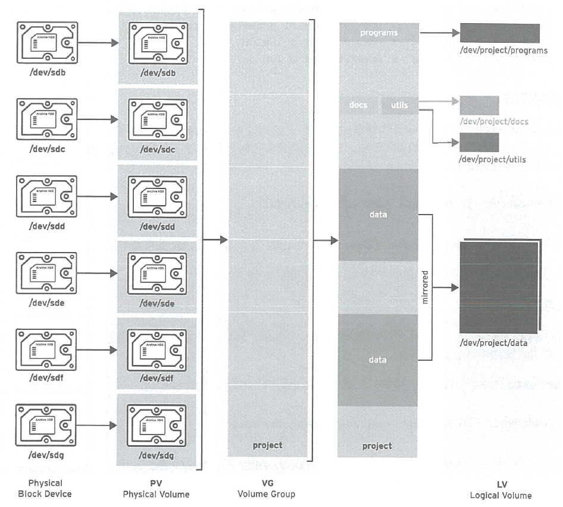

# LVM

[toc]

## 定义

**物理设备:** 是用于保存逻辑卷中所储存数据的存储设备。是块设备，可以是磁盘分区、整个磁盘、RAID阵列或SAN磁盘。必须初始化为LVM物理卷。

**物理卷(PV):** LVM工具会将物理卷划分为物理区块(PE)，是充当物理卷上最小存储块的小块数据。

**卷组(VG):** 存储池，由一个或多个物理卷组成。一个PV只能分配给一个VG。VG可以包含未使用的空间和任意数目的逻辑卷。

**逻辑卷(LV):** 逻辑卷根据卷组中的空闲物理区块创建，提供应用、用户和操作系统所使用的“存储”设备。LV是逻辑区块(LE)的集合，LE映射到物理区块(PV的最小存储块)。默认情况下，每个LE将映射到一个PE。设置特定LV选项将会更改此映射；例如，镜像会导致每个LE映射到两个PE。




## 常用的LVM部署命令

| 功能/命令 | 物理卷管理 | 卷组管理  | 逻辑卷管理 |
| --------- | ---------- | --------- | ---------- |
| 扫描      | pvscan     | vgscan    | lvscan     |
| 建立      | pvcreate   | vgcreate  | lvcreate   |
| 显示      | pvdisplay  | vgdisplay | lvdisplay  |
| 删除      | pvremove   | vgremove  | lvremove   |
| 扩展      |            | vgextend  | lvextend   |
| 缩小      |            | vgreduce  | lvreduce   |
|           | pvs        | vgs       | lvs        |

## 创建

### 物理设备

创建新分区。在LVM分区上，始终将分区类型设置为Linux LVM；对于MBR分区，使用0x8e。

```bash
parted -s /dev/vdb mkpart primary 1Mib 796Mib
parted -s /dev/vdb set 1 lvm on
```

### 物理卷

```bash
# 让新添加的两块硬盘设备支持LVM技术。
pvcreate /dev/sdb /dev/sdc
```

### 卷组

```bash
# 把两块硬盘设备加入到卷组中，然后查看卷组的状态。
vgcreate vg01 /dev/sdb /dev/sdc
vgdisplay
```

### 逻辑卷

在对逻辑卷进行切割时有两种计量单位。第一种是以容量为单位，参数为-L。另外一种是以基本单元的个数为单位，参数为-l。每个基本单元的大小默认为4MB。

```bash
lvcreate -n lv01 -l 37 vg01
lvdisplay 
```

两张命名方式：

* 传统名称	                 `/dev/vgname/lvname`
* 内核设备映射程序名  `/dev/mapper/vgname-lvname`

Linux系统会把LVM中的逻辑卷设备存放在/dev设备目录中（实际上是做了一个符号链接），同时会以卷组的名称来建立一个目录，其中保存了逻辑卷的设备映射文件（即/dev/卷组名称/逻辑卷名称）。

```bash
mkfs.ext4 /dev/vg01/lv01 
```

**逻辑卷快照**

LVM的快照卷功能有两个特点：

> 快照卷的容量必须等同于逻辑卷的容量；
>
> 快照卷仅一次有效，一旦执行还原操作后则会被立即自动删除。

**第1步**：使用-s参数生成一个快照卷，使用-L参数指定切割的大小。

```bash
lvcreate -L 120M -s -n SNAP /dev/stor/vo
lvdisplay
```

**第2步**：在逻辑卷所挂载的目录中创建一个100MB的垃圾文件，然后再查看快照卷的状态。可以发现存储空间占的用量上升了。

**第3步**：为了校验SNAP快照卷的效果，需要对逻辑卷进行快照还原操作。在此之前记得先卸载掉逻辑卷设备与目录的挂载。

```bash
umount /dev/stor/vo
lvconvert --merge /dev/storage/SNAP
```

**第4步**：快照卷会被自动删除掉。

## 删除

### 逻辑卷

```bash
# 取消逻辑卷与目录的挂载关联，删除配置文件中永久生效的设备参数。
umount /dev/vg01/lv01
vim /etc/fstab

# 删除逻辑卷设备，需要输入y来确认操作。
lvremove /dev/vg01/lv01 
```

### 卷组

```bash
vgremove vg01
```

### 物理卷设备

```bash
pvremove /dev/sdb /dev/sdc
```

## 扩展

### 卷组

```bash
parted -s /dev/vdb mkpart primary 1027MiB 1539MiB
parted -s /dev/vdb set 3 lvm on
pvcreate /dev/vdb3

vgextend vg01 /dev/vdb3
vgdisplay
```

### 逻辑卷

```bash
lvextend -L +290M /dev/vg01/lv01
# +290M		增加290MiB
# 290M		增加到290MiB
# 支持 -l -L

resize2fs /dev/vg01/lv01		# Ext4
xfs_growfs /mnt/date			# XFS 挂载点

# 替代方法：
# 在lvextend的命令中包含-r 选项，使用fsadm在扩展LV后调整文件系统的大小。
# 可用于多种不同的文件系统。
```

### 交换空间

```bash
swapoff -v /dev/vg01/lv_swap
# 停用交换空间。系统必须有足够的可用内存或交换空间，以便在停用逻辑卷上的交换空间时能接受需要置入的任何内容。
lvextend -l +extents /dev/vg01/lv_swap
mkswap /dev/vg01/lv_swap
swapon -va /dev/vg01/lv_swap
```


## 缩减

### 卷组

```bash
pvmove PV_DEVICE_NAME
# 例，pvmove /dev/vdb3,将PE从/dev/vdb3移动到同一VG中具有空闲PE的PV。操作前，进行备份。
vgreduce VG_NAME PV_DEVICE_NAME
# vgreduce vg01 /dev/vdb3
```

### 逻辑卷

相较于扩容逻辑卷，在对逻辑卷进行缩容操作时，其丢失数据的风险更大。

```bash
umount /dev/vg01/lv01
# 检查文件系统的完整性。
e2fsck -f /dev/vg01/lv01
# 把逻辑卷vo的容量减小到120MB。
resize2fs /dev/vg01/lv01 120M
lvreduce -L 120M /dev/vg01/lv01
# 重新挂载文件系统并查看系统状态。
mount -a
```

## 查看状态信息

### 物理卷

```bash
pvdisplay /dev/vdb1

--- Physical volume ---
PV NAME				/dev/vdb1
VG NAME				vg01
PV SIZE				768.00MiB / not usable 4.00 MiB
Allocatable			yes
PE SIZE				4.00 MiB
Total PE			191
Free PE				16
Allocated PE		175
PV UUID				JWzDpn-LE3e-n2ii-9Etd-VT2H-PeMm-1ZXwP1


pvs
```

### 卷组

```bash
vgdisplay vg01
--- Volume group ---
VG NAME					vg01
System ID
Format					lvm2
Metadata Areas			2
Metadata Sequence No	2
VG Access				read/write
VG Status				resizable
MAX LV					0
Cur LV					1
Open LV					1
Max PV					0
Cur PV					2
Act PV					2
VG Size					1016.00 MiB
PE Size					4.00 MiB
Total PE				254
Alloc PE / Size			175 / 700.00 MiB
Free  PE / Size			79 / 316.00 MiB
VG UUID					3snNw3-CF71-CcYG-Llk1-p4EY-rHeV-xFsueZ

vgs
```

### 逻辑卷

```bash
lvdisplay /dev/vg01/lv01

--- Logical volume ---
LV Path					/dev/vg01/lv01
LV Name					lv01
VG Name					vg01
LV UUID					5IyNw3-CF71-CcYG-Llk1-p4EY-rHeV-xFsueZ
LV Write Access			read/write
LV Creation	host, time	host.lab.example.com,2019-04-14 17:17:47 -0400
LV Status				avaliabe
# open					1
LV Size					700 MiB
Current LE				175
Segments				1
Allocation				inherit
Read ahead sectors		auto
- current set to		256
Block device			252:0
```

