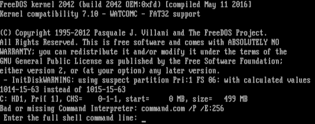
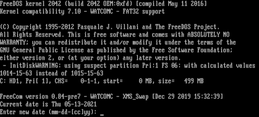
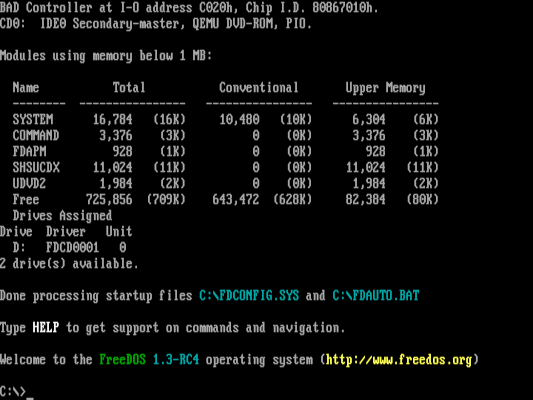

# FreeDOS

官方网站 [www.freedos.org](https://www.freedos.org/)

## 早期的 DOS

运行在最多只有 640 千字节内存中的 DOS，除了管理硬件和允许用户启动应用程序之外，真的做不了什么。因此，PC-DOS 1.0  命令行非常贫乏，只包含了一些设置日期和时间、管理文件、控制终端和格式化软盘的命令。DOS 还包括一个 BASIC  语言解释器，这是那个时代所有个人计算机的一个标准功能。

直到 PC-DOS 2.0，DOS 才变得更加有趣，为命令行添加了新的命令，并包含了其他有用的工具。但对我来说，直到 1991 年的  MS-DOS 5.0 才有了“现代感”。微软在这个版本中对 DOS 进行了大修，更新了许多命令，并用一个新的全屏编辑器取代了老旧的 Edlin  编辑器，使之更方便用户使用。DOS 5 还包括我喜欢的其他特性，比如基于微软 QuickBASIC 编译器的新 BASIC 解释器，简称  QBASIC. 如果你曾经在 DOS 上玩过 Gorillas 游戏，那可能就是在 MS-DOS 5.0 中运行的。

尽管进行了这些升级，但我对 DOS 命令行并不完全满意。DOS 从来没有偏离原来的设计，有其局限性。DOS  为用户提供了一些工具，可以从命令行执行一些事情 —— 否则，你就得使用 DOS  命令行来启动应用程序。微软认为用户大部分时间都会花在几个关键的应用程序上，比如文字处理器或电子表格。

但是开发人员想要一个功能更强的 DOS，此时一个细分行业正在萌芽，以提供小巧优雅的工具和程序。有些是全屏应用程序，但也有许多是增强 DOS 命令环境的命令行实用程序。尽管 MS-DOS  的基础相当有限，但我发现第三方实用程序加上我自己的工具创建了一个功能强大的 DOS 命令行。

## FreeDOS

1994 年初，我开始在科技杂志上看到很多对微软高管的采访，他们说下一个版本的 Windows 将完全取代 DOS。我以前使用过  Windows，但如果你还记得那个时代，你就知道 Windows 3.1 并不是一个很好的平台。Windows 3.1  很笨重，有很多毛病，如果一个应用程序崩溃，它可能会使整个 Windows 系统瘫痪。我也不喜欢 Windows  的图形用户界面。

我考虑过 Windows，并决定，“如果 Windows 3.2 或 Windows 4.0 会像 Windows 3.1 一样，我就不会去使用它。” 但我有什么选择？此时，我已经尝试过 Linux，并认为 Linux 很棒，但是 Linux 没有任何应用程序。我的文字处理器、电子表格和其他程序都在 DOS 上。我需要 DOS。

然后我有了个主意！我想，“如果开发人员能够在互联网上共同编写一个完整的 Unix 操作系统，那么我们当然可以对 DOS  做同样的事情。”毕竟，与 Unix 相比，DOS 是一个相当简单的操作系统。DOS  一次运行一个任务（单任务），并且有一个更简单的内存模型。编写我们自己的 DOS 应该不难。

因此，在 1994 年 6 月 29 日，我在一个名为 Usenet 的留言板网络上向 “comp.os.msdos.apps” 发布了一个公告：

> PD-DOS 项目公告：
>
> 几个月前，我发表了关于启动公共领域版本的 DOS 的文章。 当时大家对此的普遍支持，许多人都同意这样的说法：“开始编写吧！”所以，我就……
>
> 宣布首次生产 PD-DOS 的努力。我已经写了一个“清单”，描述了这样一个项目的目标和工作大纲，以及一个“任务列表”，它准确地显示了需要编写什么。我会把这些贴在这里，供大家讨论。

关于这个名字的说明 —— 我希望这个新的 DOS  成为每个人都可以使用的东西，我天真地认为，当每个人都可以使用它时，它就是“公共领域”。我很快就意识到了这种差别，所以我们把 “PD-DOS”  改名为 “Free-DOS”，然后去掉连字符变成 “FreeDOS”。

一些开发人员联系我，提供他们为替换或增强 DOS  命令行而创建的实用程序，类似于我自己的努力。就在项目宣布几个月后，我们汇集了我们的实用程序，并创建了一个实用的系统，我们在 1994 年 9  月发布了一个 “Alpha 1” 版本。在那些日子里，发展是相当迅速的，我们在 1994 年 12 月发布了 “Alpha 2”，1995 年 1 月发布了 “Alpha 3”，1995 年 6 月发布了“Alpha 4”。

## 一个现代的 DOS

从那以后，我们一直致力于使 FreeDOS 成为 “现代” DOS。而这种现代化大部分都集中在创建一个丰富的命令行环境上。是的，DOS  仍然需要支持应用程序，但是我们相信 FreeDOS 也需要一个强大的命令行环境。这就是为什么 FreeDOS  包含了许多有用的工具，包括浏览目录、管理文件、播放音乐、连接网络的命令，……以及类似 Unix 的实用程序集合，如 `less`、`du`、`head`、`tail`、`sed` 和 `tr`。

虽然 FreeDOS 的开发已经放缓，但它并没有停止。开发人员继续为 FreeDOS 编写新程序，并向 FreeDOS 添加新功能。我对  FreeDOS 1.3 RC4 的几个重要补充感到特别兴奋，FreeDOS 1.3 RC4 是即将发布的 FreeDOS 1.3  的最新候选版本。最近的一些更新如下：

- Mateusz Viste 创建了一个新的电子书阅读器，名为 Ancient Machine Book（AMB），我们利用它作为 FreeDOS 1.3 RC4 中的新帮助系统。
- Rask Ingemann Lambertsen、Andrew Jenner、TK Chia 和其他人正在更新 GCC 的 IA-16 版本，包括一个新的libi86 库，它提供了与 Borland TurboC++ 编译器的 C 库的某种程度的兼容性。
- Jason Hood 更新了一个可卸载的 CD-ROM 重定向器，以替代微软的 MSCDEX，最多支持 10 个驱动器。
- SuperIlu 创建了 DOjS，这是一个 Javascript 开发画布，具有集成的编辑器、图形和声音输出，以及鼠标、键盘和操纵杆输入。
- Japheth 创建了一个 DOS32PAE 扩展程序，它能够通过 PAE 分页使用大量的内存。

尽管 FreeDOS 有了新的发展，我们仍然忠于我们的 DOS 根基。在我们继续朝着 FreeDOS 1.3 “最终”版本努力时，我们带着几个核心假设，包括：

- **兼容性是关键** —— 如果 FreeDOS 不能运行经典 DOS 应用程序，它就不是真正的 “DOS”。虽然我们提供了许多优秀的开源工具、应用程序和游戏，但你也可以运行你的传统的 DOS 应用程序。
- **继续在旧 PC 上运行（XT、286、386 等）** —— FreeDOS 1.3 将保持 16 位英特尔架构，但在可能的情况下将支持扩展驱动程序支持的新硬件。为此，我们继续专注于单用户命令行环境。
- **FreeDOS 是开源软件** —— FreeDOS 1.3 将包括尽可能多地包括使用公认的开源许可证的软件。但 DOS 实际上早于 GNU  通用公共许可证（1989）和开放源码定义（1998），因此一些 DOS  软件可能会使用它自己的“免费源代码”许可证，而不是标准的“开源”许可。当我们考虑将软件包纳入 FreeDOS  时，我们将继续评估任何许可证，以确保它们是合适的“开放源码”，即使它们没有得到正式承认。

## 启动

### 初始引导

当打开计算机的电源时，系统会进行一些自我检查，如验证内存和其他组件。这被称为开机自检Power On Self Test（POST）。POST 之后，计算机使用一个硬编码指令，告诉它在哪里找到加载操作系统的指令。这就是“引导加载程序boot loader”，通常它将试图找到硬盘上的主引导记录Master Boot Record（MBR）。然后，MBR 加载主操作系统，在这里就是 FreeDOS。

这个定位一个信息以便计算机能够加载操作系统的下一个部分的过程被称为“引导bootstrapping”，来自于“通过你自己的努力振作起来picking yourself up by your bootstraps”的古老说法。正是从这个用法中，我们采用了“引导boot”一词来表示启动计算机。

### 内核

当计算机加载 FreeDOS 内核时，内核所做的第一件事就是识别用户所表示要使用的任何参数。它被保存在一个叫做 `FDCONFIG.SYS` 的文件中，与内核保存在同一个根目录下。如果 `FDCONFIG.SYS` 不存在，那么 FreeDOS 的内核就会寻找一个叫做 `CONFIG.SYS` 的替代文件。

如果你在 20 世纪 80 年代或 90 年代使用过 DOS，你可能对 `CONFIG.SYS` 文件很熟悉。从 1999 年起，FreeDOS 首先寻找 `FDCONFIG.SYS`，以防你的 DOS 系统与其他 DOS（如 MS-DOS）做了 *双启动*。请注意，MS-DOS 只使用 `CONFIG.SYS` 文件。因此，如果你用同一个硬盘同时启动 FreeDOS 和 MS-DOS，MS-DOS 使用 `CONFIG.SYS` 来配置自己，而 FreeDOS 则使用 `FDCONFIG.SYS`。这样一来，双方都可以使用自己的配置。

`FDCONFIG.SYS` 可以包含一些配置设置，其中之一是 `SHELL=` 或 `SHELLHIGH=`。任何一个都会指示内核加载这个程序作为用户的交互式 shell。

如果 `FDCONFIG.SYS` 和 `CONFIG.SYS` 都不存在，那么内核就会假定几个默认值，包括在哪里找到 shell。如果你在启动 FreeDOS 系统时看到` “Bad or missing Command Interpreter”` 的信息，这意味着 `SHELL=` 或 `SHELLHIGH=` 指向了一个在你系统中不存在的 shell 程序。

你可以通过查看 `SHELL=` 或 `SHELLHIGH=` 行来调试这个问题。如果做不到这一点，请确保你在 FreeDOS 系统的根目录下有一个名为 `COMMAND.COM` 的程序。它就是 *shell*。

### shell

在 DOS 系统中，“shell” 一词通常是指一个命令行解释器：一个交互式程序，它从用户那里读取指令，然后执行它们。在这里，FreeDOS 的 shell 与 Linux 的 Bash shell 相似。

除非你用 `SHELL=` 或 `SHELLHIGH=` 要求内核加载一个不同的 shell，否则 DOS 上的标准命令行 shell 被称为 `COMMAND.COM`。当 `COMMAND.COM` 启动时，它也寻找一个文件来配置自己。默认情况下，`COMMAND.COM` 会在根目录下寻找一个名为 `AUTOEXEC.BAT` 的文件。`AUTOEXEC.BAT` 是一个“批处理文件”，它包含一组启动时运行的指令，大致类似于 Linux 上 Bash 启动时读取的 `~/.bashrc` “资源文件”。

你可以在 `FDCONFIG.SYS` 文件中用 `SHELL=` 或 `SHELLHIGH=` 改变 shell 以及 shell 的启动文件。FreeDOS 1.3 RC4 安装程序将系统设置为读取 `FDAUTO.BAT` 而不是 `AUTOEXEC.BAT`。这与内核读取另一个配置文件的原因相同；你可以在硬盘上用另一个 DOS 双启动 FreeDOS。FreeDOS 将使用 `FDAUTO.BAT` 而 MS-DOS 将使用 `AUTOEXEC.BAT`。

如果没有像 `AUTOEXEC.BAT` 这样的启动文件，shell 将简单地提示用户输入日期和时间。

就是这些了。当 FreeDOS 加载了内核，而内核也加载了 shell，FreeDOS 就准备好让用户输入命令了。

