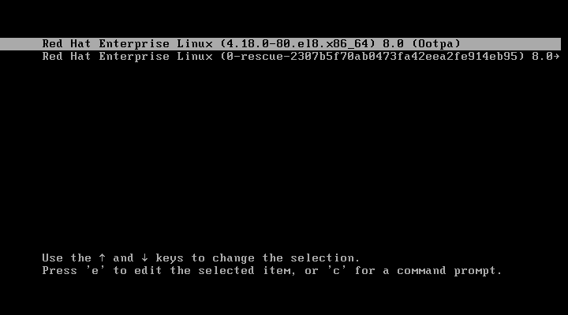

# 重置 root 密码

[TOC]

## RHEL7/CentOS7

**启动进入最小模式**

重启系统并在出现引导界面时，按下键盘上的 e 键进入内核编辑界面。



**中断启动进程**

在内核字符串中 - 在以 linux 开头的行，结尾处输入 `rd.break` 。接着 Ctrl+X 重启。系统启动进入救援模式，并将本地磁盘挂载在 /sysroot。在此模式中不需要输入密码。


**重新挂载文件系统以便读写**

```bash
mount -o remount,rw /sysroot/
```

**使 /sysroot 成为根目录**

```bash
chroot /sysroot
```

命令行提示符会稍微改变。

**修改 root 密码**

```bash
passwd
```

**加载 SELinux 策略**

```bash
load_policy -i
```

在 /etc/shadow 中设置上下文类型

```bash
chcon -t shadow_t /etc/shadow
```

**注意：**可以通过如下创建 autorelabel 文件的方式来略过最后两步，但自动重建卷标会花费很长时间。

```bash
touch /.autorelabel
```

**退出并重启**

连续按下两次Ctrl + D组合键盘来退出并重启。等待系统再次重启完毕后便可以使用新密码登录Linux系统。

## SUSE Enterprise Linux 11

1. 启动grub时候选择 Failsave, 下面的“boot option“内容全部删除，写入`init=/bin/bash`，进入单用户模式。
2. 出现命令行

```bash
(none)#:#mount -o remount, rw /
```

 根文件系统重新mount为可读写。

```bsh
cd /usr/bin
passwd root
```

> 注：
>
> 如果usr分区是单独分的，此处会报错。可通过再将usr分区挂载后，重复扫行上面的步骤。如usr分区们于/dev/sda5分区上，执行下面的命令：
>
> ```bash
> mount /dev/sda5 /usr
> ```
> 