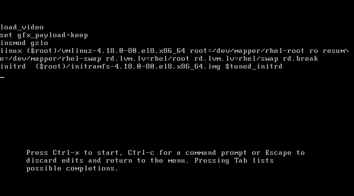

# 重置 root 密码

[TOC]

# 更改和重置根密码

​			如果需要更改现有的根密码，可以以 `root` 用户或一个非 root 用户重置它。 	

## 23.1. 作为 root 用户更改 root 密码

​				本小节论述了如何使用 `passwd` 命令以 `root` 用户更改 `root` 密码。 		

**先决条件**

- ​						`根` 访问权限 				

**流程**

- ​						要更改 `root` 密码，使用： 				

  

  ```none
  # passwd
  ```

  ​						在修改前，会提示您输入您当前的密码。 				

## 23.2. 以非 root 用户的身份更改或重置根密码

​				本小节论述了如何以非 root 用户使用 `passwd` 命令更改或重置 `root` 密码。 		

**先决条件**

- ​						您可以以非 root 用户身份登录。 				
- ​						您是管理 `wheel` 组的成员。 				

**流程**

- ​						以`wheel` 组中的非 root 用户身份修改或重置 `root` 密码，请使用： 				

  

  ```none
  $ sudo passwd root
  ```

  ​						此时会提示您输入当前的非 root 密码，然后才能更改 `root` 密码。 				

## 23.3. 在引导时重置 root 密码

​				如果您无法以非 root 用户身份登录或者不属于管理 `wheel` 组，则可以通过切换到一个特殊的 `chroot jail` 环境在引导时重置 root 密码。 		

**流程**

1. ​						重启系统，在 GRUB 2 引导屏幕上按 e 键中断引导过程。 				

   ​						此时会出现内核引导参数。 				

   

   ```none
   load_video
   set gfx_payload=keep
   insmod gzio
   linux ($root)/vmlinuz-5.14.0-70.22.1.e19_0.x86_64 root=/dev/mapper/rhel-root ro crash\
   kernel=auto resume=/dev/mapper/rhel-swap rd.lvm.lv/swap rhgb quiet
   initrd ($root)/initramfs-5.14.0-70.22.1.e19_0.x86_64.img $tuned_initrd
   ```

2. ​						进入以 **linux** 开头的行的末尾。 				

   

   ```none
   linux ($root)/vmlinuz-5.14.0-70.22.1.e19_0.x86_64 root=/dev/mapper/rhel-root ro crash\
   kernel=auto resume=/dev/mapper/rhel-swap rd.lvm.lv/swap rhgb quiet
   ```

   ​						按 Ctrl+e 键跳到这一行的末尾。 				

3. ​						在以 `linux` 开头的行的最后添加 `rd.break`。 				

   

   ```none
   linux ($root)/vmlinuz-5.14.0-70.22.1.e19_0.x86_64 root=/dev/mapper/rhel-root ro crash\
   kernel=auto resume=/dev/mapper/rhel-swap rd.lvm.lv/swap rhgb quiet rd.break
   ```

4. ​						按 Ctrl+x 使用更改的参数启动系统。 				

   ​						此时会出现 `switch_root` 提示符。 				

5. ​						将文件系统重新挂载为可写： 				

   

   ```none
   mount -o remount,rw /sysroot
   ```

   ​						文件系统以只读模式挂载到 `/sysroot` 目录中。将文件系统重新挂载为可写才可以更改密码。 				

6. ​						进入 `chroot` 环境： 				

   

   ```none
   chroot /sysroot
   ```

   ​						此时会出现 `sh-4.4#` 提示符。 				

7. ​						重置 `root` 密码： 				

   

   ```none
   passwd
   ```

   ​						按照命令行中的步骤完成 `root` 密码的更改。 				

8. ​						在下次系统引导时启用 SELinux 重新标记进程： 				

   

   ```none
   touch /.autorelabel
   ```

9. ​						退出 `chroot` 环境： 				

   

   ```none
   exit
   ```

10. ​						退出 `switch_root` 提示符： 				

    

    ```none
    exit
    ```

11. ​						等待 SELinux 重新标记过程完成。请注意，重新标记一个大磁盘可能需要很长时间。系统会在这个过程完成后自动重启。 				

**验证步骤**

1. ​						要验证 `root` 密码是否已成功更改，请以普通用户身份登录并打开 Terminal。 				

2. ​						以 root 用户身份运行交互式 shell: 				

   

   ```none
   $ su
   ```

3. ​						输入新的 `root` 密码。 				

4. ​						显示与当前有效用户 ID 关联的用户名： 				

   

   ```none
   whoami
   ```

   ​						输出会返回： 				

   

   ```none
   root
   ```

## RHEL7/CentOS7

**启动进入最小模式**

重启系统并在出现引导界面时，按下键盘上的 e 键进入内核编辑界面。


**中断启动进程**

在内核字符串中 - 在以 linux 开头的行，结尾处输入 `rd.break` 。接着 Ctrl+X 重启。系统启动进入救援模式，并将本地磁盘挂载在 /sysroot。在此模式中不需要输入密码。



**重新挂载文件系统以便读写**

```bash
mount -o remount,rw /sysroot/
```

**使 /sysroot 成为根目录**

```bash
chroot /sysroot
```

命令行提示符会稍微改变。

**修改 root 密码**

```bash
passwd
```

**加载 SELinux 策略**

```bash
load_policy -i
```

在 /etc/shadow 中设置上下文类型

```bash
chcon -t shadow_t /etc/shadow
```

**注意：**可以通过如下创建 autorelabel 文件的方式来略过最后两步，但自动重建卷标会花费很长时间。

```bash
touch /.autorelabel
```

**退出并重启**

连续按下两次Ctrl + D组合键盘来退出并重启。等待系统再次重启完毕后便可以使用新密码登录Linux系统。

## SUSE Enterprise Linux 11

1. 启动grub时候选择 Failsave, 下面的“boot option“内容全部删除，写入`init=/bin/bash`，进入单用户模式。
2. 出现命令行

```bash
(none)#:#mount -o remount, rw /
```

 根文件系统重新mount为可读写。

```bsh
cd /usr/bin
passwd root
```

> 注：
>
> 如果usr分区是单独分的，此处会报错。可通过再将usr分区挂载后，重复扫行上面的步骤。如usr分区们于/dev/sda5分区上，执行下面的命令：
>
> ```bash
> mount /dev/sda5 /usr
> ```