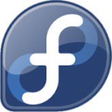
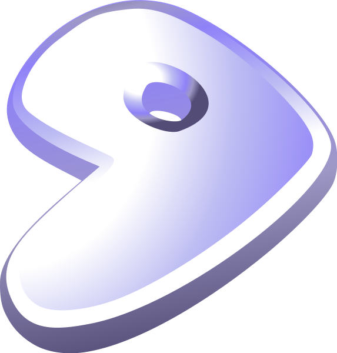

# 发行版

[TOC]

## 概述

Linux 的发行版就是将 Linux 内核与应用软件做一个打包。

 

目前市面上较知名的发行版有：

目前主流的 Linux 版本有：

- Debian（及其派生版本Ubuntu、Linux Mint）
- Fedora（及其相关版本Red Hat Enterprise Linux、CentOS）
- openSUSE
- SUSE
- Arch Linux
- SolusOS

## 列表

* AlmaLinux

* Alpine Linux

* ALT

* Arch Linux

* Asianux

* BluePoint

* CentOS 

   **CentOS社区企业操作系统（Community Enterprise Operating System）**

  CentOS是由开源社区研发和维护的一款企业级Linux操作系统，在2014年1月被红帽公司正式收购。CentOS系统最为人广泛熟悉的标签就是“免费”。由于红帽企业版Linux是开源软件，任何人都有修改和创建衍生品的权利，因此CentOS便是将红帽企业版Linux中的收费功能通通去掉，然后将新系统重新编译后发布给用户免费使用的Linux系统。也正因为其免费的特性，CentOS拥有了广泛的用户。

  从本质上来说，由于CentOS是针对红帽企业版Linux进行修改后再发布的版本，因此不会针对它单独开发新功能，CentOS的版本号也是随红帽企业版Linux而变更。例如，CentOS 8.0对应的就是RHEL 8.0，CentOS 8.1对应的就是RHEL  8.1；以此类推。再就是，CentOS系统和RHEL系统的软件包可以通用。也就是说，如果工作中用的是RHEL，但是在安装某款软件时只找到了该软件的CentOS系统软件源，也是可以正常安装该软件的。

* Circle Linux

* CirrOS

* Clear Linux OS

* Debain

   历史久远，最初发布于1993年9月。Debian的名字取自创始人**Ian** Murdock和他女朋友**Deb**ra的姓氏组合。在维基百科中，Debian被翻译为“蝶变”。

  Debian系统具有很强的稳定性和安全性，并且提供了免费的基础支持，可以良好地适应各种硬件架构，以及提供近十万种不同的开源软件，在国外拥有很高的认可度和使用率。

* deepin

   **深度操作系统**

  在过去的十多年，基于开源系统二次定制开发的“国产操作系统”陆续出现过一些，但大多发展不好，深度操作系统却是少数能够将技术研发与商业运作结合起来的成功案例。据Deepin的官网介绍，该系统是由武汉深之度科技有限公司于2011年基于Debian系统衍生而来的，提供32种语言版本，目前累计下载量已近1亿次，用户遍布100余个国家/地区。

  就Deepin来讲，最吸引人的还是它的本土化工作。Deepin默认集成了诸如WPS  Office、搜狗输入法、有道词典等国内常用的软件，对“小白”用户相当友好。当然，Deepin的技术研发能力相较于国际水平肯定还有差距，这点我们也要承认并正视。

* Endless OS

* Fedora Linux

   Fedora翻译为中文是“浅顶软呢男帽”的意思，翻译之后跟Linux系统很不搭界，所以更多人干脆将其音译为“费多拉”系统。Fedora  Linux是正正经经的红帽公司自己的产品，最初是为了给红帽企业版Linux制作和测试第三方软件而构建的产品，孕育了最早的开源社群，固定每6个月发布一个新版本，当前在全球已经有几百万的用户。

  Fedora是桌面版本的Linux系统，可以理解成是微软公司的Windows XP或者Windows  10。它的目标用户是应付日常的工作需要，而不会追求稳定性的人群。用户可以在这个系统中体验到最新的技术和工具，当这些技术和工具成熟后才会被移植到红帽企业版Linux中，因此Fedora也被称为RHEL系统的“试验田”。运维人员如果想每天都强迫自己多学点Linux知识，保持自己技术的领先性，就应该多关注此类Linux系统的发展变化和新特征，不断调整自己的学习方向。

* Freenix

* Generic Linux

* Gentoo Linux

   Gentoo翻译为中文是“巴布亚企鹅”。终于找到一个跟Linux吉祥物—企鹅相关的名字了。巴布亚企鹅是企鹅家族中体型最大的物种之一，游泳时速最快可达36千米—多么灵活的胖子！

  Gentoo系统最大的特色就是允许用户完全自由地进行定制。开发人员Daniel曾经说过：“Gentoo系统的设计出发点就是让用户随意使用，没有限制地使用”。只要理解了这句话，后面也就不需要再解释什么了。在Gentoo系统中，任何一部分功能（包括最基本的系统库和编译器）都允许用户重新编译；用户也可以选择喜欢的补丁或者插件进行定制。但是，也因为Gentoo极高的自定制性，导致操作复杂，因此仅适合有经验的运维人员使用。有兴趣的读者可以在学习完本书后尝试一下该系统。

  如果大家今后真的安装了Gentoo系统，千万别忘记试一下Portage工具。这款软件管理工具以模块化、可移植、易维护和灵活性而著称，几乎可以无限制地适应用户的计算机硬件。

* Guix

* Haiku

* Kali Linux

   这款系统一般是供黑客或安全人员使用的，能够以此为平台对网站进行渗透测试，通俗来讲就是能“攻击”网站。Kali  Linux系统的前身名为BackTrack，其设计用途就是进行数字鉴识和渗透测试，内置有600多款网站及系统的渗透测试软件，包括大名鼎鼎的Nmap、Wireshark、sqlmap等。Kali  Linux能够被安装到个人电脑、公司服务器，甚至手掌大小的树莓派（一款微型电脑）上，可以让人有一种随身携带了一个武器库的感觉。

* Mageia

* Manjaro

* Mandriva

* MIRACLE Linux

* NixOS

* OpenSUSE

   一款源自德国的Linux系统，在全球范围内有着不错的声誉及市场占有率。openSUSE的桌面版系统简洁轻快易于使用，而服务器版本则功能丰富极具稳定性，而且即便是“菜鸟”也能轻松上手。虽然openSUSE在技术上颇具优势，而且大大的绿色蜥蜴Logo人见人爱，只可惜命途多舛，赞助和研发该系统的SuSE Linux  AG公司由于效益不佳，于2003年被Novell公司收购，而Novell公司又因经营不佳而在2011年被Attachmate公司收购。而到了2014年，Attachmate公司又被Micro Focus公司收购，后者仍然只把维护openSUSE系统的团队当作公司内的一个部门来运营。

   即便如此，依然不妨碍openSUSE系统的坚强发展，用户可以完全自主选择要使用的软件。例如，针对GUI环境，就提供了诸如GNOME、KDE、Cinnamon、MATE、LXQt、Xfce等可选项；除此之外，还为用户提供了数千个免费开源的软件包。

* Oracle Linux

* Pop!_OS

* PureOS

* RedFlag

* RedHat

   **红帽企业版系统（RHEL,RedHatEnterpriseLinux）**

  红帽公司成立于1994年，于1998年在纳斯达克上市，自从1999年起陆续收购了包括JBoss中间件供应商、CentOS（社区企业操作系统）、Ceph企业级存储业务等在内的数十家高科技公司及热门产品，这么做的目的当然是为了对主营业务红帽企业版Linux进行增强。

  红帽企业版Linux最初于2002年3月面世，当年Dell、HP、Oracle以及IBM公司便纷纷表示支持该系统平台的硬件开发，因此红帽企业版Linux系统的市场份额在近20年时间内不断猛增。红帽企业版Linux当时是全世界使用最广泛的Linux系统之一，在世界500强企业中，所有的航空公司、电信服务提供商、商业银行、医疗保健公司均无一例外地通过该系统向外提供服务。

  红帽企业版Linux当前的最新版本是RHEL 8，该系统具有极强的稳定性，在全球范围内都可以获得完善的技术支持。

* Rocky Linux

* Scientific Linux

* SlackWare

* SuSE

* Trisquel

* TurboLinux

* Ubuntu

   ubuntu是一款桌面版Linux系统，以Debian为蓝本进行修改和衍生而来，发布周期为6个月。Ubuntu的中文音译为“乌班图”，这个词最初来自于非洲南部部落使用的祖鲁语，意思是“我的存在是因为大家的存在”，体现了一种谦卑、感恩的价值观，寓意非常好。

  Ubuntu系统的第一个版本发布于2004年10月。2005年7月，Ubuntu基金会成立，Ubuntu后续不断增加开发分支，有了桌面版系统、服务器版系统和手机版系统。尽管Ubuntu基于Debian系统衍生而来，但会对系统进行深度化定制，因此两者之间的软件并不一定完全兼容。Ubuntu系统现在由Canonical公司提供商业技术支持，只要购买付费技术支持服务就能获得帮助，桌面版系统最长时间3年，服务器版系统最长时间5年。

* Void Linux 

   https://voidlinux.org/

* Xterm

   中国一家公司发布。但目前未找到相关主页。

* 
