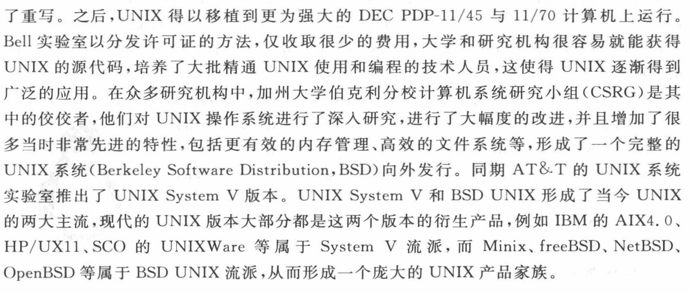

# 历史

[TOC]

## MULTICS

* 1965 年，为了解决服务器的终端连接数量的限制和处理复杂计算的问题，贝尔（Bell）实验室、通用电气（GE）公司以及麻省理工学院（MIT）决定联手打造一款全新的操作系统 — MULTICS（多任务信息与计算系统）。

  目标是开发一种交互式的、具有多道程序处理能力的分时操作系统，以取代当时广法使用的批处理操作系统。

  但由于开发过程不顺利，遇到了诸多阻碍，后期连资金也出现了短缺现象，最终在 1969 年，随着贝尔实验室的退出，MULTICS 也终止了研发工作。

## UNIX

- **1969 :**  AT&T Bell 实验室的开发人员 肯·汤普森（ Ken Thompson ）开始利用一台闲置的 PDP-7 计算机设计了一种多用户、多任务的操作系统 UNIX（UNiplexed Information and Computing Service）。不久，丹尼斯·里奇（Dennis Ritchie）加入了这个项目。UNIX 的设计者最初是使用汇编语言开发的，后来开发了 B 语言和 C 语言（1971年），并完全重写了 UNIX。 UNIX / Linux  系统自 1970 年开发以来，其参考日期依旧为 1970 年 1 月 1 日。

## Minix

- **1987**: A.S. Tanenbaum 开发了 MINIX（一种简化的 UNIX）以一种简单的方式教授操作系统课程。 Tanenbaum 先生将他的操作系统源代码开放。

## Linux

- **1991**: 芬兰学生 **Linus Torvalds** 为他的个人计算机创建了一个操作系统，并将其命名为 Linux。 他在 Usenet 论坛上发布了他的第一个版本 0.02，其他开发者也来帮助他改进他的系统。 术语 Linux 是来自创始人的名字 Linus 和 UNIX 两者的组合。

- **1993**: 创建 Debian 发行版。 Debian 是一个基于社区的非商业发行版。 它最初是为在服务器上使用而开发的，特别适合于服务器，但它是一个通用系统，因此也可以在个人计算机上使用。 Debian 是许多其他发行版的基础，例如 Mint 或 Ubuntu。

- **1994**: 商业发行版 RedHat 由 RedHat 公司创建，该公司目前是 GNU/Linux 操作系统的领先发行商。 RedHat 支持社区版 Fedora 和自由发行版 CentOS。

- **1997**: 创建 KDE 桌面环境。 它基于 QT 组件库和 C++ 开发语言。

- **1999**: 创建 Gnome 桌面环境。 它基于 GTK+ 组件库。

- **2002**: 创建 Arch 发行版。 其特殊性在于滚动发行（持续更新）。

- **2004**: Canonical 公司（Mark Shuttleworth）创建 Ubuntu。 它基于 Debian，但包括自由和专有软件。

- **2021**: Rocky Linux 诞生，基于 RedHat 发行版。

  


而同年，MULTICS 的开发人员 Ken Thompson 使用汇编语言编写出了一款新的系统内核，当时被同事戏称为UNICS（联合信息与计算系统），在贝尔实验室内广受欢迎。

1973 年时，C 语言之父 Dennis M.  Ritchie 了解到 UNICS 系统并对其非常看好，但汇编语言有致命的缺点—需要针对每一台不同架构的服务器重新编写汇编语言代码，才能使其使用 UNICS 系统内核。这样不仅麻烦而且使用门槛极高。于是 Dennis M. Ritchie 便决定使用 C 语言重新编写一遍 UNICS 系统，让其具备更好的跨平台性，更适合被广泛普及。开源且免费的UNIX系统由此诞生。

但是在 1979 年，贝尔实验室的上级公司 AT&T 看到了 UNIX 系统的商业价值和潜力，不顾贝尔实验室的反对声音，依然坚决做出了对其商业化的决定，并在随后收回了版权，逐步限制 UNIX 系统源代码的自由传播，渴望将其转化成专利产品而大赚一笔。崇尚自由分享的黑客面对冷酷无情的资本力量心灰意冷，开源社区的技术分享热潮一度跌入谷底。此时，人们也不能再自由地享受科技成果了，一切都以商业为重。

面对如此封闭的软件创作环境，著名的黑客 Richard  Stallman 在 1983 年发起了 GNU 源代码开放计划，并在 1989 年起草了著名的 GPL 许可证。他渴望建立起一个更加自由和开放的操作系统和社区。之所以称之为 GNU，其实是有 “GNU’s Not  Unix!” 的含义，这暗戳戳地鄙视了一下被商业化的 UNIX 系统。但是，想法和计划只停留在口头上是不够的，还需要落地才行，因此 Richard 便以当时现有的软件功能为蓝本，重新开发出了多款开源免费的好用工具。在 1987 年，GNU 计划终于有了重大突破，Richard 和社区共同编写出了一款能够运行 C 语言代码的编译器— gcc（GNU C  Compiler）。这使得人们可以免费地使用 gcc 编译器将自己编写的 C 语言代码编译成可执行文件，供更多的用户使用，这进一步发展壮大了开源社区。随后的一段时间里，Emacs 编辑器和 bash 解释器等重磅产品陆续亮相，一批批的技术爱好者也纷纷加入 GNU 源代码开放计划中来。

在 1984 年时，UNIX 系统版权依然被 AT&T 公司死死地攥在手里，AT&T 公司明确规定不允许将代码提供给学生使用。荷兰的一位大学教授 Andrew（历史中被遗忘的大神）为了能给学生上课，竟然仿照 UNIX 系统编写出了一款名为 Minix 的操作系统。但当时他只是用于课堂教学，根本没有大规模商业化的打算，所以实际使用 Minix 操作系统的人数其实并不算多。

芬兰赫尔辛基大学的在校生 Linus  Torvalds 便是其中一员，在1991 年 10 月使用 bash 解释器和 gcc 编译器等开源工具编写出了一个名为 Linux 的全新的系统内核，并且在技术论坛中低调地上传了该内核的 0.02 版本。该系统内核因其较高的代码质量且基于GNU GPL 许可证的开放源代码特性，迅速得到了 GNU 源代码开放计划和一大批黑客程序员的支持，随后 Linux 正式进入如火如荼的发展阶段。Linus  Torvalds 最早发布的帖子内容的截图如下。

```bash
  Hello everybody out there using minix -

  I'm doing a (free) operating system (just a hobby, won't be big and
  professional like gnu) for 386(486) AT clones.  This has been brewing
  since april, and is starting to get ready.  I'd like any feedback on
  things people like/dislike in minix, as my OS resembles it somewhat
  (same physical layout of the file-system (due to practical reasons)
  among other things).

  I've currently ported bash(1.08) and gcc(1.40), and things seem to work.
  This implies that I'll get something practical within a few months, and
  I'd like to know what features most people would want.  Any suggestions
  are welcome, but I won't promise I'll implement them :-)

                Linus torvalds
```

Linux 系统的吉祥物名为 Tux，是一只呆萌的小企鹅。相传 Linus  Torvalds 在童年时期去澳大利亚的动物园游玩时，不幸被一只企鹅咬伤，所以为了“报复”就选择了这个物种作为吉祥物。这个故事是否可信无从考证，但万幸是只企鹅，而不是老虎或者狮子，否则就不是换个 Logo 这么简单的事了。

1994 年，红帽（Red Hat）公司创始人 Bob  Young 在 Linux 系统内核的基础之上，集成了众多的常用源代码和程序软件，随后发布了红帽操作系统并开始出售技术服务，这进一步推动了 Linux 系统的普及。1998 年以后，随着 GNU 源代码开放计划和 Linux 系统的继续火热，以 IBM 和 Intel 为首的多家 IT 巨头企业开始大力推动开放源代码软件的发展，很多人认为这是一个重要转折点。2012 年，红帽公司成为全球第一家年收入 10 亿美元的开源公司，后来是 20 亿、30 亿……不断刷新纪录。

时至今日，Linux内核已经发展到 5.6 版本，衍生系统也有数百个版本之多，它们使用的都是 Linus Torvalds 开发维护的 Linux 系统内核。红帽也成为开源行业及Linux 系统的领头羊。

