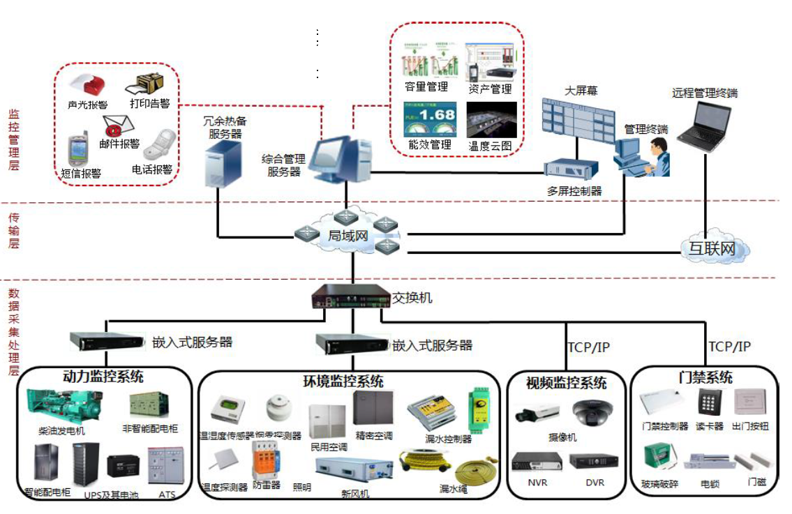
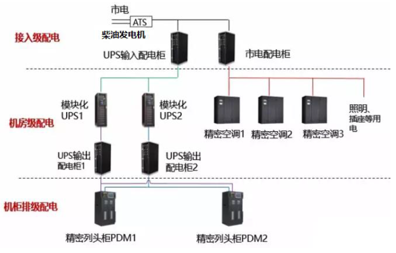
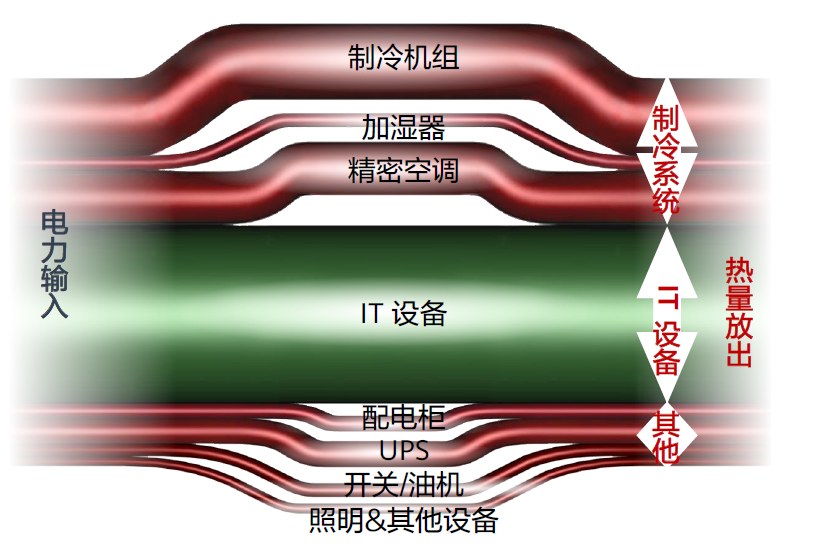

# 数据中心

[TOC]

## 分级

### 国标 GB 50174-2017
《数据中心设计规范》

分类依据：数据中心的使用性质，数据丢失或网络中断在经济或社会上造成的损失或影响程度。

| 级别 | 描述 |
|------|-----|
| A | 容错型，在系统需要运行期间，其场地设备不应因操作失误、设备故障、外电源中断、维护和检修而导致电子信息系统运行中断。 |
| B | 冗余型，在系统需要运行期间，其场地设备在冗余能力范围内，不应因设备故障导致电子信息系统运行中断。 |
| C | 基本型，在场地设备正常运行的情况下，应保证电子信息系统运行不中断。 |

### Uptime Institute的可用性分级体系

|                          | Tier I | Tier II | Tier III      | Tier IV     |
| ------------------------ | ------ | ------- | ------------- | ----------- |
| 支持IT负载的基础设施设备 | N      | N + 1   | N + 1         | 2N          |
| 分配路径                 | 1      | 1       | 1运行 + 1备用 | 2个同时运行 |
| 可并行维护               | 否     | 否      | 是            | 是          |
| 容错性                   | 否     | 否      | 否            | 是          |
| 分区                     | 否     | 否      | 否            | 是          |
| 连续冷却                 | 否     | 否      | 否            | 是          |


| 级别 | 发电机 | UPS | 供电来源 | HVAC | 可用性 |
|----|-----|-----|------|------|-----|
| 1 | 无 | N | 单路 | N | 99.671% |
| 2 | N | N+1 | 单路 | N+1 | 99.741% |
| 3 | N+1 | N+1 | 双路，可切换 | N+1 | 99.982% |
| 4 | 2N | 2N | 双路，并行 | 2N | 99.995% |

### TIA-942

* Ⅰ		Basic （基本）
* Ⅱ        Redundant Component （冗余）
* Ⅲ        Concurrently Maintainable（可并行维护）
* Ⅳ        Fault Tolerant（容错）

## 功能区

### 划分

* 主机房

  安装和运行数据处理设备的建筑空间，包括服务器机房、网络机房、存储机房等功能区域。

* 辅助区

  安装、调试、维护、运行监控和管理电子信息设备和软件的场所，包括进线间、测试机房、总控中心、消防和安防控制室、拆包区、备件库、维修室、打印室等区域。

* 支持区

  为主机房、辅助区提供动力支持和安全保障的区域，包括变配电室、柴油发电机房、电池室、空调机房、动力站房、不间断电源系统用房、消防设施用房等。

* 行政管理区

  日常行政管理及客户对托管设备进行管理的场所，包括办公室、门厅、值班室、盥洗室、更衣间和用户工作室。

### 面积

在对电子信息设备的具体情况不完全掌握时，主机房使用面积

```bash
A=SN

# A 主机房的使用面积m^2
# S 单台机柜（架）、大型电子信息设备和列头柜等设备占用面积，可取 2 - 4 m^2/台
# N 主机房内所有机柜（架）、大型电子信息设备和列头柜等设备的总台数。
```

## 基础设施组成

### 消防系统

* 火灾探测系统
* 烟感探测系统
* 灭火系统

### DCIM管理

* 集成管理

* 门禁

* CCTV

* 监控

  

### 综合布线

* 走线架
* 光纤配线架
* 线缆 光纤
* 标识
* 走线支架

### 制冷系统

主流方案：风冷型制冷系统、冷冻水型制冷系统

制冷配置方式：机房级制冷、行级制冷、机柜级制冷

* 精密空调
* 舒适性空调
* 通风系统

### 防雷/接地

* 瞬间浪涌电压抑制装置
* 接地保护系统

### 机柜系统

* 精确送风机柜
* IT设备机柜

### 供电系统



* 高压变配电系统

  将市电（6kV/10kV/35kV，3相）通过该变压器转换成（380V/400V，3相），供后级低压设备用电。

* 低压配电系统

  电能分配，将前级的电能按照要求、标准与规范分配给各种类型的用电设备。

* UPS输出列头配电系统

  UPS输出电能分配，将电能按照要求与标准分配给各种类型的IT设备。

* 机架配电系统

  机架内的电能分配。

* -48V直流电源

  为通信设备提供安全、可靠的电源保障。

* 柴油发电机系统

  作为后备电源，一旦市电失电，迅速启动为后级低压设备提供备用电源，根据不同电压级别，分中压油机和低压油机。

* UPS

  电能净化，电能后备，为IT负载提供纯净、可靠的用电保护。

* 直流电源柜

* 交流电源柜

* 自动转换开关系统 ATS

  自动完成市电与市电或者市电与柴油发电机之间的备用切换。

* 电池及电池架

* 电源线缆

### 内部装修

* 平面布局
* 门窗
* 墙 天花板
* 架空地板
* 照明

## 数据中心内机架的功率分级

| 功率级别 | 瓦/机架 |
|------|------|
| 超高密度 | 25kW |
| 甚高密度 | 20kW |
| 高密度 | 16kW |
| 存储设备 | 12kW |
| 网络交换设备 | 8kW |
| 正常密度 | 6kW |

## kVA和kW
kVA=kW/0.85  
kW=kVA*0.85

## 绿色IT中“绿色”的含义
>* 较低的功耗
>* 较小的场地需求
>* 较低的耗材消耗
>* 可循环利用的产出

## 供电

1. 设备内部安装蓄电池（比如服务器主板）
2. UPS
3. 双线供电
4. 柴油发电机 + 油罐

## 发展历程

* 传统离散数据中心
* 虚拟化数据中心
* 云数据中心
* 分布式云数据中心

## 制冷技术

* 联动管理
* 冷冻水行级空调
* 自然冷却技术
* 密闭冷热通道

## 标准

* 数据中心设计规范  GB 50174-2017

* Data Center Site Infrastructure Tier Standard - Operational Sustainablitity

  数据中心现场基础设施Tier标准 - 运营可持续性

* Data Center Site Infrastructure Tier Standard -  Topology

  数据中心现场基础设施Tier标准 - 拓扑

* TIA-942-B-2017

  美国 数据中心电信基础设施标准

* 低压配电设计规范 GB 50054-2011

* 建筑照明设计标准 GB 50034-2013

* 民用建筑供暖通风与空气调节设计规范 GB 50736-2012

* 建筑设计防火规范 GB 50016-2014

* 互联网数据中心工程技术规范 GB 51195-2016

* ISO/IEC 30134

  * 概述和通用要求           Overview and general requirements - 2016
  * 电能使用效率               Power usage effectiveness (PUE) - 2016
  * 可再生能源效率系统   Renewable energy factor (REF) -2016
  * IT设备能效                    IT equipment energy efficiency for servers (ITEE) -2017
  * IT设备利用率                IT equipment utilization for servers (ITEU_SV) -2017

* 欧盟EN 50600

* 日本JDCC FS-001

## 能耗

耗电分为IT设备负荷，制冷设备负荷，照明负荷以及设备损耗等。



能源使用分布图


### 能效指标

#### PUE (Power Usage Effectiveness,电能利用效率)

是国内外数据中心普遍接受和采用的一种衡量数据中心基础设施能效的综合指标。
$$
PUE=\frac{P_{Total}}{P_{IT}}\
$$

| PUE  | 能效等级   |
| ---- | ---------- |
| 3.0  | 非常不节能 |
| 2.5  | 不节能     |
| 2.0  | 一般       |
| 1.5  | 节能       |
| 1.2  | 非常节能   |

#### pPUE (Partial PUE,局部PUE)

是PUE概念的延伸，用于对数据中心的局部区域或设备的能效进行评估和分析。

#### CLF (Cooling Load Factor,制冷负载系数)

数据中心制冷设备耗电与IT设备耗电的比值。

#### PLF (Power Load Factor,供电负载系数)

数据中心中供配电系统耗电与IT设备耗电的比值。

#### RER（Renewable Energy Ratio,可再生能源利用率）

用于衡量数据中心利用可再生能源的情况。

RER=可再生能源供电/数据中心总耗电


