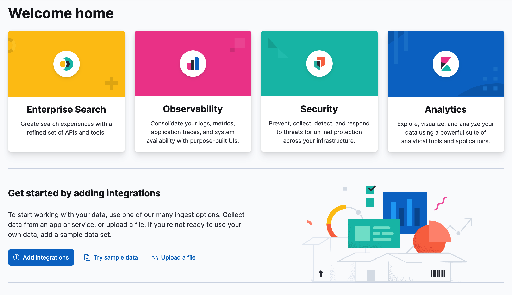
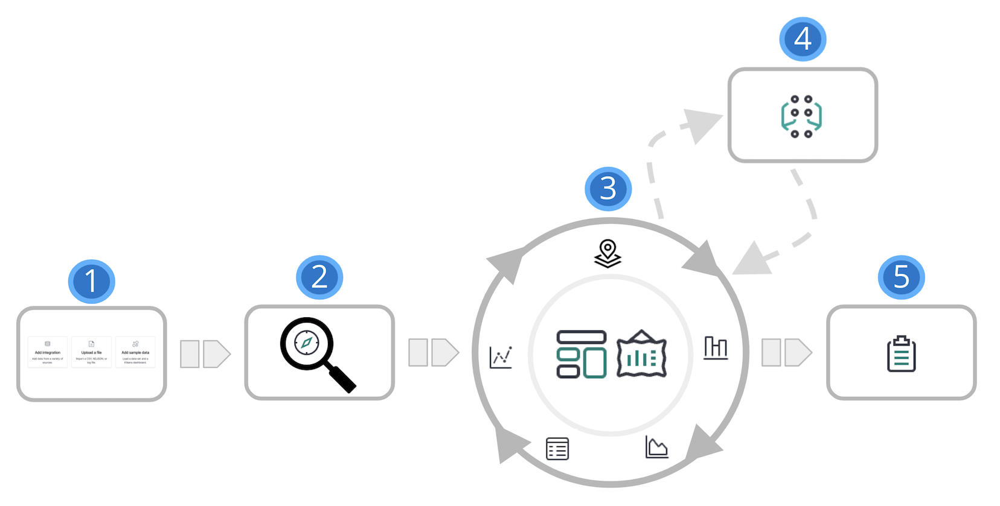
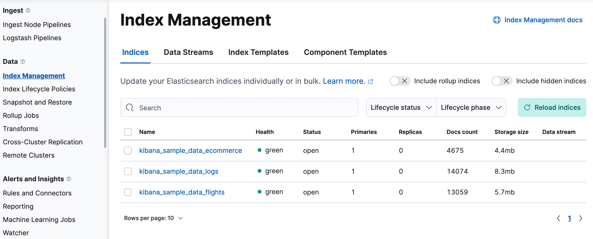
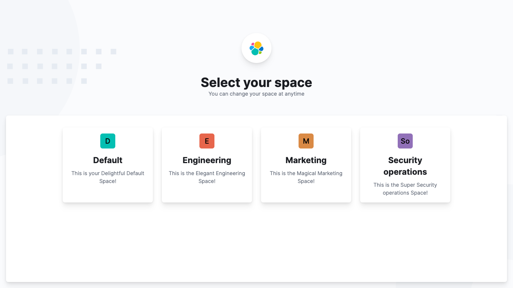
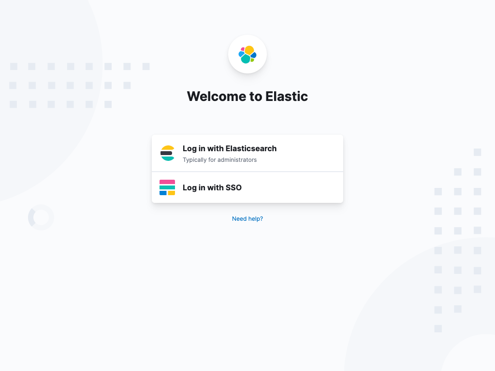
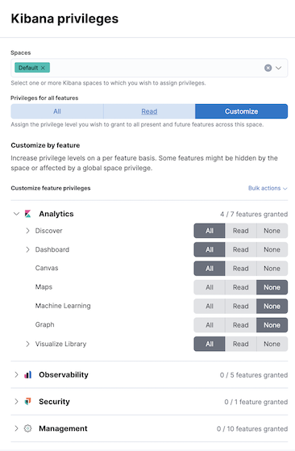
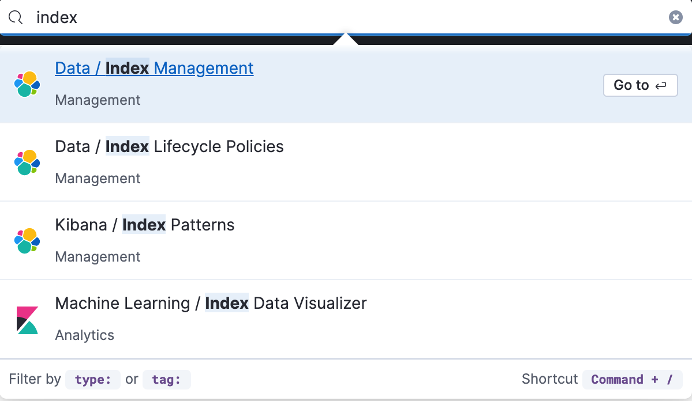
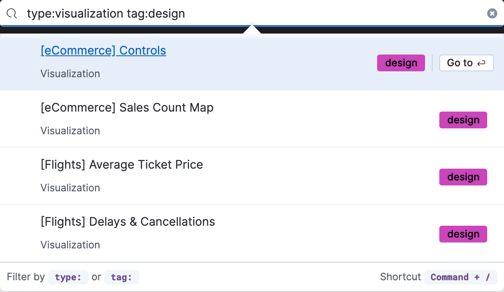

# Kibana

[TOC]

## 概述

Kibana 是一个用户界面，可让您可视化 Elasticsearch 数据并导航 Elastic Stack 。

Kibana enables you to give shape to your data and navigate the Elastic Stack.Kibana 使您能够为数据制定形状并导航 Elastic Stack。使用 Kibana，您可以：

- **Search, observe, and protect your data.** From discovering documents to analyzing logs to finding security vulnerabilities, Kibana is your portal for accessing these capabilities and more. **搜索、观察和保护您的数据。**从发现文档到分析日志，再到查找安全漏洞，Kibana 是您访问这些功能等的门户。
- **Analyze your data.** Search for hidden insights, visualize what you’ve found in charts, gauges, maps, graphs, and more, and combine them in a dashboard. **分析您的数据。**搜索隐藏的见解，可视化您在图表、仪表、地图、图形等中找到的内容，并将它们组合到一个仪表板中。
- **管理、监控和保护 Elastic Stack 。**管理您的数据，监控 Elastic Stack 集群的运行状况，并控制哪些用户可以访问哪些功能。

**Kibana is for administrators, analysts, and business users.Kibana 适用于管理员、分析师和业务用户。** 作为管理员，您的职责是管理 Elastic Stack，从创建部署到将 Elasticsearch 数据导入 Kibana，再到管理数据。As an analyst, you’re looking to discover insights in the data, visualize your data on dashboards, and share your findings.  作为分析师，您希望从数据中发现见解，在控制面板上可视化数据，并分享您的发现。As a business user, you want to view existing dashboards and drill down into details.作为业务用户，您希望查看现有控制面板并深入了解详细信息。

**Kibana 可处理所有类型的数据。**您的数据可以是结构化或非结构化文本、数值数据、时间序列数据、地理空间数据、日志、指标、安全事件等。Kibana can help you uncover patterns and relationships and visualize the results.无论您的数据是什么，Kibana 都可以帮助您发现模式和关系，并将结果可视化。

### 搜索、观察和保护

能够搜索、观察和保护您的数据是任何分析师的要求。Kibana provides solutions for each of these use cases.Kibana 为这些用例中的每一个都提供了解决方案。

- [**企业级搜索**](https://www.elastic.co/guide/en/enterprise-search/current/index.html)使您能够为应用程序、工作区和网站创建搜索体验。
- [**Elastic Observability**](https://www.elastic.co/guide/en/observability/8.15/observability-introduction.html) enables you to monitor and apply analytics in real time to events happening across all your environments. You can analyze log  events, monitor the performance metrics for the host or container that it ran in, trace the transaction, and check the overall service  availability. 
  [**Elastic 可观测性**](https://www.elastic.co/guide/en/observability/8.15/observability-introduction.html)使您能够实时监控所有环境中发生的事件并将其应用于分析。您可以分析日志事件、监控运行日志事件的主机或容器的性能指标、跟踪事务以及检查整体服务可用性。
- Designed for security analysts, [**Elastic Security**](https://www.elastic.co/guide/en/security/8.15/es-overview.html) provides an overview of the events and alerts from your environment.  Elastic Security helps you defend your organization from threats before damage and loss occur. 
  [**Elastic Security**](https://www.elastic.co/guide/en/security/8.15/es-overview.html) 专为安全分析师设计，可提供来自您环境中的事件和警报的概览。Elastic Security 可帮助您在损害和损失发生之前保护组织免受威胁。

### 分析

借助 Kibana [**Analytics**](https://www.elastic.co/guide/en/kibana/current/get-started.html)，可以快速搜索大量数据，探索字段和值，然后使用拖放界面快速构建图表、表格、指标等。

1. **添加数据。**向 Elastic Stack 添加数据的最佳方式是使用众多[集成（integrations）](https://www.elastic.co/guide/en/kibana/current/connect-to-elasticsearch.html)之一。或者，可以添加示例数据集或上传文件。所有三个选项都可以在主页上找到。
2. **Explore.探讨。** With [**Discover**](https://www.elastic.co/guide/en/kibana/current/discover.html), you can search your data for hidden insights and relationships.借助 [**Discover**](https://www.elastic.co/guide/en/kibana/current/discover.html)，您可以搜索数据以查找隐藏的见解和关系。提出您的问题，然后将结果筛选为所需的数据。可以将结果限制为最近添加到 Elasticsearch 的文档。
3. **可视化。**Kibana provides many options to create visualizations of your data, from aggregation-based data to time series data to geo data.Kibana 提供了许多选项来创建数据可视化，从基于聚合的数据到时间序列数据再到地理数据。[**Dashboard**](https://www.elastic.co/guide/en/kibana/current/dashboard.html) 是您创建可视化的起点，然后将它们整合在一起以从多个角度显示数据。 Use [**Canvas**](https://www.elastic.co/guide/en/kibana/current/canvas.html), to give your data the “wow” factor for display on a big screen. Use **Graph** to explore patterns and relationships. 使用 [**Canvas**](https://www.elastic.co/guide/en/kibana/current/canvas.html) 为您的数据提供“哇”因素，以便在大屏幕上显示。使用 **Graph** 探索模式和关系。
4. **Model data behavior.** Use [**Machine learning**](https://www.elastic.co/guide/en/kibana/current/xpack-ml.html) to model the behavior of your data—forecast unusual behavior and perform outlier detection, regression, and classification analysis. **对数据行为进行建模。**使用[**机器学习**](https://www.elastic.co/guide/en/kibana/current/xpack-ml.html)对数据行为进行建模 — 预测异常行为并执行异常值检测、回归和分类分析。
5. **共享。**准备好与更多受众[分享](https://www.elastic.co/guide/en/kibana/current/reporting-getting-started.html)您的发现了吗？Kibana 提供了许多选项，包括嵌入仪表板、共享链接、导出为 PDF 等。

### 管理您的数据

Kibana 可帮助您通过 UI 的便利性执行数据管理任务。您可以：

- Refresh, flush, and clear the cache of your indices. 
  刷新、刷新和清除索引的缓存。
- Define the lifecycle of an index as it ages. 
  定义索引在老化时的生命周期。
- Define a policy for taking snapshots of your cluster. 
  定义用于拍摄集群快照的策略。
- Roll up data from one or more indices into a new, compact index. 
  将数据从一个或多个索引汇总到一个新的紧凑索引中。
- Replicate indices on a remote cluster and copy them to a local cluster. 
  在远程集群上复制索引并将其复制到本地集群。

### 发出警报并采取行动

Detecting and acting on significant shifts and signals in your data is a need that exists in almost every use case. 检测数据中的重大变化和信号并采取相应措施几乎存在于每个用例中。Alerting allows you to detect conditions in different Kibana apps and trigger actions when those conditions are met. 通过警报，您可以检测不同 Kibana 应用中的条件，并在满足这些条件时触发操作。For example, you might trigger an alert when a shift occurs in your business critical KPIs or when memory, CPU, or disk space take a dip. When the alert triggers, you can send a notification to a system that is part of your daily workflow: email, Slack, PagerDuty, ServiceNow, and other third party integrations.例如，当业务关键型 KPI 发生偏移或内存、CPU  或磁盘空间下降时，您可能会触发警报。触发警报时，您可以向日常工作流程中的系统发送通知：电子邮件、Slack、PagerDuty、ServiceNow 和其他第三方集成。

用于创建、搜索和编辑规则的专用视图位于 [**Rules**](https://www.elastic.co/guide/en/kibana/current/create-and-manage-rules.html) 中。

### 组织内容

您可能正在管理数十、数百甚至数千个仪表板、可视化和其他 Kibana 资产。Kibana 具有多项功能，可让您的内容井井有条。

#### Collect related items in a space 在空间中收集相关项目

Kibana provides [spaces](https://www.elastic.co/guide/en/kibana/current/xpack-spaces.html) for organizing your visualizations, dashboards, data views, and more. Think of a space as its own mini Kibana installation—it’s isolated from all other spaces, so you can tailor it to your specific needs without impacting others.
Kibana 提供了用于组织可视化、仪表板、数据视图等的[空间](https://www.elastic.co/guide/en/kibana/current/xpack-spaces.html)。将空间视为自己的迷你 Kibana 安装，它与所有其他空间隔离，因此您可以根据自己的特定需求进行定制，而不会影响其他人。

#### 使用标签组织您的内容

Tags are keywords or labels that you assign to saved objects, such as dashboards and visualizations, so you can classify them in a way that is meaningful to you. For example, if you tag objects with “design”, you can search and filter on the tag to see all related objects. Tags are also good for grouping content into categories within a space.
标签是您分配给已保存对象 （如控制面板和可视化） 的关键字或标签，因此您可以以对您有意义的方式对它们进行分类。例如，如果使用 “design” 标记对象，则可以搜索和筛选标记以查看所有相关对象。标记还适用于将空间内的内容分组到类别中。

Don’t worry if you have hundreds of dashboards that need to be tagged. Use [**Tags**](https://www.elastic.co/guide/en/kibana/current/managing-tags.html) in **Stack Management** to create your tags, then assign and delete them in bulk operations.
如果您有数百个需要标记的控制面板，请不要担心。使用 **Stack Management** 中的[**标签**](https://www.elastic.co/guide/en/kibana/current/managing-tags.html)创建标签，然后在批量操作中分配和删除它们。

### 安全的 Kibana

Kibana 提供了一系列安全功能，供您控制谁可以访问哪些内容。[Security is enabled automatically](https://www.elastic.co/guide/en/elasticsearch/reference/8.15/configuring-stack-security.html) when you enroll Kibana with a secured Elasticsearch cluster. 当您使用安全的 Elasticsearch 集群注册 Kibana 时[，系统会自动启用安全性](https://www.elastic.co/guide/en/elasticsearch/reference/8.15/configuring-stack-security.html)。

#### 登录

Kibana supports several [authentication providers](https://www.elastic.co/guide/en/kibana/current/kibana-authentication.html), allowing you to login using Elasticsearch’s built-in realms, or with your own single sign-on provider.
Kibana 支持多个[身份验证提供程序](https://www.elastic.co/guide/en/kibana/current/kibana-authentication.html)，允许您使用 Elasticsearch 的内置领域登录，或者使用您自己的单点登录提供程序进行登录。

 

#### 安全访问

Kibana 提供用于控制哪些用户可以查看和管理 Kibana 功能的角色和权限。权限授予查看应用程序或执行特定操作的权限，并分配给角色。Roles allow you to describe a “template” of capabilities that you can grant to many users, without having to redefine what each user should be able to do.角色允许您描述可以授予许多用户的能力“模板”，而不必重新定义每个用户应该能够做什么。

When you create a role, you can scope the assigned Kibana privileges to specific spaces. This makes it possible to grant users different access levels in different spaces, or even give users their very own private space. For example, power users might have privileges to create and edit visualizations and dashboards, while analysts or executives might have **Dashboard** and **Canvas** with read-only privileges.
创建角色时，您可以将分配的 Kibana 权限范围限定为特定空间。这使得可以在不同的空间中授予用户不同的访问级别，甚至可以为用户提供自己的私人空间。例如，高级用户可能具有创建和编辑可视化和控制面板的权限，而分析师或高管可能具有具有只读权限的**控制面板**和 **Canvas**。

Kibana 的角色管理界面允许您描述这些不同的访问级别，或者可以通过 [API](https://www.elastic.co/guide/en/kibana/current/role-management-api.html) 自动创建角色。

 

#### 审核访问权限

配置用户和角色后，可能希望维护谁在何时执行了哪些操作的记录。Kibana 审计日志将为您记录此信息，然后将其与 Elasticsearch 审计日志相关联，以更深入地了解用户的行为。

### 查找应用程序和对象

要快速查找应用程序和您创建的对象，请使用全局标题中的搜索字段。Search suggestions include deep links into applications, allowing you to directly navigate to the views you need most.搜索建议包括应用程序的深层链接，允许您直接导航到您最需要的视图。

可以按类型、名称和标签搜索对象。要充分利用搜索功能，请遵循以下提示：

- 使用键盘快捷键（在 Windows 和 Linux 上为 Ctrl+/，在 MacOS 上为 Command+/）随时专注于输入。

- 使用提供的语法关键字。

  | 搜索             | 示例                                                         |
  | ---------------- | ------------------------------------------------------------ |
  | 按类型搜索       | `type:dashboard` 可用类型：`application`， `canvas-workpad`， `dashboard`， `data-view`， `lens`， `maps`， `query`， `search`， `visualization` |
  | 按标签搜索       | `tag:mytagname`  `tag:"tag name with spaces"`           |
  | 按类型和名称搜索 | `type:dashboard my_dashboard_title`                          |
  | 高级搜索         | `tag:(tagname1 or tagname2) my_dashboard_title`  `type:lens tag:(tagname1 or tagname2)`  `type:(dashboard or canvas-workpad) logs` |

此示例使用标记 `design` 搜索可视化 。

## 获取帮助

单击  以获取问题帮助或提供反馈。

To keep up with what’s new and changed in Elastic, click the celebration icon in the global header.
要了解 Elastic 中的新增功能和更改，请单击全局标题中的庆祝图标。