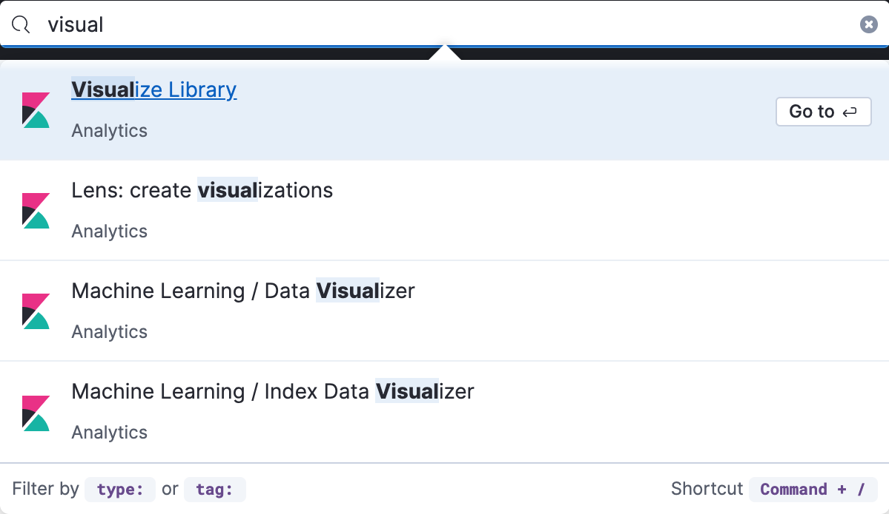
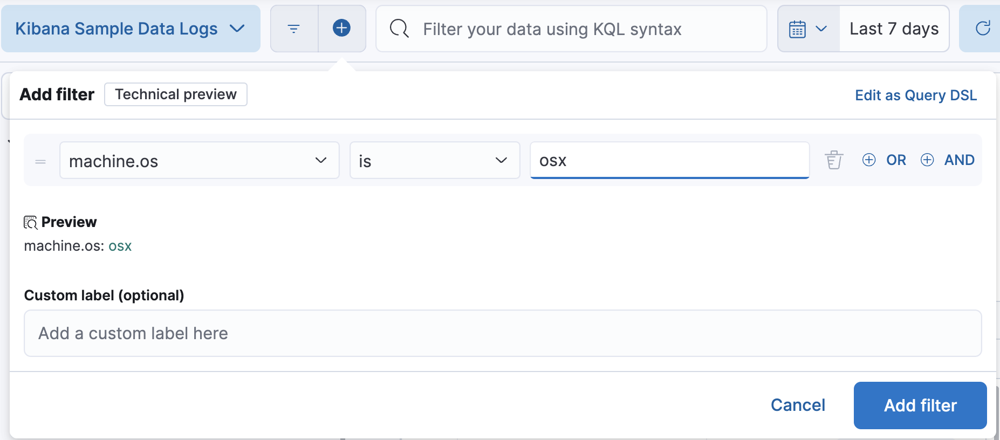

# 概念

[TOC]

**Learn the shared concepts for analyzing and visualizing your data 了解分析和可视化数据的共享概念** 

作为分析师，您将结合使用 Kibana 应用程序来分析和可视化数据。Kibana 包含通用应用和适用于[**企业搜索**](https://www.elastic.co/guide/en/enterprise-search/current/index.html)、[**Elastic 可观测性和**](https://www.elastic.co/guide/en/observability/8.15/observability-introduction.html) [**Elastic 安全**](https://www.elastic.co/guide/en/security/8.15/es-overview.html)解决方案的应用。这些应用程序共享一组通用的概念。

## 关于 Elasticsearch 的三件事

使用 Kibana，不需要了解有关 Elasticsearch 的所有信息，但最重要的概念如下：

- **Elasticsearch 使 JSON 文档可搜索和可聚合。**文档存储在[索引](https://www.elastic.co/guide/en/elasticsearch/reference/8.15/documents-indices.html)或[数据流](https://www.elastic.co/guide/en/elasticsearch/reference/8.15/data-streams.html)中，它们表示一种类型的数据。
- ***Searchable\* means that you can filter the documents for conditions.** For example, you can filter for data "within the last 7 days" or data that "contains the word Kibana". Kibana provides many ways for you to construct filters, which are also called queries or search terms. 
  ***Searchable （可搜索\*） 表示您可以筛选文档的条件。**例如，您可以筛选“过去 7 天内”的数据或“包含单词 Kibana”的数据。Kibana 为您提供了许多构建筛选条件的方法，这些筛选条件也称为查询或搜索词。
- ***Aggregatable\* means that you can extract summaries from matching documents.** The simplest aggregation is **count**, and it is frequently used in combination with the **date histogram**, to see count over time. The **terms** aggregation shows the most frequent values. 
  ***可聚合\*意味着您可以从匹配的文档中提取摘要。**最简单的聚合是 **count**，它经常与**日期直方图**结合使用，以查看一段时间内的计数。**terms** aggregation 显示最频繁的值。

## 查找应用程序和对象

Kibana 在每个页面上都提供了一个[全局搜索栏](https://www.elastic.co/guide/en/kibana/current/introduction.html#kibana-navigation-search)，可以使用它来查找任何应用程序或保存的对象。在 Windows 和 Linux 上使用键盘快捷键 Ctrl+/，在 MacOS 上使用 Command+/ 打开搜索栏。

## 使用数据视图访问数据

Kibana requires a data view to tell it which Elasticsearch data you want to access, and whether the data is time-based. A data view can point to one or more Elasticsearch data streams, indices, or index aliases by name.
Kibana 需要一个数据视图来告诉它您要访问哪些 Elasticsearch 数据，以及数据是否基于时间。数据视图可以按名称指向一个或多个 Elasticsearch 数据流、索引或索引别名。

数据视图通常由管理员在将数据发送到 Elasticsearch 时创建。您可以在 **Stack Management** [中创建或更新数据视图](https://www.elastic.co/guide/en/kibana/current/data-views.html)，也可以使用访问 Kibana API 的脚本创建或更新数据视图。

Kibana uses the data view to show you a list of fields, such as `event.duration`. You can customize the display name and format for each field. For example, you can tell Kibana to display `event.duration` in seconds. Kibana has [field formatters](https://www.elastic.co/guide/en/kibana/current/managing-data-views.html#managing-fields) for strings, dates, geopoints, and numbers.
Kibana 使用数据视图向您显示字段列表，例如 `event.duration`。您可以自定义每个字段的显示名称和格式。例如，您可以指示 Kibana 以秒为单位显示 `event.duration`。Kibana 具有用于字符串、日期、地理点和数字的[字段格式化程序](https://www.elastic.co/guide/en/kibana/current/managing-data-views.html#managing-fields)。

## 搜索数据

Kibana 为您提供了多种构建搜索查询的方法，这将减少您从 Elasticsearch 获得的文档匹配项数量。Kibana 应用程序提供时间筛选器，大多数应用程序还包括半结构化搜索和额外筛选器。

If you frequently use any of the search options, click  next to the semi-structured search to save or load a previously saved query. The saved query always contains the semi-structured search query, and optionally the time filter and extra filters.
如果您经常使用任何搜索选项，请单击  半结构化搜索旁边的 以保存或加载以前保存的查询。保存的查询始终包含半结构化搜索查询，以及可选的时间筛选器和额外筛选器。

### 时间过滤器

[全局时间筛选器](https://www.elastic.co/guide/en/kibana/current/set-time-filter.html) 限制显示数据的时间范围。在大多数情况下，the time filter applies to the time field in the data view, but some apps allow you to use a different time field.时间筛选器适用于数据视图中的时间字段，但某些应用程序允许您使用不同的时间字段。

使用时间筛选条件，可以配置刷新率以定期重新提交搜索。

 

要手动重新提交搜索，请单击 **Refresh** 按钮。当您使用 Kibana 查看基础数据时，这非常有用。

### 半结构化搜索

Combine free text search with field-based search using the Kibana Query Language (KQL). Type a search term to match across all fields, or start typing a field name to get suggestions for field names and operators that you can use to build a structured query. The semi-structured search will filter documents for matches, and only return matching documents.
使用 Kibana 查询语言 （KQL） 将自由文本搜索与基于字段的搜索相结合。键入要在所有字段中匹配的搜索词，或开始键入字段名称以获取可用于构建结构化查询的字段名称和运算符的建议。半结构化搜索将筛选匹配项的文档，并且仅返回匹配的文档。

以下是一些示例 KQL 查询。

| 查询                            | 示例                                                |
| ------------------------------- | --------------------------------------------------- |
| Exact phrase query 精确短语查询 | `http.response.body.content.text:"quick brown fox"` |
| Terms query 术语查询            | http.response.status_code:400 401 404               |
| Boolean query 布尔查询          | `response:200 or extension:php`                     |
| Range query 范围查询            | `account_number >= 100 and items_sold <= 200`       |
| Wildcard query 通配符查询       | `machine.os:win*`                                   |

### 使用 AND 的其他过滤器

Structured filters are a more interactive way to create Elasticsearch queries, and are commonly used when building dashboards that are shared by multiple analysts. Each filter can be disabled, inverted, or pinned across all apps. Each of the structured filters is combined with AND logic on the rest of the query.
结构化筛选器是创建 Elasticsearch 查询的一种更具交互性的方式，通常用于构建由多个分析师共享的仪表板。可以在所有应用程序中禁用、反转或固定每个筛选器。每个结构化筛选器都与查询其余部分的 AND 逻辑相结合。

## 保存对象

Kibana 允许保存对象以供自己将来使用或与他人共享。每种[保存的对象](https://www.elastic.co/guide/en/kibana/current/managing-saved-objects.html)类型都有不同的功能。例如，您可以保存使用 **Discover** 进行的搜索查询，这样就可以：

- 分享搜索链接
- 以 CSV 格式下载完整的搜索结果
- Start an aggregated visualization using the same search query 
  使用相同的搜索查询启动聚合可视化
- 将 **Discover** 搜索结果嵌入到仪表板中
- 将 **Discover** 搜索结果嵌入到 Canvas Workpad 中

对于组织，每个保存的对象都可以具有名称、[标签](https://www.elastic.co/guide/en/kibana/current/introduction.html#kibana-navigation-search)和类型。使用全局搜索可快速打开已保存的对象。