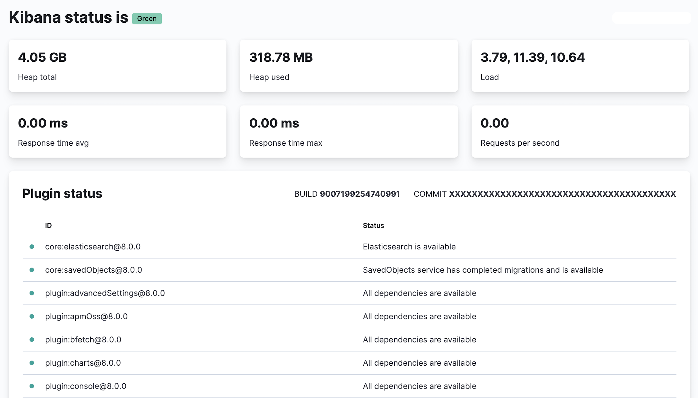

# 访问 Kibana

[TOC]

## 登录到 Web 应用程序

如果使用的是自行管理的部署，请通过端口 5601 上的 Web 应用程序访问 Kibana。

1. 将 Web 浏览器指向运行 Kibana 的计算机，并指定端口号。例如，`localhost:5601` 或 `http://YOURDOMAIN.com:5601`。
   
   要远程连接到 Kibana，请将 [server.host](https://www.elastic.co/guide/en/kibana/current/settings.html#server-host) 设置为非环回地址。
   
2. 登录您的帐户。

## 检查 Kibana 状态

The status page displays information about the server resource usage and installed plugins.
状态页面显示有关服务器资源使用情况和已安装插件的信息。

To view the Kibana status page, use the status endpoint. For example, `localhost:5601/status`.
要查看 Kibana 状态页面，请使用 status 终端节点。例如，`localhost：5601/status`。

 

有关 JSON 格式的服务器状态详细信息，请使用 `localhost：5601/api/status` API 端点。

## 排查 Kibana UI 错误

排查 `Kibana Server is not Ready yet` 错误。

1. 在 Kibana 节点中，确认与 Elasticsearch 的连接：
   
   ```bash
   curl -XGET elasticsearch_ip_or_hostname:9200/
   ```
   
2. Guarantee the health of the three Kibana-backing indices.  All indices must appear and display `status:green` and `status:open`:
   保证三个 Kibana 支持指数的运行状况。所有索引都必须显示并显示 `status：green` 和 `status：open`：

   ```bash
   curl -XGET elasticsearch_ip_or_hostname:9200/_cat/indices/.kibana,.kibana_task_manager,.kibana_security_session?v=true
   ```

   These Kibana-backing indices must also not have [index settings](https://www.elastic.co/guide/en/elasticsearch/reference/8.15/indices-get-settings.html) flagging `read_only_allow_delete` or `write` [index blocks](https://www.elastic.co/guide/en/elasticsearch/reference/8.15/index-modules-blocks.html).
   这些 Kibana 支持的索引也不得具有标记 `read_only_allow_delete` 或`写入`[索引块](https://www.elastic.co/guide/en/elasticsearch/reference/8.15/index-modules-blocks.html)的[索引设置](https://www.elastic.co/guide/en/elasticsearch/reference/8.15/indices-get-settings.html)。

3. [关闭所有 Kibana 节点](https://www.elastic.co/guide/en/kibana/current/start-stop.html)。
   
4. 选择任何 Kibana 节点，然后更新配置以设置[调试日志记录](https://www.elastic.co/guide/en/kibana/current/log-settings-examples.html#change-overall-log-level)。
   
5. [启动节点](https://www.elastic.co/guide/en/kibana/current/start-stop.html)，然后检查启动调试日志中是否存在 `ERROR` 消息或其他启动问题。
   
   例如：
   
   - 当 Kibana 无法连接到运行状况良好的 Elasticsearch 集群时，会出现诸如 `master_not_discovered_exception` 或 `UNABLE to revive connection` 或 `license is not available` 错误。
   - When one or more Kibana-backing indices are unhealthy, the `index_not_green_timeout` error appears. 
     当一个或多个 Kibana 支持的索引运行状况不佳时，将显示 `index_not_green_timeout` 错误。

## 保护对 Kibana 的访问

Kibana 拥有一套不断增长的强大功能，可帮助您充分利用数据。数据很重要，应该受到保护。Kibana 允许您保护对数据的访问并控制用户与数据交互的方式。

For example, some users might only need to view your stunning dashboards,  while others might need to manage your fleet of Elastic agents and run  machine learning jobs to detect anomalous behavior in your network.
例如，一些用户可能只需要查看令人惊叹的控制面板，而另一些用户可能需要管理您的 Elastic 代理队列并运行机器学习作业来检测您网络中的异常行为。

Kibana 的三项安全功能：空间、角色和用户。

### 空间

是否有多个团队在使用 Kibana？是否希望有一个“游乐场”来试验新的可视化或规则？如果是这样，那么 [ Kibana Spaces](https://www.elastic.co/guide/en/kibana/current/xpack-spaces.html) 可以提供帮助。

将空间视为 Kibana 的另一个实例。A space allows you to organize your [dashboards](https://www.elastic.co/guide/en/kibana/current/dashboard.html), [rules](https://www.elastic.co/guide/en/kibana/current/alerting-getting-started.html), [machine learning jobs](https://www.elastic.co/guide/en/kibana/current/xpack-ml.html), and much more into their own categories. 空间允许您将[控制面板](https://www.elastic.co/guide/en/kibana/current/dashboard.html)、[规则](https://www.elastic.co/guide/en/kibana/current/alerting-getting-started.html)、[机器学习作业](https://www.elastic.co/guide/en/kibana/current/xpack-ml.html)等组织到自己的类别中。例如，您可能有一个 Marketing 空间供营销人员跟踪其营销活动的结果，还有一个 Engineering 空间供开发人员[监控应用程序性能](https://www.elastic.co/guide/en/apm/guide/8.15/apm-overview.html)。

在一个空间中创建的资源与其他空间隔离，因此当进入空间时，只能看到属于该空间的资源。

### 角色

设置空间后，保护访问权限的下一步是配置角色。角色是允许您在 Kibana 和 Elasticsearch 中执行操作的权限集合。Roles are assigned to  users, and to [system accounts](https://www.elastic.co/guide/en/elasticsearch/reference/8.15/built-in-users.html) that power the Elastic Stack.角色分配给用户和为 Elastic Stack 提供支持的[系统帐户](https://www.elastic.co/guide/en/elasticsearch/reference/8.15/built-in-users.html)。

可以创建自己的角色，也可以使用任何[内置角色](https://www.elastic.co/guide/en/elasticsearch/reference/8.15/built-in-roles.html)。某些内置角色适用于 Elastic Stack 组件，不应直接分配给最终用户。

`kibana_admin` 是更有用的内置角色之一。将此角色分配给您的用户将授予对 Kibana 所有功能的访问权限。这包括管理 Spaces 的能力。

The built-in roles are great for getting started with the Elastic Stack,  and for system administrators who do not need more restrictive access.  With so many features, it’s not possible to ship more granular roles to  accommodate everyone’s needs. This is where custom roles come in.
内置角色非常适合开始使用 Elastic Stack，以及不需要更多限制性访问权限的系统管理员。由于功能如此之多，因此无法提供更精细的角色来满足每个人的需求。这就是自定义角色的用武之地。

作为管理员，可以创建自己的角色，以准确描述您的用户应具有的访问权限类型。例如，可以创建一个 `marketing_user` 角色，然后将其分配给营销部门中的所有用户。此角色将授予对该团队成功所需的所有必要数据和功能的访问权限，而无需授予他们不需要的访问权限。

### 用户


设置角色后，保护访问权限的下一步是创建用户，并为他们分配一个或多个角色。Kibana’s user management  allows you to provision accounts for each of your users.Kibana 的用户管理允许您为每个用户预置账户。

Want Single Sign-on? Kibana supports a wide range of SSO implementations, including SAML, OIDC, LDAP/AD, and Kerberos.
需要单点登录？Kibana 支持广泛的 SSO 实施，包括 SAML、OIDC、LDAP/AD 和 Kerberos。

### 示例：创建仅有权访问控制面板的用户

考虑一位想要监控其营销活动效果的营销分析师。他们应该能够查看其团队的仪表板，但不允许查看或管理 Kibana 中的其他任何内容。团队的所有仪表板都位于 Marketing 空间中。

#### 创建 space

创建营销空间供营销分析师使用。

1. 打开主菜单，然后选择 **Stack Management**。
   
2. 在 **Kibana** 下，选择 **Spaces**。
   
3. 单击 **Create a space（创建空间**）。
   
4. Give this space a unique name. For example: `Marketing`. 
   为此空间指定唯一名称。例如：`营销`。

5. Click **Create space**.
   单击 **Create space（创建空间**）。

   If you’ve followed the example above, you should end up with a space that looks like this:
   如果您遵循了上面的示例，则最终应该得到一个如下所示的空格：

   

#### Create a role 创建角色

To effectively use dashboards, create a role that describes the privileges you want to grant. In this example, a marketing analyst will need:
要有效地使用控制面板，请创建一个角色来描述您要授予的权限。在此示例中，营销分析师将需要：

- Access to **read** the data that powers the dashboards 
  读取支持仪表板的数据的权限
- Access to **read** the dashboards within the `Marketing` space 
  有权**读取** `Marketing` Space 中的仪表板

To create the role: 要创建角色，请执行以下操作：

1. Open the main menu, and select **Stack Management**. 
   打开主菜单，然后选择 **Stack Management**。

2. Under **Security**, select **Roles**. 
   在 **Security（安全**）下，选择 **Roles（角色**）。

3. Click **Create role**. 
   单击 **Create role（创建角色**）。

4. Give this role a unique name. For example: `marketing_dashboards_role`. 
   为此角色指定唯一名称。例如：`marketing_dashboards_role`。

5. For this example, you want to store all marketing data in the `acme-marketing-*` set of indices. To grant this access, locate the **Index privileges** section and enter:
   在此示例中，您希望将所有营销数据存储在 `acme-marketing-*` 索引集中。要授予此访问权限，请找到 **Index privileges** 部分并输入：

   1. `acme-marketing-*` in the **Indices** field. 
      `acme-marketing-*` 在 **Indices** 字段中。

   2. `read` and `view_index_metadata` in the **Privileges** field.
      `读取`并`view_index_metadata` **Privileges** 字段。

      You can add multiple patterns of indices, and grant different access levels to each. Click **Add index privilege** to grant additional access.
      您可以添加多种索引模式，并为每个模式授予不同的访问级别。单击 **Add index privilege** 以授予其他访问权限。

6. To grant access to dashboards in the `Marketing` space, locate the Kibana section, and click **Add Kibana privilege**:
   要授予对 `Marketing` 空间中仪表板的访问权限，请找到 Kibana 部分，然后单击 **Add Kibana privilege**：

   1. From the **Spaces** dropdown, select the `Marketing` space. 
      从 **Spaces** 下拉列表中，选择 `Marketing` 空间。
   2. Expand the **Analytics** section, and select the **Read** privilege for **Dashboard**. 
      展开 **Analytics** 部分，然后选择 **Dashboard** 的 **Read** 权限。
   3. Click **Add Kibana privilege**. 
      单击 **Add Kibana privilege（添加 Kibana 权限**）。

7. Click **Create role**.
   单击 **Create role（创建角色**）。

   If you’ve followed the example above, you should end up with a role that looks like this:
   如果您遵循了上面的示例，则最终应该会得到一个如下所示的角色：

   

#### Create a user 创建用户

Now that you created a role, create a user account.
现在，您已创建角色，请创建一个用户账户。

1. Navigate to **Stack Management**, and under **Security**, select **Users**. 
   导航到 **Stack Management**，然后在 **Security** 下选择 **Users**。
2. Click **Create user**. 
   单击 **Create user（创建用户**）。
3. Give this user a descriptive username, and choose a secure password. 
   为此用户提供描述性用户名，然后选择安全密码。
4. Assign the **marketing_dashboards_role** that you previously created to this new user. 
   将您之前创建的**marketing_dashboards_role**分配给此新用户。
5. Click **Create user**. 
   单击 **Create user（创建用户**）。


#### Verify 验证

Verify that the user and role are working correctly.
验证用户和角色是否正常工作。

1. Logout of Kibana if you are already logged in. 
   如果您已经登录，请注销 Kibana。

2. In the login screen, enter the username and password for the account you created.
   在登录屏幕中，输入您创建的帐户的用户名和密码。

   You’re taken into the `Marketing` space, and the main navigation shows only the **Dashboard** application.
   您将进入 `Marketing` 空间，主导航仅显示 **Dashboard** 应用程序。

   
