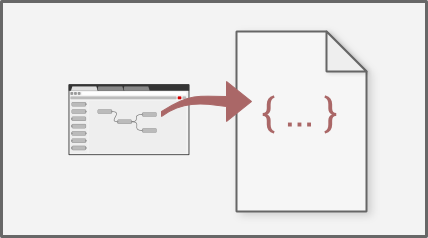

# Node-RED

[TOC]

## 概述

Low-code programming for event-driven applications 事件驱动应用程序的低代码编程

https://nodered.org/

Node-RED 是一个编程工具，用于以新颖有趣的方式将硬件设备、API 和在线服务连接在一起。

It provides a browser-based editor that makes it easy to wire together  flows using the wide range of nodes in the palette that can be deployed  to its runtime in a single-click.
它提供了一个基于浏览器的编辑器，可以使用面板中的大量节点轻松地将流连接在一起，只需单击即可将这些节点部署到运行时。

Node-RED is a flow-based programming tool, originally developed by [IBM’s Emerging Technology Services](https://emerging-technology.co.uk) team and now a part of the [OpenJS Foundation](https://openjsf.org/).
Node-RED 是一个基于流的编程工具，最初由 [IBM的新兴技术服务](https://emerging-technology.co.uk) 团队开发，现在是 [OpenJS 基金会](https://openjsf.org/) 的一部分。

### Browser-based flow editing 基于浏览器的流编辑

 

Node-RED provides a browser-based flow editor that makes it easy to wire  together flows using the wide range of nodes in the palette. Flows can  be then deployed to the runtime in a single-click.
Node-RED 提供了一个基于浏览器的流编辑器，可以使用选项板中的各种节点轻松地将流连接在一起。然后，只需单击一下，就可以将流部署到运行时。

JavaScript functions can be created within the editor using a rich text editor.
JavaScript 函数可以使用富文本编辑器在编辑器中创建。

内置的库允许保存有用的函数、模板或流以供重用。

### 在 Node.js 上构建

 

The light-weight runtime is built on Node.js, taking full advantage of its  event-driven, non-blocking model. This makes it ideal to run at the edge of the network on low-cost hardware such as the Raspberry Pi as well as in the cloud.
轻量级运行时构建在 Node.js 上，充分利用其事件驱动的非阻塞模型。这使得它非常适合在 Raspberry Pi 等低成本硬件上的网络边缘以及云中运行。

Node 的软件包存储库中有超过 225,000 个模块，因此很容易扩展组件面板节点的范围以添加新功能。

### Social Development 社会发展

 

在 Node-RED 中创建的流使用 JSON 存储，可以轻松地导入和导出，以便与他人共享。

一个在线流程库允许您与世界分享您最好的流程。

### 开始

This makes it ideal to run at the edge of the  network on low-cost hardware such as the Raspberry Pi as well as in the  cloud.
Node-RED 基于 Node.js 构建，充分利用了其事件驱动的非阻塞模型。这使得它非常适合在 Raspberry Pi 等低成本硬件上的网络边缘以及云中运行。

#### 本地运行

- [Getting started 入门](https://nodered.org/docs/getting-started/)
- [Docker](https://nodered.org/docs/platforms/docker)

#### 在设备上

- [Raspberry Pi](https://nodered.org/docs/hardware/raspberrypi)
- [BeagleBone Black](https://nodered.org/docs/hardware/beagleboneblack)
- [Interacting with Arduino 与Arduino互动](https://nodered.org/docs/hardware/arduino)
- [Android](https://nodered.org/docs/platforms/android)

#### 在云中

- [FlowFuse 弗卢恩](https://flowfuse.com)
- [Amazon Web Services 亚马逊网络服务](https://nodered.org/docs/platforms/aws)
- [Microsoft Azure](https://nodered.org/docs/platforms/azure)

### Flow-based Programming 基于流的编程

[flow-based programming](https://en.wikipedia.org/wiki/Flow-based_programming) is a way of describing an application’s behavior as a network of black-boxes, or “nodes” as they are called in Node-RED. Each node has a well-defined purpose; it is given some data, it does something with that data and then it passes that data on. The network is responsible for the flow of data between the nodes.
由 J. Paul Morrison 在 20 世纪 70 年代发明，[基于流的编程](https://en.wikipedia.org/wiki/Flow-based_programming) 是将应用程序的行为描述为黑盒网络的一种方式，或者在 Node-RED 中称为“节点”。每个节点都有明确的目的：给它一些数据，它对这些数据做些什么，然后它传递这些数据， 网络负责节点之间的数据流。

这是一种非常适合于视觉表示的模型，使其更容易为更广泛的用户所接受。如果有人可以将问题分解为离散的步骤，他们就可以查看流并了解它在做什么，而不必理解每个节点中的单独代码行。

### Runtime/Editor 作者/编辑

Node-RED consists of a Node.js based runtime that you point a web browser at to access the flow editor. Within the browser you create your application by dragging nodes from your palette into a workspace and start to wire them together. With a single click, the application is deployed back to the runtime where it is run.
Node-RED 由一个基于 Node.js 的运行时组成，可以将 Web 浏览器指向该运行时以访问流编辑器。在浏览器中，可以通过将节点从调色板拖到工作区中来创建应用程序，并开始将它们连接在一起。只需单击一下，应用程序就可以部署回运行它的运行时。

The palette of nodes can be easily extended by installing new nodes created by the community and the flows you create can be easily shared as JSON files.
通过安装社区创建的新节点，可以轻松扩展节点的调色板，并且可以轻松地将您创建的流作为 JSON 文件共享。

### 历史

Node-RED 于 2013 年初由 IBM 新兴技术服务团队的 Nick O 'Leary 和 Dave Conway-Jones 发起。

What began as a proof-of-concept for visualising and manipulating mappings between MQTT topics, quickly became a much more general tool that could be easily extended in any direction.
最初作为可视化和操纵 MQTT 主题之间映射的概念验证，很快成为一个更通用的工具，可以轻松地向任何方向扩展。

它于 2013 年 9 月开源，并一直在开放中开发，最终于 2016 年 10 月成为 JS 基金会的创始项目之一。

2019 年，Node.js 基金会与 JS 基金会合并，成立了 [OpenJS Foundation](https://openjsf.org/) 。

**为什么叫 Node-RED ？**

The name was a light-hearted play on words sounding like 'Code Red'. It stuck and was a great improvement on whatever it was called in the first few days. The 'Node' part reflects both the flow/node programming model as well as the underlying Node.JS runtime. We never did come to a conclusion on what the 'RED' part stands for. "Rapid Event Developer" was one suggestion, but we've never felt compelled to formalise anything. We stick with 'Node-RED'. 

这个名字是一个轻松的游戏，听起来像“红色代码”。它坚持了下来，是一个很大的改进，无论它被称为在最初的几天。"Node“部分反映了流/节点编程模型以及底层的Node.JS运行时。我们从来没有得出结论，什么是'红色'的一部分代表。“快速事件开发者”是一个建议，但我们从来没有觉得有必要正式化任何东西。我们坚持使用“Node RED”。