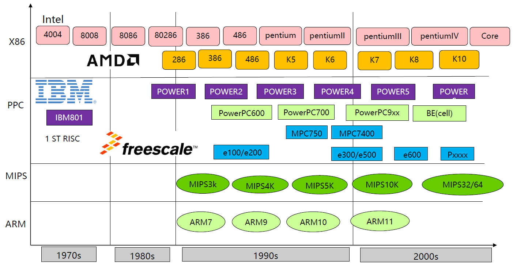

# CPU

[TOC]

## 指令集类型

### CISC（Complex Instruction Set Computer）

复杂指令集。早期的CPU都是CISC架构。设计目的是要用最少的机器语言指令来完成所需的计算任务。这种架构会增加CPU结构的复杂性和对CPU工艺的要求，但对于编译器的开发十分有利。

| 架构名称 | 推出公司   | 推出时间 | 主要授权商 |
| -------- | ---------- | -------- | ---------- |
| X86      | Intel，AMD | 1978     | 海光，兆芯 |

### RISC（Reduced Instruction Set Computer）

精简指令集。要求软件来指定各个操作步骤。这种架构可以降低CPU结构的复杂性以及云霄在相同的工艺水平下生产出功能更强大的CPU，但对于编译器的设计有更高的要求。

| 架构名称 | 推出公司 | 推出时间 | 主要授权商                             |
| -------- | -------- | -------- | -------------------------------------- |
| ARM      | ARM      | 1985     | Apple，三星，Nvidia，高通，海思，TI 等 |
| MIPS     | MIPS     | 1981     | 龙芯、炬力等                           |
| PowerPC  | IBM      | 1991     | IBM                                    |

### 对比

#### CISC  RISC

| 对比项      | CISC                   | RISC                     |
| ----------- | ---------------------- | ------------------------ |
| 指令系统    | 复杂                   | 精简                     |
| 存储器操作  | 控制指令多             | 控制简单                 |
| 程序        | 编程效率高             | 需要大内存空间，不易设计 |
| CPU芯片电路 | 功能强、面积大、功耗大 | 面积小，功耗低           |
| 应用范围    | 通用机                 | 专用机                   |

#### X86   ARM   Power

|            | X86                      | ARM                        | Power                       |
| ---------- | ------------------------ | -------------------------- | --------------------------- |
| 指令集     | CISC                     | RISC                       | RISC                        |
| 架构       | 重核架构，高性能高功耗   | 多核架构，均衡的性能功耗比 | 重核架构，高性能内核        |
| 工艺及技术 | 14nm，摩尔定律放缓       | 7nm，业界最领先的制程工艺  | 14nm                        |
| 生态       | 生态非常成熟，通用性强   | 生态正在快速发展与完备     | 生态局限，聚集大小型机和HPC |
| 开放性     | 封闭架构，Intel及AMD主导 | 开放平台，IP授权的商业模式 | 封闭架构，IBM主导           |

## 主流CPU发展路径

## ARM

Advanced RISC Machines

### 授权

1. 架构/指令集授权

   按照所授权的架构和指令集自行编写代码、设计芯片。

2. 处理器授权

   * 提供RTL代码，处理器的核数、缓存可配置。
   * 自主后端设计（主频、工艺、代工厂等）。

3. 处理器优化包/物理IP包授权（POP）

   只能按照ARM设计好的处理器类型、在指定的代工厂和工艺进行生产。