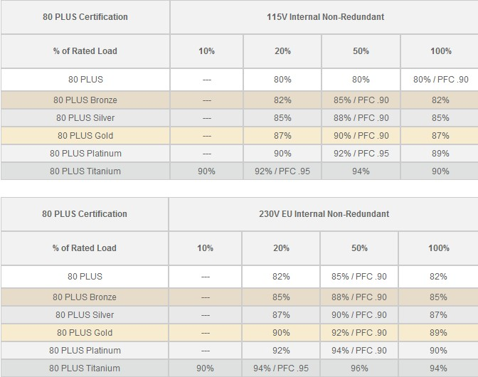
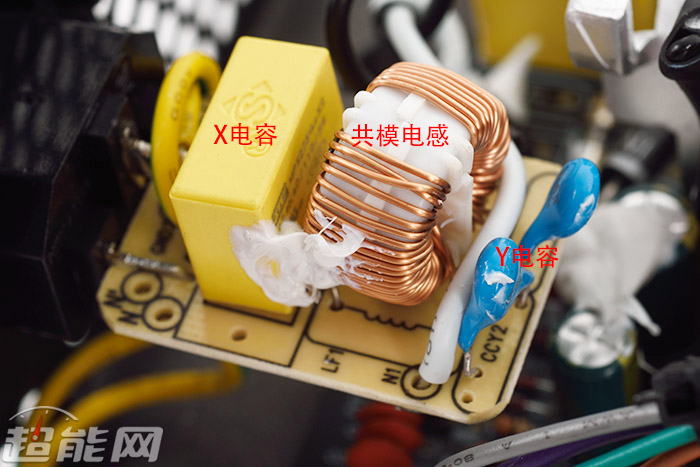

# 电源

## 认证

### Ecova 80Plus

## EMI滤波电路

PC电源中的EMI滤波电路可以分为一级EMI滤波电路以及二级EMI滤波电路，前者一般放置在电源上的AC输入插座上，有直接把元件焊接在插座上的，也有制作成独立PCB再与插座连接的；后者在多数是放置在PC电源的主PCB上，元件相比一级EMI滤波电路更多，同时也是电源保护系统的重要组成部分。

**一级EMI滤波电路**主要由X电容和Y电容组成，X电容和Y电容都属于安规电容，其中X电容并接在火线和零线之间，块头通常比较大，负责滤除差模干扰；而Y电容则是在火线与地线之间以及零线与地线之间并接的电容，通常以成对的形式出现，负责滤除共模干扰。

大部分的PC电源在都会采用一个X电容和一对Y电容组成一级EMI滤波电路，基本上这个属于主流的标准配置。而有部分产品会在这个基础上加入共模电感以增强EMI滤波作用，高端PC电源甚至会在这样的基础上增加接地金属罩以加强对EMI的防护效果。

**二级EMI滤波电路**则是在一级EMI滤波电路的基础上增添更多元件而来，除了X电容和Y电容外还会有共模电感和差模电感。共模电感（Common Mode Choke）是拥有两个绕组的线圈，其主要作用是抑制市电输入中的共模干扰，同时也抑制电源本身的共模干扰对外泄漏；而差模电感（Differential Mode Choke） 则是单个绕组的电感线圈，其主要用于抑制市电输出中的差模干扰。

差模电感的旁边有一个使用热缩套包裹的两脚直插元件，被称为MOV，即金属氧化物压敏电阻（Metal Oxide Varistor），它可以抑制输入电压的尖峰，可以起到防止输入电压过高以及雷击保护的作用。

NTC即热敏电阻（Negative Temperature CoeffiCient Resistor）也是二级EMI滤波电路中的常见的元件 ，共模电感旁边、采用热缩套包裹的墨绿色元件，具有常温下高电阻、随着自身温度提升阻值迅速减小的特性，电源在刚通电的时候NTC的温度往往与室温相当，自身呈高阻值， 可以限制电源主电容充电形成的冲击电流。

由于NTC本质上是一个电阻，因此其多少会形成不必要的电流消耗，从而影响电源的转换效率。不过其在电源进入正常工作后，会因为自身通电而发热，随之阻值下降， 对电流的限制也会放宽，从而减少对电源效能的影响。不过部分追求高效率的电源会设法将NTC的影响降到最低，这就需要用到继电器了。

继电器一般并联在NTC热敏电阻上，在开机前处于断开状态，因此在电源通电时是NTC热敏电阻在工作；而当电源进入正常工作状态后，继电器启动并导通，从而短路NTC热敏电阻，此时NTC热敏电阻不再工作，不再 消耗电流，也就不再发热，重新回到高阻态的模式下。

继电器与NTC并联的设计可以在减少电流损耗的同时也提高 了PC电源的可靠性。对于追求效率的电源来说，NTC热敏电阻几瓦的损耗始终会降低电源的转换效率，而且对于关机后在短时间内再次开机的情况，如果没有继电器，处于高温下的NTC热敏电阻将无法发挥正常作用，因此继电器与NTC在高端电源中往往是配套使用。

PC电源中EMI滤波电路本质上是一个低通滤波器，它可以滤除输入市电中的高频杂波，只让纯净50Hz的交流电进入后续的整流调压电路当中。同时它还可以降低市电中的共模和差模干扰，进一步提升输入电流的纯净度，以确保电源的稳定工作。

PC电源的EMI电路还可以起到保护电源的作用，EMI滤波电路中的MOV以及NTC可以抑制市电输入中的突发电压和突发电流，避免后续电路元件因为电压或电流的冲击而烧毁，可以说是PC电源乃至整台PC的第一道防线。

EMI滤波电路还可以抑制电源自身对外发出EMI电磁干扰。