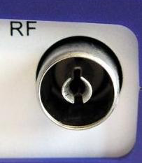
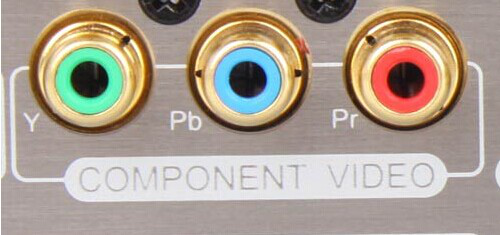
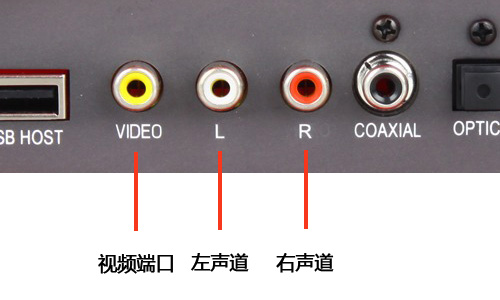
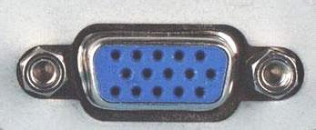
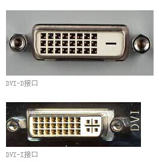
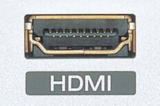

# 连接件

[TOC]

## 视频

### 射频RF

是天线和模拟闭路连接电视机采用的射频（RF）接口。可同时传输模拟视频以及音频信号。

RF射频信号需要经过调制、放大、检波、解调等过程。RF接口传输的是视频和音频混合编码后的信号，显示设备的电路将混合编码信号进行一系列分离、解码再输出成像。

### S-video接口（S端子）

全称叫 Separate Video，将 Video 信号分开传送，是在AV接口的基础上将色度信号 C 和亮度信号 Y 进行分离，再分别以不同的通道进行传输，在很大程度上避免了视频设备内信号串扰而产生的图像失真，极大提高了图像的清晰度。

S-video接口又可分为三种:

* 普通S端子
* 增强型S端子
* VIVO端子

 

### 色差

通常标记为YCbCr\YPbPr，用蓝、绿、红三种颜色来标注每条线缆和接口。绿色线缆（Y），传输亮度信号。蓝色和红色线缆（Pb 和Pr）传输的是颜色差别信号。

### AV

全称叫标准视频输入（RCA）接口,通常都是成对的白色的音频接口和黄色的视频接口，它通常采用RCA(俗称莲花头)进行连接，使用时只需要将带莲花头的标准AV线缆与相应接口连接起来即可。

### RGB

也叫RGBHV接口，“R、G、B、H、V”五种信号分别是红绿蓝三原色和行场同步信号，分别用五根同轴电缆进行传输，使信号相互间干扰减少，达到更佳的信号响应效果。

### VGA

也叫D-Sub接口，是一种D型接口，上面共有15针空，分成三排，每排五个，常用于电脑显卡的输出接口，属于模拟接口。VGA接口是显卡上应用最为广泛的接口类型，绝大多数的显卡都带有此种接口。迷你音响或者家庭影院拥有VGA接口就可以方便的和计算机的显示器连接，用计算机的显示器显示图像。

### DVI

与VGA都是电脑中最常用的接口，与VGA不同的是，DVI传输的是数字信号，速度快，画面清晰。目前，很多高清电视上也提供了DVI接口。DVI采用全数字传输方式，是一种数字化接口，通常称之为高清接口，通常情况下有效传输距离仅有10米左右。

DVI接口分为两种，一个是DVI-D接口，只能接收数字信号，不兼容模拟信号。另一种是DVI-I接口，可同时兼容模拟和数字信号。

### HDMI

与DVI接口一样采用全数字传输方式，不同的是HDMI接口不仅能传输高清数字视频信号，还可以同时传输高质量的音频信号，是高清晰度多媒体接口，广泛应用于DVD播放机、有线电视/卫星电视机顶盒、HDTV等设备上，它们可以有效地提高数字图像的质量，不再需要进行模数转换。

## 网络

## 电气

