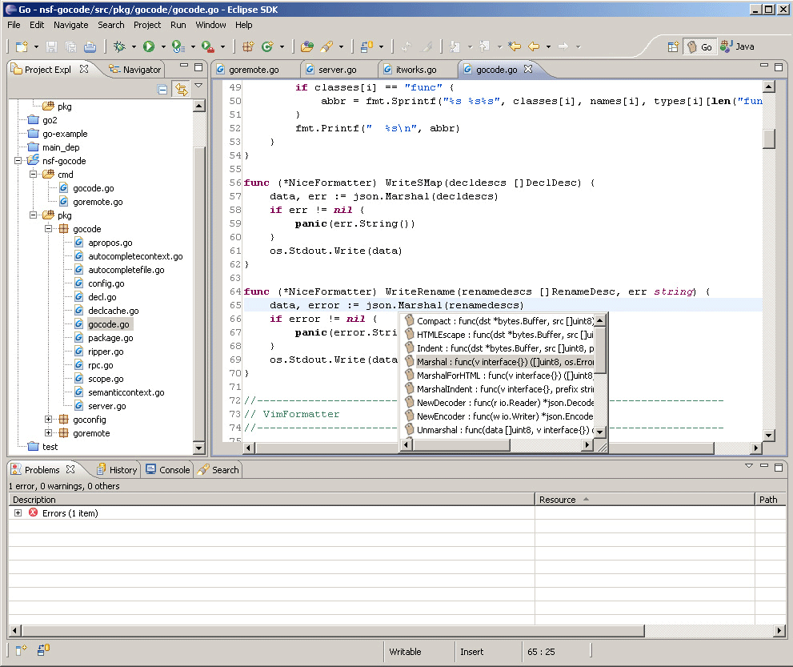

# Go 语言开发工具

## GoLand

Jetbrains 家族的 Go 语言 IDE，有 30 天的免费试用期。

支持的操作系统：Mac、Linux、Windows 

下载页面 https://www.jetbrains.com/go/


## LiteIDE

一款开源、跨平台的轻量级 Go 语言集成开发环境（IDE）。

支持的 操作系统

- Windows x86 (32-bit or 64-bit)
- Linux x86 (32-bit or 64-bit)

下载地址 ：http://sourceforge.net/projects/liteide/files/

源码地址 ：https://github.com/visualfc/liteide


## Eclipse




1. 下载 [goclipse](http://goclipse.github.io/) 插件 https://github.com/GoClipse/goclipse/blob/latest/documentation/Installation.md#installation

3. 下载 gocode，用于 go 的代码补全提示

   gocode 的 github 地址：

   ```http
   https://github.com/nsf/gocode
   ```

   再在 cmd 下安装：

   ```bash
go get -u github.com/nsf/gocode
   ```
   
   也可以下载代码，直接用 go build 来编译，会生成 gocode.exe

4. 下载 [MinGW](http://sourceforge.net/projects/mingw/files/MinGW/) 并按要求装好

5. 配置插件

   Windows->Reference->Go

   (1)、配置 Go 的编译器

   

   设置 Go 的一些基础信息

   (2)、配置 Gocode（可选，代码补全），设置 Gocode 路径为之前生成的 gocode.exe 文件

   

   设置 gocode 信息

   (3)、配置 GDB（可选，做调试用），设置 GDB 路径为 MingW 安装目录下的 gdb.exe 文件

   

   设置 GDB 信息

6. 测试是否成功

   新建一个 go 工程，再建立一个 hello.go。如下图：

   

   新建项目编辑文件

   调试如下（要在 console 中用输入命令来调试）：

   

   图 1.16 调试 Go 程序

## Sublime Text

## GoClipse

## Visual Studio Code


## 2. 配置 Goland 环境

学习编程语言，使用一个称心的 IDE，可以帮你省去很多麻烦。

开发 Python 项目，我习惯使用 PyCharm，因为已经习惯了 JetBrains 风格的IDE，可以替我省去很多熟悉新IDE的成本，所以这里我照样使用 JetBrains 专门为 Go语言开发的IDE：`Goland`。

Goland 没有像 PyCharm 那样搞一个免费社区版，它是需要付费的。

网上的PJ教程几乎都不能用了，幸好我这里有绿色免安装的版本，对，就是那种连安装都不用安装，下载解压后就能使用的专业版本。


当你的可以正常使用 Goland 后，通过点击设置进入如下界面，创建我的项目目录，顺便设置好 GOROOT 。


创建好Project后，再点击 Files->Settings->GOPATH，添加我们的项目目录`F:\Go-Player`


随便点击一个go文件，就能在下图箭头处看到配置入口，点击进入配置一下 Go运行器。


按照如下指示进行配置。


去掉参数提示


设置 goproxy


可先的代理有如下（注意后面的 direct 不要删除）

- `https://goproxy.io`
- `https://goproxy.cn`
- `https://mirrors.aliyun.com/goproxy/`

设置 goimports（自动格式化插件），如果 你之前 没有安装 ，会提示你点击 `yes` 下载安装 。


至此，环境配置完成。

在项目根目录下，创建如下三个文件夹，并在 src 目录下创建一个hello.go 的文件。


点击运行按钮，在控制台我们看到了熟悉的 `Hello, World!`


## 3. 配置 VS Code 环境

提前设置用户级的环境变量

```
GOPATH = F:\Go-Player
PATH = %GOPATH%\bin  # 以追加的方式
```

昨天评论区有人问，GOPATH 和 GOROOT 是什么？为什么需要设置？回想一下 你学 Python 的话，安装 Python 解释器的时候，是不是也要设置环境变量？这里也是类似。

GOROOT ：在GO语言中表示的是 Go语言编译、工具、标准库等的安装路径，通过它可以告诉系统你的 go.exe 是放在哪里，不设置的话，你后面执行 `go get` 、`go install` 的时候，系统就不认识它了。

而 GOPATH环境变量则表示 Go的工作目录，这个目录指定了需要从哪个地方寻找GO的包、可执行程序等，这个目录可以是多个目录表示。这里我设置成我的工作空间（目录你可以自己定） ：`F:\Go-Player`，如果不设置的话 ，默认是在你的用户目录下的 go 文件夹。

这时要再说一点，GO 项目中，一般来说它的工作目录结构是这样的：

- bin目录：包含了可执行程序，注意是可执行的，不需要解释执行。
- pkg目录：包含了使用的包或者说库。
- src目录：里面包含了go的代码源文件，其中仍按包的不同进行组织。

所以后面我的创建的GO工作目录，也是按照这个标准来，先说明一下。

接下来，要开始配置 VS Code 环境。

打开你的 VS Code软件，先确认你设置的环境变量已经生效，点击 `Terminal` -> `New Terminal`，使用 cmd 命令查看环境变量。


如上图所求，我的环境变量是OK的，如果你的输出是指向你的用户目录：`%USERPROFILE%\go` 建议你不要折腾（因为我无论重启多少次 VS Code，其记录的GOPATH始终指向%USERPROFILE%:raw-latex:go）， 直接重启你的电脑。

好了之后，我们要从 github 上下载两个仓库，之所以要手动下载，是因为有墙的存在，在线安装的话，很多插件你会下载失败。

创建目录 `src/goland.org/x/`，并进入此目录，执行命令

```
$ git clone https://github.com/golang/tools.git
$ git clone https://github.com/golang/lint.git
```

点击 `File` - `Open Folder` 安装两个插件：

第一个是：Go 语言的扩展插件


第二个是：Code Runner，让你的 VS Code 能够编译运行 Go 的程序。


随便点开一个 go 文件，在你的右下角会提示要你安装一些工具，安装的包有些由于墙的原因，无法下载，为了保证下载顺利，可以设置一下代理。

```
$ go env -w GOPROXY=https://goproxy.cn,direct
```

然后再点击 `Install All`


然后你在 OUTPUT 就能看到安装进度


安装的 exe 文件会放在 %GOPATH%/bin 下，也就是 `F:\Go-Player\bin`


而此的 src 目录结构是这样的


到这时环境配置完成，编写 HelloWorld，并运行查看输出，一切完成。

