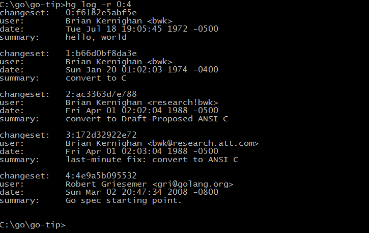

# History

在上个世纪70年代，贝尔实验室的 [Ken Thompson](http://genius.cat-v.org/ken-thompson/) 和 [Dennis M. Ritchie](http://genius.cat-v.org/dennis-ritchie/) 合作发明了 [UNIX](http://doc.cat-v.org/unix/) 操作系统，同时 Dennis M. Ritchie 为了解决 [UNIX](http://doc.cat-v.org/unix/) 系统的移植性问题而发明了 C 语言，贝尔实验室的 UNIX 和 C 语言两大发明奠定了整个现代IT行业最重要的软件基础。

在 UNIX 和 C 语言发明40年之后，目前已经在Google工作的 Ken Thompson 和 [Rob Pike](http://genius.cat-v.org/rob-pike/) （他们在贝尔实验室时就是同事）、还有 [Robert Griesemer](http://research.google.com/pubs/author96.html) （设计了V8 引擎和 HotSpot 虚拟机）一起合作，为了解决在21世纪多核和网络化环境下越来越复杂的编程问题而发明了 Go 语言。从 Go 语言库早期代码库日志可以看出它的演化历程（Git用`git log --before={2008-03-03} --reverse`命令查看）：

从早期提交日志中也可以看出，Go 语言是从 Ken Thompson 发明的 B 语言、Dennis M. Ritchie 发明的 C 语言逐步演化过来的，是 C 语言家族的成员。

在C语言发明之后约5年的时间之后（1978年），[Brian W. Kernighan](http://www.cs.princeton.edu/~bwk/) 和 Dennis M. Ritchie 合作编写出版了C语言方面的经典教材《[The C Programming Language](http://s3-us-west-2.amazonaws.com/belllabs-microsite-dritchie/cbook/index.html)》，该书被誉为C语言程序员的圣经，作者也被大家亲切地称为 [K&R](https://en.wikipedia.org/wiki/K%26R)。同样在Go语言正式发布（2009年）约5年之后（2014年开始写作，2015年出版），由Go语言核心团队成员 [Alan A. A. Donovan](https://github.com/adonovan) 和 K&R 中的 Brian W. Kernighan 合作编写了Go语言方面的经典教材《[The Go Programming Language](http://gopl.io)》。

go语言（或  Golang）是 Google 开发的开源编程语言，诞生于2006年1月2日下午15点4分5秒，于2009年11月开源，2012年发布go稳定版。

Go 语言由来自Google公司的[Robert Griesemer](http://research.google.com/pubs/author96.html)，[Rob Pike](http://genius.cat-v.org/rob-pike/)和[Ken Thompson](http://genius.cat-v.org/ken-thompson/)三位大牛于2007年9月开始设计和实现，然后于2009年的11月对外正式发布（关于Go语言的创世纪过程请参考 http://talks.golang.org/2015/how-go-was-made.slide ）。语言及其配套工具的设计目标是具有表达力，高效的编译和执行效率，有效地编写高效和健壮的程序。后来加入了 Ian  Lance Taylor、Russ Cox 等人，最终于2009年11月10日开源，在2012年早些时候发布了Go  1稳定版本。