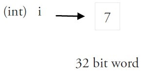
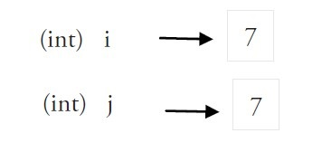

# 变量

[TOC]

变量可以通过变量名访问。

变量名由字母、数字、下划线组成，其中首个字符不能为数字。

## 声明变量

Go 语言是静态类型语言，编译时，编译器会检查变量的类型，要求所有的变量都要有明确的类型。

变量在使用前，需要先声明。

一般形式是使用 var 关键字：

```go
var identifier type

//可以一次声明多个变量
var identifier1, identifier2 type

//变量初始化。根据值自行判定变量类型。
var identifier type = value
var identifier = value
identifier1, identifier2 = v1, v2
var identifier1, identifier2 = v1, v2


//省略 var, := 左侧如果没有声明新的变量，就产生编译错误。
//只能用在函数内部，不能用于函数外
identifier := value
identifier1, identifier2 := v1, v2
//示例
var intVal int 
intVal :=1             // 这时候会产生编译错误
intVal,intVal1 := 1,2  // 此时不会产生编译错误，因为有声明新的变量，因为 := 是一个声明语句
//这种方法，也经常用于变量的交换
var a int = 100
var b int = 200
b, a = a, b


// 这种因式分解关键字的写法，只能声明全局变量
var (
    vname1 v_type1
    vname2 v_type2
)


var v2 string

var v3 [10]int            // 数组

var v4 []int              // 数组切片

var v5 struct {
	f int
}

var v6 *int               // 指针

var v7 map[string]int     // map,key为string类型，value为int类型

var v8 func(a int) int


// new 函数声明一个指针变量
// new 函数，是 Go 里的一个内建函数。
// 使用表达式 new(Type) 将创建一个Type类型的匿名变量，初始化为Type类型的零值，然后返回变量地址，返回的指针类型为`*Type`。
ptr := new(int)
fmt.Println("ptr address: ", ptr)
fmt.Println("ptr value: ", *ptr)    // * 后面接指针变量，表示从内存地址中取出值
// 用new创建变量和普通变量声明语句方式创建变量没有什么区别，除了不需要声明一个临时变量的名字外，还可以在表达式中使用new(Type)。
// 如下两种写法，是等价的
// 使用 new
func newInt() *int {
    return new(int)
}
// 使用传统的方式
func newInt() *int {
    var dummy int
    return &dummy
}
```

### 零值

变量如果没有初始化，则默认为零值。零值就是变量没有做初始化时，系统默认设置的值。

- 数值类型（包括complex64/128）为 **0**

- float 为 **0**

- 布尔类型为 **false**

- 字符串为 **""**（空字符串）

- bool 零值为 **false**

- 以下几种类型为 **nil**：

  ```go
  var a *int
  var a []int
  var a map[string] int
  var a chan int
  var a func(string) int
  var a error // error 是接口
  ```

## 值类型和引用类型

所有像 `int`、`float`、`bool` 和 `string` 这些基本类型都属于值类型，使用这些类型的变量直接指向存在内存中的值：



当使用等号 `=` 将一个变量的值赋值给另一个变量时，如：`j = i`，实际上是在内存中将` i` 的值进行了拷贝：



你可以通过 `&i` 来获取变量 `i ` 的内存地址，例如：0xf840000040（每次的地址都可能不一样）。值类型的变量的值存储在栈中。

内存地址会根据机器的不同而有所不同，甚至相同的程序在不同的机器上执行后也会有不同的内存地址。因为每台机器可能有不同的存储器布局，并且位置分配也可能不同。

更复杂的数据通常会需要使用多个字，这些数据一般使用引用类型保存。

一个引用类型的变量 `r1` 存储的是 `r1` 的值所在的内存地址（数字），或内存地址中第一个字所在的位置。


这个内存地址为称之为指针，这个指针实际上也被存在另外的某一个字中。

同一个引用类型的指针指向的多个字可以是在连续的内存地址中（内存布局是连续的），这也是计算效率最高的一种存储形式；也可以将这些字分散存放在内存中，每个字都指示了下一个字所在的内存地址。

当使用赋值语句 `r2 = r1` 时，只有引用（地址）被复制。

如果 `r1` 的值被改变了，那么这个值的所有引用都会指向被修改后的内容，在这个例子中，r2 也会受到影响。

### := 赋值操作符

是使用变量的首选形式，但是它只能被用在函数体内，而不可以用于全局变量的声明与赋值。使用操作符 `:=` 可以高效地创建一个新的变量，称之为初始化声明。

**注意事项**

如果在相同的代码块中，不可以再次对于相同名称的变量使用初始化声明，例如：`a := 20` 就是不被允许的，编译器会提示错误 `no new  variables on left side of :=`，但是 `a = 20` 是可以的，因为这是给相同的变量赋予一个新的值。

如果在定义变量 `a` 之前使用它，则会得到编译错误 `undefined: a`。

如果声明了一个局部变量却没有在相同的代码块中使用它，同样会得到编译错误。

但是全局变量是允许声明但不使用的。 

如果想要交换两个变量的值，则可以简单地使用 `a, b = b, a`，两个变量的类型必须是相同。

并行赋值也被用于当一个函数返回多个返回值时，比如这里的 val 和错误 err 是通过调用 Func1 函数同时得到：`val, err = Func1(var1)`。

## 匿名变量

**匿名变量**，也称作占位符，或者空白标识符，用下划线表示。

空白标识符 _ 也被用于抛弃值，如值 5 在：`_, b = 5, 7` 中被抛弃。`_` 实际上是一个只写变量，不能得到它的值。这样做是因为 Go 语言中你必须使用所有被声明的变量，但有时你并不需要使用从一个函数得到的所有返回值。

匿名变量，优点有三：

- 不分配内存，不占用内存空间
- 不需要你为命名无用的变量名而纠结
- 多次声明不会有任何问题

通常用匿名接收必须接收，但是又不会用到的值。

```go
func GetData() (int, int) {
    return 100, 200
}
func main(){
    a, _ := GetData()
    _, b := GetData()
    fmt.Println(a, b)
}
```

空白标识符在函数返回值时的使用：

```go
package main
import "fmt"

func main() {
  _,numb,strs := numbers() //只获取函数返回值的后两个
  fmt.Println(numb,strs)
}

//一个可以返回多个值的函数
func numbers()(int,int,string){
  a , b , c := 1 , 2 , "str"
  return a,b,c
}
```

## 变量作用域

作用域为已声明标识符所表示的常量、类型、变量、函数或包在源代码中的作用范围。

Go 语言中变量可以在三个地方声明：

- 函数内定义的变量称为局部变量
- 函数外定义的变量称为全局变量
- 函数定义中的变量称为形式参数

### 局部变量

在函数体内声明的变量称之为局部变量，它们的作用域只在函数体内，参数和返回值变量也是局部变量。

以下实例中 main() 函数使用了局部变量 a, b, c：

```go
package main
import "fmt"
 
func main() {
  /* 声明局部变量 */
  var a, b, c int 
 
  /* 初始化参数 */
  a = 10
  b = 20
  c = a + b

  fmt.Printf ("结果： a = %d, b = %d and c = %d\n", a, b, c)
}
```

以上实例执行输出结果为：

```
结果： a = 10, b = 20 and c = 30
```

### 全局变量

在函数体外声明的变量称之为全局变量，全局变量可以在整个包甚至外部包（被导出后）使用。

全局变量可以在任何函数中使用，以下实例演示了如何使用全局变量：

```go
package main
 
import "fmt"
 
/* 声明全局变量 */
var g int
 
func main() {
 
  /* 声明局部变量 */
  var a, b int
 
  /* 初始化参数 */
  a = 10
  b = 20
  g = a + b
 
  fmt.Printf("结果： a = %d, b = %d and g = %d\n", a, b, g)
}
```

以上实例执行输出结果为：

```
结果： a = 10, b = 20 and g = 30
```

Go 语言程序中全局变量与局部变量名称可以相同，但是函数内的局部变量会被优先考虑。实例如下：

```go
package main
import "fmt"
 
/* 声明全局变量 */
var g int = 20
 
func main() {
  /* 声明局部变量 */
  var g int = 10
 
  fmt.Printf ("结果： g = %d\n",  g)
}
```

以上实例执行输出结果为：

```
结果： g = 10
```

### 形式参数

形式参数会作为函数的局部变量来使用。实例如下：

```go
package main

import "fmt"

/* 声明全局变量 */
var a int = 20;

func main() {
  /* main 函数中声明局部变量 */
  var a int = 10
  var b int = 20
  var c int = 0

  fmt.Printf("main()函数中 a = %d\n",  a);
  c = sum( a, b);
  fmt.Printf("main()函数中 c = %d\n",  c);
}

/* 函数定义-两数相加 */
func sum(a, b int) int {
  fmt.Printf("sum() 函数中 a = %d\n",  a);
  fmt.Printf("sum() 函数中 b = %d\n",  b);

  return a + b;
}
```

以上实例执行输出结果为：

```go
main()函数中 a = 10
sum() 函数中 a = 10
sum() 函数中 b = 20
main()函数中 c = 30
```

## 初始化局部和全局变量

不同类型的局部和全局变量默认值为：

| 数据类型 | 初始化默认值 |
| -------- | ------------ |
| int      | 0            |
| float32  | 0            |
| pointer  | nil          |

​			


