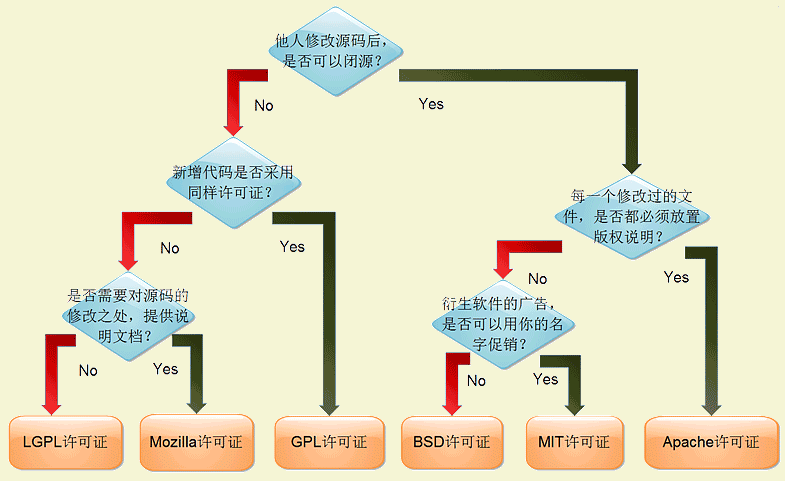

# 开源许可

[TOC]

## 常用六种开源许可比较
 

## GPL

**GNU General Public License**，**GNU** 通用公共许可证：只要软件中包含了遵循 GPL 协议的产品或代码，该软件就必须也遵循 GPL 许可协议且开源、免费，因此这个协议并不适合商用软件。遵循该协议的开源软件数量极其庞大，包括 Linux 系统在内的大多数的开源软件都是基于这个协议的。

  

**复制自由：**允许把软件复制到任何人的电脑中，并且不限制复制的数量。

**传播自由：**允许软件以各种形式进行传播。

**收费传播：**允许在各种媒介上出售该软件，但必须提前让买家知道这个软件是可以免费获得的；因此，一般来讲，开源软件都是通过为用户提供有偿服务的形式来盈利的。

**修改自由：**允许开发人员增加或删除软件的功能，但软件修改后必须依然基于 GPL 许可协议授权。

## **BSD**

 

**Berkeley Software Distribution**，伯克利软件发布版 许可协议：用户可以使用、修改和重新发布遵循该许可的软件，并且可以将软件作为商业软件发布和销售，前提是需要满足下面 3 个条件。

1. 如果再发布的软件中包含源代码，则源代码必须继续遵循 BSD 许可协议。
2. 如果再发布的软件中只有二进制程序，则需要在相关文档或版权文件中声明原始代码遵循了 BSD 协议。
3. 不允许用原始软件的名字、作者名字或机构名称进行市场推广。

## Apache 许可证版本

 

**Apache License Version** 许可协议：在为开发人员提供版权及专利许可的同时，允许用户拥有修改代码及再发布的自由。该许可协议适用于商业软件，现在热门的 Hadoop、Apache  HTTP Server、MongoDB 等项目都是基于该许可协议研发的，程序开发人员在开发遵循该协议的软件时，要严格遵守下面的 4 个条件。

1. 该软件及其衍生品必须继续使用 Apache 许可协议。
2. 如果修改了程序源代码，需要在文档中进行声明。
3. 若软件是基于他人的源代码编写而成的，则需要保留原始代码的协议、商标、专利声明及其他原作者声明的内容信息。
4. 如果再发布的软件中有声明文件，则需在此文件中标注Apache许可协议及其他许可协议。

## MPL

**Mozilla Public License**，**Mozilla**公共许可 许可协议：相较于 GPL 许可协议，MPL 更加注重对开发者的源代码需求和收益之间的平衡。

## MIT

**Massachusetts Institute of Technology** 许可协议：目前限制最少的开源许可协议之一，只要程序的开发者在修改后的源代码中保留原作者的许可信息即可，因此普遍被商业软件所使用。

