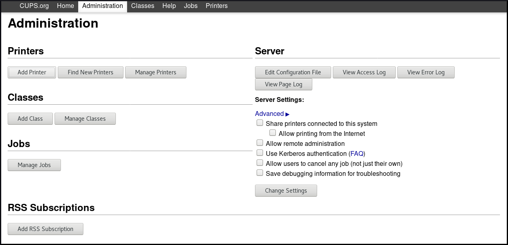
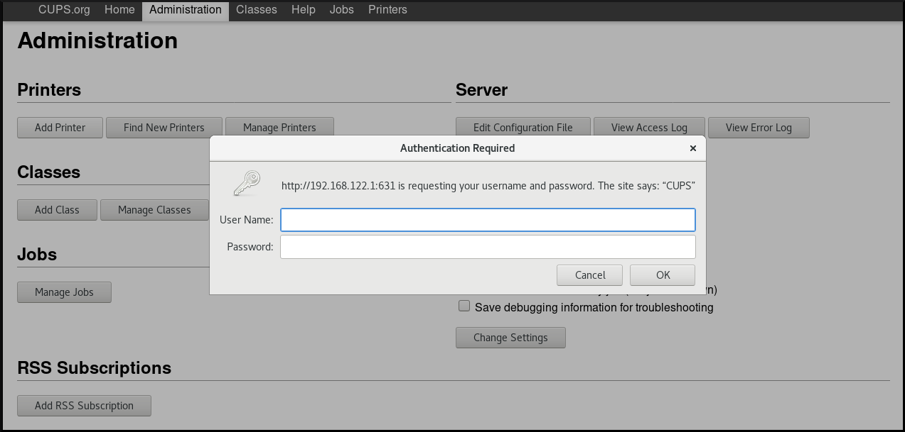
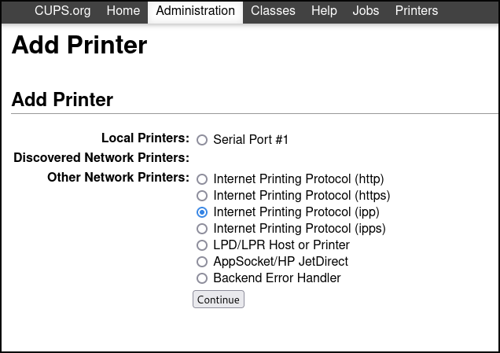
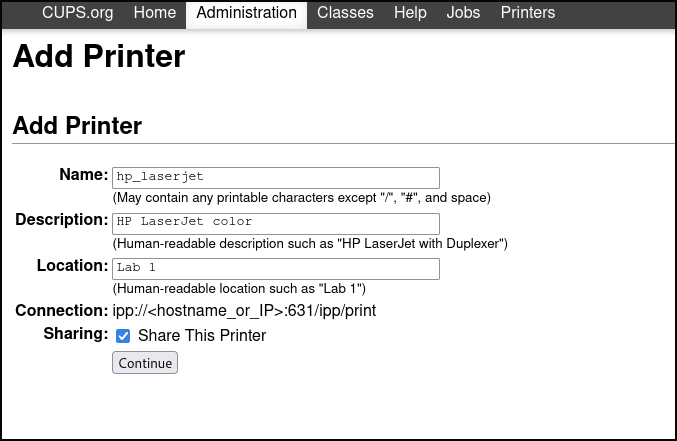
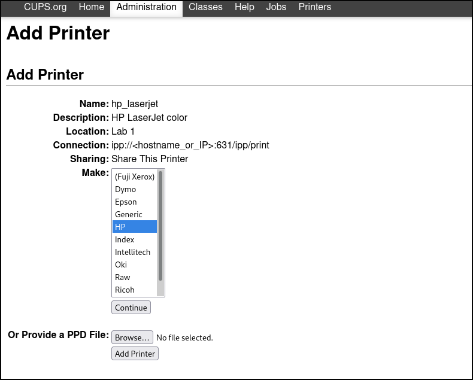
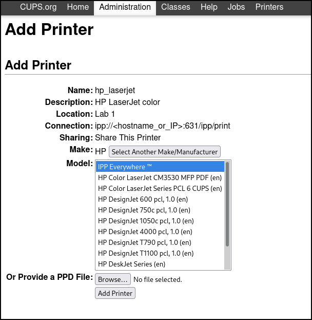
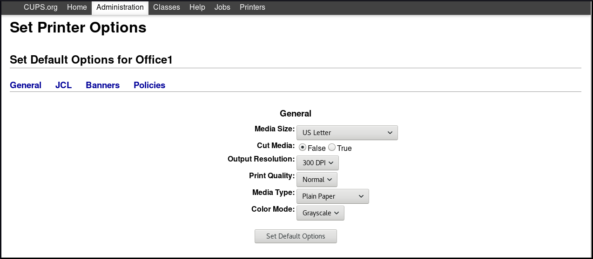

# CUPS

[TOC]

## 概述

通用 Unix 打印系统 (CUPS) 。

## 激活 cups 服务

安装：

```bash
dnf install cups
```

启动 `cups` 服务： 				

```bash
systemctl start cups
systemctl enable cups 
```

检查 `cups` 服务的状态： 				

```bash
systemctl status cups
```

## 打印设置工具

要实现各种与打印相关的任务：

- CUPS Web 用户界面 (UI)		
- GNOME 控制中心 				

使用上述工具可以实现的任务包括： 		

- 添加和配置新打印机 				
- 维护打印机配置 				
- 管理打印机类 				

## CUPS Web UI

### 访问 CUPS Web UI 			

1. 通过在 `/etc/cups/cupsd.conf` 文件中设置 ` Port 631`，允许 CUPS 服务器监听来自网络的连接： 				

   ```bash
   #Listen localhost:631
   Port 631
   ```

   > **警告:**
   >
   > 启用 CUPS 服务器侦听端口 631 会为服务器访问的任何地址打开这个端口。因此，只在从外部网络无法访问的本地网络中使用此设置。不推荐在可公开访问的服务器上配置 CUPS 服务器。

2. 通过在 `/etc/cups/cupsd.conf` 文件中包含以下指令来允许您的系统访问 CUPS 服务器： 				

   ```bash
   <Location />
   Allow from <your_ip_address>
   Order allow,deny
   </Location>
   
   # <your_ip_address> 是系统的实际 IP 地址。还可以将正则表达式用于子网。
   ```

   > **警告:**
   >
   > CUPS 配置在 <Location> 标签中提供了 `Allow from all` 指令，但建议仅在可信任的网络中使用此指令。设置 `Allow from all` 使所有能够通过端口 631 连接到服务器的用户拥有访问权限。如果将 `Port` 指令设置为 631，并且该服务器可从外部网络访问，那么互联网上的任何人都可以访问您系统上的 CUPS 服务。

3. 重启 cups.service： 				

   ```bash
   systemctl restart cups
   ```

4. 打开浏览器，进入到 `http://<IP_address_of_the_CUPS_server>:631/`。

   

   现在，除了 `管理` 菜单外的所有菜单都可用。 				

   如果点击 `管理` 菜单，您会收到 **Forbidden** 信息： 				

   

### 获取 **CUPS Web UI** 的管理访问权限	

1. 要能够访问 **CUPS Web UI** 中的 `管理` 菜单，请在 `/etc/cups/cupsd.conf` 文件中包括以下行：

   ```bash
   <Location /admin>
   Allow from <your_ip_address>
   Order allow,deny
   </Location>
   ```

2. 要访问 **CUPS Web UI** 中的配置文件，请在 `/etc/cups/cupsd.conf` 文件中包括以下内容：

   ```bash
   <Location /admin/conf>
   AuthType Default
   Require user @SYSTEM
   Allow from <your_ip_address>
   Order allow,deny
   </Location>
   ```

3. 要访问 **CUPS Web UI** 中的日志文件，请在 `/etc/cups/cupsd.conf` 文件中包括以下内容：

   ```
   <Location /admin/log>
   AuthType Default
   Require user @SYSTEM
   Allow from <your_ip_address>
   Order allow,deny
   </Location>
   ```

4. 要在 **CUPS Web UI** 中指定加密对经过身份验证的请求的使用，请在 `/etc/cups/cupsd.conf` 文件中包括 `DefaultEncryption` ：

   ```bash
   DefaultEncryption IfRequested
   ```

   有了此设置，在尝试访问 `管理` 菜单时，您将收到一个验证窗口，用来输入允许添加打印机的用户的用户名。

5. 重启 `cups` 服务：

   ```bash
   systemctl restart cups
   ```


## 配置无驱动程序打印

可以将无驱动程序打印配置为使用打印机或远程 CUPS 队列，而无需任何特殊软件。 		

RHEL 9 为以下无驱动程序标准提供无驱动程序打印支持：

- CUPS 中的 **IPP Everywhere 模型** 支持 AirPrint、IPP Everywhere 和 Wi-Fi Direct 标准。 				
- cups-filters 中的 **Driverless 模型** 支持与 CUPS 相同的标准，同时还支持 PCLm 文档格式。 				

这些标准使用 Internet 打印协议 (IPP) 2.0  或更高版本来沟通打印机设置，并无需为特定打印机安装特定驱动程序。要在没有特定驱动程序的情况下使用打印机，您需要有打印机，它支持一种无驱动程序的标准。要确定您的打印机是否支持没有驱动程序标准，请选择以下选项之一： 		

- 请参阅打印机规格，并搜索 [无驱动程序的标准支持](https://openprinting.github.io/driverless/01-standards-and-their-pdls/) 或询问您的供应商。 				
- 搜索 [认证的打印机](https://www.pwg.org/printers/)。 				
- 使用 [ipptool 命令根据](https://access.redhat.com/documentation/zh-cn/red_hat_enterprise_linux/9/html/configuring_and_using_a_cups_printing_server/configuring-driverless-printing_configuring-printing#determining-printer-attributes-using-ipptool_configuring-driverless-printing) 打印机的属性确定驱动程序无支持。 				

要使用 IPP Everywhere 模型在客户端上安装打印队列，该模型指向打印服务器上的队列，您需要让远程打印服务器和具有 RHEL 8.6 安装或更新的客户端安装。 		

> **注意:**
>
> 您可以使用 [ipptool 命令根据](https://access.redhat.com/documentation/zh-cn/red_hat_enterprise_linux/9/html/configuring_and_using_a_cups_printing_server/configuring-driverless-printing_configuring-printing#determining-printer-attributes-using-ipptool_configuring-driverless-printing) 打印服务器的属性验证驱动程序无支持。 			

### 使用 ipptool 确定打印机属性

要确定打印机或打印服务器是否支持无驱动程序标准，可使用 `ipptool` 软件包中提供的 `ipptool` 命令检查打印机属性。

显示打印机或打印服务器的属性： 					

```bash
ipptool -tv <URI> get-printer-attributes.test
```

> **注意:**
>
> 将 <URI> 替换为打印机的 URI，例如 `ipp://<hostname_or_IP_address>:631/ipp/print` for printers 或 `ipp://<hostname_or_IP_address>:631/printers/<remote_print_queue` > 用于来自打印服务器的远程打印队列。

您的打印机或打印服务器支持无驱动程序打印：

- `ipp-version-supported` 属性包含 IPP 协议 `2.0` 的 2.0 或更高版本，以及 					
- `document-format-supported` 属性包含 [无驱动程序打印标准](https://openprinting.github.io/driverless/01-standards-and-their-pdls/) 中列出的受支持文档格式之一。 					

### 在 CUPS Web UI 中添加驱动程序更新打印机

从 RHEL 8.6 开始，可以在 CUPS Web UI 中添加无驱动程序打印机，并使用 CUPS 直接从应用程序打印到网络打印机或打印服务器，而无需为特定打印机安装任何特定驱动程序或软件。 			

**先决条件**

- 打印机或打印服务器具有 IPP Everywhere 标准实现。 					
- 打开 IPP 端口：用于 IPP 的端口 **631** 或端口 **443，** 用于使用 IPPS 进行安全打印。 					
- 在打印服务器的防火墙中启用 `ipp` 和 `ipp-client` 通信。 
- 如果目的地是另一个 CUPS 服务器，允许在远程服务器上进行远程访问，或者如果使用网络打印机，打开 Web 用户界面，搜索 IPP 相关的设置： IPP 或 AirPrint，并启用这些设置。 					

**流程**

1. 在浏览器中，前往 `localhost:631` 并选择 `Administration` 选项卡。

2. 在 `打印机` 下，`单击添加打印机`。 					

   

3. 使用用户名和密码进行身份验证： 					

   

   > **重要:**
   >
   > 为了可以使用 **CUPS Web UI** 添加新打印机，必须以属于 `/etc/cups/cups-files` 中 **SystemGroup** 指令定义的组用户的身份进行身份验证。默认组为： 
   >
   > * root
   > * sys
   > * wheel

4. 在 `Administrator` 选项卡中，在 `Add Printer` 下选择其中一个选项： 					

   - `Internet 打印协议(IPP)` 
   - `Internet 打印协议(ipps)`  

    

5. 在 `Connection` 字段中，输入设备的 URI，然后单击 `Continue`。

    

   > **注意:**
   >
   > URI 由以下部分组成：
   >
   > * 协议 `ipp://` 或 `ipps://` 如果打印机或打印服务器支持加密
   >
   > * 打印机的主机名或 IP 地址
   >
   > * 端口
   >
   > * 资源部分 `/ipp/print` 用于打印机，或用于远程 CUPS 队列的 `/printers/<remote_queue_name` >。 
   >
   >   例如： `ipp://myprinter.mydomain:631/ipp/print` 或 `ipp://myserver.mydomain:631/printers/myqueue`。

6. 添加有关新打印机的详细信息：名称、描述和位置。要设置可以通过网络共享的打印机，请选中 `Share This Printer` 复选框。

    

   > **注意:**
   >
   > 'name' 是唯一必填字段，其他字段是可选的。 						
7. 从" `制作` "下拉菜单中，选择打印机厂商，然后单击 `Continue`。

    

8. 要继续安装无驱动程序打印机，请从下拉菜单中选择 `IPP Everywhere`，然后单击 `添加打印机`。 					

    

9. 添加新打印机后，您可以设置您选择的默认打印选项。

   
   
10. 最后的窗口确认设置了无驱动程序打印机并可使用。

    

## 在 CUPS Web UI 中添加带有经典驱动程序的打印机	

**先决条件**

- ​						您可以使用 **CUPS Web UI 的管理访问权限**，如 [获取 CUPS Web UI 的管理访问权限](https://access.redhat.com/documentation/zh-cn/red_hat_enterprise_linux/9/html/configuring_and_using_a_cups_printing_server/acquiring-administration-access-to-cups-web-ui_configuring-printing) 中所述。 				

**流程**

1. ​						启动 **CUPS Web UI**，如启动 [CUPS Web UI](https://access.redhat.com/documentation/zh-cn/red_hat_enterprise_linux/9/html/configuring_and_using_a_cups_printing_server/starting-cups-web-ui_configuring-printing)所述 				

2. ​						在您的浏览器中，前往 `localhost:631` 并选择 `Administration` 选项卡。 				

3. ​						在 `打印机` 下，`单击添加打印机`。 				

   [](https://access.redhat.com/webassets/avalon/d/Red_Hat_Enterprise_Linux-9-Configuring_and_using_a_CUPS_printing_server-zh-CN/images/4679eed2027c5677722fd4b289211da3/add-printer-in-cups-ui-2.png)

4. ​						使用用户名和密码进行身份验证： 				

   [](https://access.redhat.com/webassets/avalon/d/Red_Hat_Enterprise_Linux-9-Configuring_and_using_a_CUPS_printing_server-zh-CN/images/087f020317d6bd55150e0eff9a897f42/add-printer-in-cups-ui-auth-n.png)

   重要

   ​							为了可以使用 **CUPS Web UI** 添加新打印机，您必须以属于 `/etc/cups/cups-files` 中的 **SystemGroup** 指令定义的组的身份进行身份验证。 					

   ​							默认组： 					

   - ​									root 							
   - ​									sys 							
   - ​									wheel 							

5. ​						如果连接了本地打印机，或者 CUPS 找到了可用的网络打印机，请选择打印机。如果本地打印机或网络打印机都不可用，请从 `其他网络打印机` 中选择一个打印机类型，如 **APP Socket/HP Jet direct**，输入打印机的 IP 地址，然后点击 `继续`。 				

   [](https://access.redhat.com/webassets/avalon/d/Red_Hat_Enterprise_Linux-9-Configuring_and_using_a_CUPS_printing_server-zh-CN/images/fbffc5556f67b57882698f25b9b2ad56/add-printer-in-cups-ui-4-new.png)

6. ​						如果您已选择如上所示的 **APP Socket/HP Jet direct**，请输入打印机的 IP 地址，然后点击 `继续`。 				

   [](https://access.redhat.com/webassets/avalon/d/Red_Hat_Enterprise_Linux-9-Configuring_and_using_a_CUPS_printing_server-zh-CN/images/802c829d9095eec587a985c9ab4cfdf4/add-printer-in-cups-ui-5-new.png)

7. ​						您可以添加有关新打印机的更多详情，如名称、描述和位置。要设置可以通过网络共享的打印机，请选中 `Share This Printer` 复选框。 				

   [](https://access.redhat.com/webassets/avalon/d/Red_Hat_Enterprise_Linux-9-Configuring_and_using_a_CUPS_printing_server-zh-CN/images/2acc8eb9914ae366bf71dd9aa7925fc7/add-printer-in-cups-ui-6-new.png)

8. ​						选择打印机制造商，然后点击 `继续`。 				

   [](https://access.redhat.com/webassets/avalon/d/Red_Hat_Enterprise_Linux-9-Configuring_and_using_a_CUPS_printing_server-zh-CN/images/8f2eae25e7db830be8ca357790071357/add-printer-in-cups-ui-7-new.png)

   ​						或者，您也可以通过单击底部的 `Browse…` 按钮，提供用作打印机驱动程序的 **postscript 打印机描述** (PPD)文件。 				

9. ​						选择打印机的型号，然后点击 `添加打印机`。 				

   [](https://access.redhat.com/webassets/avalon/d/Red_Hat_Enterprise_Linux-9-Configuring_and_using_a_CUPS_printing_server-zh-CN/images/7bec6e7816e8bc58e69abcf210992759/add-printer-in-cups-ui-8-new.png)

10. ​						添加打印机后，下一个窗口允许您设置默认打印选项。 				

    [](https://access.redhat.com/webassets/avalon/d/Red_Hat_Enterprise_Linux-9-Configuring_and_using_a_CUPS_printing_server-zh-CN/images/918d49afebcd80b10bb0b94b96b13302/cups-web-ui-set-defaults-n2.png)

​				点击 `设置默认选项` 后，您将收到一条新打印机已成功添加的确认信息。 		

[](https://access.redhat.com/webassets/avalon/d/Red_Hat_Enterprise_Linux-9-Configuring_and_using_a_CUPS_printing_server-zh-CN/images/e71405d37ad651b944ba1122ae49b2f7/add-printer-in-cups-ui-final-confirm.png)

**验证步骤**

- ​						请打印测试页，尤其是在您设置了打印机时： 				

  - ​								进入 `打印机` 菜单，然后点击 `维护` → `打印测试页`。 						

    [](https://access.redhat.com/webassets/avalon/d/Red_Hat_Enterprise_Linux-9-Configuring_and_using_a_CUPS_printing_server-zh-CN/images/20e4a6896b739bb38ee7a60481997028/printing-test-page-cups-web-ui.png)

## 在 CUPS Web UI 中配置打印机

​				本节论述了如何配置新打印机，以及如何使用 **CUPS Web UI** 维护打印机配置。 		

**先决条件**

- ​						您可以使用 **CUPS Web UI 的管理访问权限**，如 [获取 CUPS Web UI 的管理访问权限](https://access.redhat.com/documentation/zh-cn/red_hat_enterprise_linux/9/html/configuring_and_using_a_cups_printing_server/acquiring-administration-access-to-cups-web-ui_configuring-printing) 中所述。 				

**流程**

1. ​						点击 `打印机` 菜单，来查看您可以配置的可用打印机。 				

   [](https://access.redhat.com/webassets/avalon/d/Red_Hat_Enterprise_Linux-9-Configuring_and_using_a_CUPS_printing_server-zh-CN/images/2d5b745b61351d3215bcde83d8c2423d/conf-printer-cups-1.png)

2. ​						选择您要配置的打印机。 				

   [](https://access.redhat.com/webassets/avalon/d/Red_Hat_Enterprise_Linux-9-Configuring_and_using_a_CUPS_printing_server-zh-CN/images/1fb7a2fe9c3df04117a1f86d48e886d1/conf-printer-cups-2.png)

3. ​						使用其中一个可用菜单来执行您选择的任务： 				

   - ​								从第一个下拉菜单中选择 `Maintenance`。 						

     [](https://access.redhat.com/webassets/avalon/d/Red_Hat_Enterprise_Linux-9-Configuring_and_using_a_CUPS_printing_server-zh-CN/images/396ac0b8797a859314cb28a7c0d67ce3/conf-printer-cups-3.png)

   - ​								从第二个下拉菜单中选择 `Administration`。 						

     [](https://access.redhat.com/webassets/avalon/d/Red_Hat_Enterprise_Linux-9-Configuring_and_using_a_CUPS_printing_server-zh-CN/images/c69ec1ce500da1a40e176ac86752f3af/conf-printer-cups-4.png)

   - ​								您还可以通过点击 `显示完成的作业` 或 `显示所有的作业` 按钮来检查已完成的打印作业或所有活动的打印作业。 						

**验证步骤**

- ​						请打印测试页，尤其是当您更改了打印机配置时： 				

  - ​								进入 `打印机` 菜单，然后点击 `维护` → `打印测试页`。 						

    [](https://access.redhat.com/webassets/avalon/d/Red_Hat_Enterprise_Linux-9-Configuring_and_using_a_CUPS_printing_server-zh-CN/images/20e4a6896b739bb38ee7a60481997028/printing-test-page-cups-web-ui.png)

## 使用 CUPS Web UI 设置打印选项

​				本节描述了如何在 **CUPS web UI** 中设置通用的打印选项，如介质大小和类型、打印质量或颜色模式。 		

**先决条件**

​					您可以使用 **CUPS Web UI 的管理访问权限**，如 [获取 CUPS Web UI 的管理访问权限](https://access.redhat.com/documentation/zh-cn/red_hat_enterprise_linux/9/html/configuring_and_using_a_cups_printing_server/acquiring-administration-access-to-cups-web-ui_configuring-printing) 中所述。 			

**流程**

1. ​						进入 `管理` 菜单，然后点击 `维护` → `设置默认选项`。 				

   [](https://access.redhat.com/webassets/avalon/d/Red_Hat_Enterprise_Linux-9-Configuring_and_using_a_CUPS_printing_server-zh-CN/images/729ee1c0a509a09c6beeac18cb1f5741/cups-web-ui-set-defaults-n1.png)

2. ​						设置打印选项。 				

   [](https://access.redhat.com/webassets/avalon/d/Red_Hat_Enterprise_Linux-9-Configuring_and_using_a_CUPS_printing_server-zh-CN/images/918d49afebcd80b10bb0b94b96b13302/cups-web-ui-set-defaults-n2.png)

## 为打印服务器安装证书

​				要为打印服务器安装证书，您可以选择以下一个选项： 		

- ​						使用自签名证书自动安装 				
- ​						使用认证认证机构生成的证书和私钥手动安装 				

**先决条件**

​					对于服务器上的 **cupsd** 守护进程： 			

1. ​						将 `/etc/cups/cupsd.conf` 文件中的以下指令设置为： 				

   ​						`Encryption Required` 				

2. ​						重启 cups 服务： 				

   ```none
   $ sudo systemctl restart cups
   ```

***\*使用自签名证书自动安装\****

​					有了这个选项，CUPS 会自动生成证书和密钥。 			

注意

​					自签名证书并不以身份管理(IdM)、Active Directory(AD)或红帽证书系统(RHCS)认证颁发机构生成的证书提供非常安全,但可用于打印位于安全本地网络中的服务器。 			

**流程**

1. ​						要访问 CUPS Web UI，打开浏览器并访问 `https://<server>:631` 				

   ​						其中 *<server>* 是服务器 IP 地址或服务器主机名。 				

   注意

   ​							当 CUPS 首次连接到系统时，浏览器会显示自签名证书有潜在安全风险的警告。 					

2. ​						要确认继续操作是否安全，请点击 `Advanced…` 按钮。 				

   [](https://access.redhat.com/webassets/avalon/d/Red_Hat_Enterprise_Linux-9-Configuring_and_using_a_CUPS_printing_server-zh-CN/images/16059ef9cdb048558a2c3543b0a49f10/cups_ui_certificate_warning.png)

3. ​						单击 `Accept the Risk and Continue` 按钮。 				

   [](https://access.redhat.com/webassets/avalon/d/Red_Hat_Enterprise_Linux-9-Configuring_and_using_a_CUPS_printing_server-zh-CN/images/6798f63cbe3e20ccd50463397b23b6ce/cups_ui_certificate_warning2.png)

​				CUPS 现在开始使用自生成的证书和密钥。 		

注意

​					当您在自动安装后访问 CUPS Web UI 时，浏览器会在地址栏中显示一个警告图标。这是因为您通过确认安全风险警告添加了安全例外。如果您想永久删除此警告图标，请使用认证机构生成的证书和私钥来执行手动安装。 			

***\*使用认证认证机构生成的证书和私钥手动安装\****

​					对于位于公共网络中的打印服务器或要永久删除浏览器中的警告，请手动导入证书和密钥。 			

**先决条件**

- ​						您有 IdM、AD 或 RHCS 认证颁发机构生成的证书和私钥文件。 				

**流程**

1. ​						将 `.crt` 和 `.key` 文件复制到您要使用 CUPS Web UI 的系统的 `/etc/cups/ssl` 目录中。 				

2. ​						将复制的文件重命名为 `<hostname>.crt` 和 `<hostname>.key`。 				

   ​						将 *<hostname>* 替换为您要连接 CUPS Web UI 的系统主机名。 				

3. ​						将以下权限设置为重命名的文件： 				

   - ​								`# **chmod 644 /etc/cups/ssl/<hostname>.crt**` 						
   - ​								`# **chmod 644 /etc/cups/ssl/<hostname>.key**` 						
   - ​								`# **chown root:root /etc/cups/ssl/<hostname>.crt**` 						
   - ​								`# **chown root:root /etc/cups/ssl/<hostname>.key**` 						

4. ​						重启 cups 服务： 				

   - ​								`# **systemctl restart cupsd**` 						

## 使用 Samba 打印到使用 Kerberos 验证的 Windows 打印服务器

​				有了 `samba-krb5-printing`  包装程序，登录到Red Hat Enterprise Linux 的 Active Directory(AD)用户可以通过使用 Kerberos 来认证到 Active Directory(AD)，然后打印到将打印作业转发到 Windows 打印服务器的本地 CUPS 打印服务器。 		

​				此配置的好处在于，Red Hat Enterprise Linux 上的 CUPS 管理员不需要在配置中存储固定的用户名和密码。CUPS 使用发送打印作业的用户的 Kerberos ticket 验证 AD。 		

​				这部分论述了如何为这种情况配置 CUPS。 		

注意

​					红帽只支持从本地系统将打印作业提交给 CUPS，而不支持在 Samba 打印服务器上重新共享打印机。 			

**先决条件**

- ​						要添加到本地 CUPS 实例中的打印机在 AD 打印服务器上是共享的。 				
- ​						作为 AD 的成员加入 Red Hat Enterprise Linux 主机。 				
- ​						CUPS 已安装在 Red Hat Enterprise Linux 上，并且 `cups` 服务正在运行。详情请查看 [激活 CUPS 服务](https://access.redhat.com/documentation/zh-cn/red_hat_enterprise_linux/9/html/configuring_and_using_a_cups_printing_server/configuring-printing_configuring-and-using-a-cups-printing-server#activating-cups-service_configuring-printing)。 				
- ​						打印机的 PostScript 打印机描述(PPD)文件存储在 `/usr/share/cups/model/` 目录中。 				

**流程**

1. ​						安装 `samba-krb5-printing`、`samba-client` 和 `krb5-workstation` 软件包： 				

   ```none
   # dnf install samba-krb5-printing samba-client krb5-workstation
   ```

2. ​						可选： 作为域管理员授权并显示 Windows 打印服务器上共享的打印机列表： 				

   ```none
   # smbclient -L win_print_srv.ad.example.com -U administrator@AD_KERBEROS_REALM --use-kerberos=required
   
   	Sharename       Type      Comment
   	---------       ----      -------
   	...
   	Example         Printer   Example
   	...
   ```

3. ​						可选：显示 CUPS 模型列表以识别打印机的 PPD 名称： 				

   ```none
   lpinfo -m
   ...
   samsung.ppd Samsung M267x 287x Series PXL
   ...
   ```

   ​						在下一步中添加打印机时，需要 PPD 文件的名称。 				

4. ​						在 CUPS 中添加打印机： 				

   ```none
   # lpadmin -p "example_printer" -v smb://win_print_srv.ad.example.com/Example -m samsung.ppd -o auth-info-required=negotiate -E
   ```

   ​						该命令使用以下选项： 				

   - ​								`-p *printer_name*` 在 CUPS 中设置打印机的名称。 						
   - ​								`-V *URI_to_Windows_printer*` 将 URI 设置为 Windows 打印机。使用以下格式：smb `://*host_name*/*printer_share_name*`. 						
   - ​								`-m *PPD_file*` 设置打印机使用的 PPD 文件。 						
   - ​								`-O auth-info-required=negotiate` 配置 CUPS，以便在将打印作业转发到远程服务器时使用 Kerberos 身份验证。 						
   - ​								`-e` 可使打印机，CUPS 接受打印机的作业。 						

**验证步骤**

1. ​						以 AD 域用户身份登录 Red Hat Enterprise Linux 主机。 				

2. ​						以 AD 域用户身份进行身份验证： 				

   ```none
   # kinit domain_user_name@AD_KERBEROS_REALM
   ```

3. ​						将文件输出到您添加到本地 CUPS 打印服务器的打印机： 				

   ```none
   # lp -d example_printer file
   ```

​    

## 日志

CUPS 提供三种不同类型的日志： 			

- 错误日志 - 存储错误消息、警告和调试信息。 					
- 访问日志 - 存储有关访问 CUPS 客户端和 Web UI 的次数的信息。 					
- 页面日志 - 保存每个打印作业打印页面总数的信息。 					

​					在 Red Hat Enterprise Linux 8 中，所有三种类型都在 `systemd-journald` 中与其他程序的日志一起集中记录。 			

警告

​						在 Red Hat Enterprise Linux 8 中，不会再像 Red Hat Enterprise Linux 7 那样将日志存储在 `/var/log/cups` 目录中的特定文件中。 				

# 访问所有 CUPS 日志

​					您可以列出 `systemd-journald` 中的所有 CUPS 日志。 			

**流程**

- ​							过滤 CUPS 日志： 					

```none
$ journalctl -u cups
```

# 访问特定打印作业的 CUPS 日志

​					如果您需要为特定打印作业查找 CUPS 日志，您可以使用打印作业的编号来过滤日志。 			

**流程**

- ​							过滤特定打印作业的日志： 					

```none
$ journalctl -u cups JID=N
```

​					其中 `N` 是一个打印作业号。 			

#  根据特定时间框架访问 CUPS 日志

​					如果您需要在特定时间段内访问 CUPS 日志，您可以在 `systemd-journald` 中过滤日志。 			

**流程**

- ​							在指定时间段内过滤日志： 					

```none
$ journalctl -u cups --since=YYYY-MM-DD --until=YYYY-MM-DD
```

​					其中 `YYYY` 为年份，`MM` 为月份，`DD` 为天。 			

**其它资源**

- ​							`journalctl(1)` 手册页 					

# 配置 CUPS 日志位置

​					这部分论述了如何配置 CUPS 日志的位置。 			

​					在 Red Hat Enterprise Linux 8 中，CUPS 日志默认登录到 systemd-journald，其是通过 `/etc/cups/cups-files.conf` 文件中的以下默认设置保证的： 			

```none
ErrorLog syslog
```

重要

​						红帽建议保留 CUPS 日志的默认位置。 				

​					如果要将日志发送到不同的位置，您需要更改 `/etc/cups/cups-files.conf` 文件中的设置，如下所示： 			

```none
ErrorLog <your_required_location>
```

警告

​						如果您更改了 CUPS 日志的默认位置，您可能会遇到 SELinux 问题。 				

# 配置和使用 CUPS 打印服务器

Red Hat Enterprise Linux 9

## 将您的系统配置为作为 CUPS 服务器运行并管理打印机、打印队列和您的打印环境

Red Hat Customer Content Services

[法律通告](https://access.redhat.com/documentation/zh-cn/red_hat_enterprise_linux/9/html-single/configuring_and_using_a_cups_printing_server/index#idm140031734192160)

**摘要**

​				安装、配置和管理您的 CUPS 打印服务器。添加打印机或修改现有打印机，管理打印队列，并将 CUPS 与 RHEL 环境集成。使用  Web 浏览器和网络访问管理 CUPS Web UI 中的打印。配置无驱动程序打印以使用打印机或远程 CUPS  队列，而无需任何特殊软件。在您的打印机中安装证书以提高安全性。使用 Samba 连接到 Windows 打印服务器。使用 CUPS 日志监控  CUPS 打印服务器，以获取用于故障排除问题、跟踪和审核打印作业活动的信息，或监控打印机的性能。 		

------

# 对红帽文档提供反馈

​			我们感谢您对我们文档的反馈。让我们了解如何改进它。 	

**提交对具体内容的评论**

1. ​					查看 **Multi-page HTML** 格式的文档，并确保在页面完全加载后看到右上角的 **Feedback** 按钮。 			
2. ​					使用光标突出显示您要评论的文本部分。 			
3. ​					点击在高亮文本旁的 **Add Feedback** 按钮。 			
4. ​					添加您的反馈并点 **Submit**。 			

**通过 Bugzilla 提交反馈（需要帐户）**

1. ​					登录到 [Bugzilla](https://bugzilla.redhat.com/enter_bug.cgi?product=Red Hat Enterprise Linux 9&component=Documentation) 网站。 			
2. ​					从 **Version** 菜单中选择正确的版本。 			
3. ​					在 **Summary** 字段中输入描述性标题。 			
4. ​					在 **Description** 字段中输入您对改进的建议。包括文档相关部分的链接。 			
5. ​					点 **Submit Bug**。 			

# 第 1 章 配置打印

​			Red Hat Enterprise Linux 8 上的打印是基于通用 Unix 打印系统(CUPS)。 	

​			本文档描述了如何配置您的系统，使其能够作为 CUPS 服务器操作。 	

## 1.1. 激活 cups 服务

​				这部分描述了如何在您的系统上激活 `cups` 服务。 		

**先决条件**

- ​						`cups` 软件包包括在 Appstream 存储库中，必须安装在您的系统中： 				

  

  ```none
  # dnf install cups
  ```

**流程**

1. ​						启动 `cups` 服务： 				

   

   ```none
   # systemctl start cups
   ```

2. ​						将 `cups` 服务配置以使其在引导时自动启动： 				

   

   ```none
   # systemctl enable cups
   ```

3. ​						另外，还可检查 `cups` 服务的状态： 				

   

   ```none
   $ systemctl status cups
   ```

## 1.2. 打印设置工具

​				要实现各种与打印相关的任务，您可以选择以下工具之 一 : 		

- ​						**CUPS Web 用户界面(UI)** 				
- ​						**GNOME 控制中心** 				

警告

​					Red Hat Enterprise Linux 7 中使用的 **Print Settings** 配置工具不再可用。 			

​				使用上述工具可以实现的任务包括： 		

- ​						添加和配置新打印机 				
- ​						维护打印机配置 				
- ​						管理打印机类 				

​				请注意，本文档只涵盖在 **CUPS Web 用户界面(UI)** 中的打印。如果要使用 **GNOME 控制中心** 来打印，则需要有GUI。有关使用 **GNOME 控制中心** 打印的更多信息，请参阅 [使用 GNOME 处理打印](https://access.redhat.com/documentation/zh-cn/red_hat_enterprise_linux/8/html/using_the_desktop_environment_in_rhel_8/getting-started-with-gnome_using-the-desktop-environment-in-rhel-8#handling-printing_getting-started-with-gnome) 。 		

## 1.3. 访问并配置 CUPS Web UI

​				本节描述了访问 **CUPS Web 用户界面** (web UI)，并将其配置为能够通过这个接口管理打印。 		

**流程**

1. ​						通过在 `/etc/cups/cupsd.conf` 文件中设置 ` Port 631`，允许 CUPS 服务器监听来自网络的连接： 				

   

   ```none
   #Listen localhost:631
   Port 631
   ```

   警告

   ​							启用 CUPS 服务器侦听端口 631 会为服务器访问的任何地址打开这个端口。因此，只在从外部网络无法访问的本地网络中使用此设置。红帽不推荐在可公开访问的服务器上配置 CUPS 服务器。 					

2. ​						通过在 `/etc/cups/cupsd.conf` 文件中包含以下指令来允许您的系统访问 CUPS 服务器： 				

   

   ```none
   <Location />
   Allow from <client_ip_address>
   Order allow,deny
   </Location>
   ```

   ​						其中 *<client_ip_address* > 是您要连接到 CUPS Web UI 的系统 IP 地址。CUPS 支持 `Allow from` 指令的多种值，如子网。如需更多信息，请参阅 `cupsd.conf (5)` 手册页。 				

   警告

   ​							CUPS 配置在 *<Location>* 标签中提供了 `Allow from all` 指令，但红帽建议仅在可信任的网络中使用此指令。设置 `Allow from all` 使所有能够通过端口 631 连接到服务器的用户拥有访问权限。如果将 `Port` 指令设置为 631，并且该服务器可从外部网络访问，那么互联网上的任何人都可以访问您系统上的 CUPS 服务。 					

3. ​						为互联网打印协议(IPP)服务启用传入流量： 				

   

   ```none
   # firewall-cmd --zone=public --add-service=ipp --permanent
   # firewall-cmd --reload
   ```

4. ​						重启 cups.service： 				

   

   ```none
   # systemctl restart cups
   ```

5. ​						打开浏览器，进入到 `http://<IP_address_of_the_CUPS_server>:631/`。 				

   [](https://access.redhat.com/webassets/avalon/d/Red_Hat_Enterprise_Linux-9-Configuring_and_using_a_CUPS_printing_server-zh-CN/images/fa3ca40daa664cd3cebfaf59a323acf6/cups_ui_intro.png)

   ​						现在，除了 `管理` 菜单外的所有菜单都可用。 				

   ​						如果点击 `管理` 菜单，您会收到 **Forbidden** 信息： 				

   [](https://access.redhat.com/webassets/avalon/d/Red_Hat_Enterprise_Linux-9-Configuring_and_using_a_CUPS_printing_server-zh-CN/images/477c886a0d2a0bbae706ce95490a207d/forbidden-message.png)

   ​						要获取对 `Administration` 菜单的访问权限，请按照 [获取对 CUPS Web UI 的管理访问权限](https://access.redhat.com/documentation/zh-cn/red_hat_enterprise_linux/9/html-single/configuring_and_using_a_cups_printing_server/index#acquiring-administration-access-to-cups-web-ui_configuring-printing) 中的说明。 				

## 1.4. 获取 CUPS Web UI 的管理访问权限

​				本节论述了如何获取 **CUPS Web UI** 的管理访问权限。 		

**流程**

1. ​						要能够访问 **CUPS Web UI** 中的 `管理` 菜单，请在 `/etc/cups/cupsd.conf` 文件中包括以下行： 				

   

   ```none
   <Location /admin>
   Allow from <your_ip_address>
   Order allow,deny
   </Location>
   ```

   注意

   ​							将 `<your_ip_address>` 替换为您系统的实际 IP 地址。 					

2. ​						要访问 **CUPS Web UI** 中的配置文件，请在 `/etc/cups/cupsd.conf` 文件中包括以下内容： 				

   

   ```none
   <Location /admin/conf>
   AuthType Default
   Require user @SYSTEM
   Allow from <your_ip_address>
   Order allow,deny
   </Location>
   ```

   注意

   ​							将 `<your_ip_address>` 替换为您系统的实际 IP 地址。 					

3. ​						要访问 **CUPS Web UI** 中的日志文件，请在 `/etc/cups/cupsd.conf` 文件中包括以下内容： 				

   

   ```none
   <Location /admin/log>
   AuthType Default
   Require user @SYSTEM
   Allow from <your_ip_address>
   Order allow,deny
   </Location>
   ```

   注意

   ​							将 `<your_ip_address>` 替换为您系统的实际 IP 地址。 					

4. ​						要在 **CUPS Web UI** 中指定加密对经过身份验证的请求的使用，请在 `/etc/cups/cupsd.conf` 文件中包括 `DefaultEncryption` ： 				

   

   ```none
   DefaultEncryption IfRequested
   ```

   ​						有了此设置，在尝试访问 `管理` 菜单时，您将收到一个验证窗口，用来输入允许添加打印机的用户的用户名。但是，对于如何设置 `DefaultEncryption` 还有其他选项。详情请查看 `cupsd.conf` 手册页。 				

5. ​						重启 `cups` 服务： 				

   

   ```none
   # systemctl restart cups
   ```

   警告

   ​							如果您不重启 `cups` 服务，则不会应用 `/etc/cups/cupsd.conf` 中的修改。因此，您将无法获取 **CUPS Web UI** 的管理访问权限。 					

**其他资源**

- ​						`cupsd.conf` 手册页 				

## 1.5. 配置无驱动程序打印

​				作为管理员，您可以将无驱动程序打印配置为使用打印机或远程 CUPS 队列，而无需任何特殊软件。 		

​				RHEL 9 为以下无驱动程序标准提供无驱动程序打印支持： 		

- ​						CUPS 中的 **IPP Everywhere 模型** 支持 AirPrint、IPP Everywhere 和 Wi-Fi Direct 标准。 				
- ​						cups-filters 中的 **无驱动程序模型** 支持与 CUPS 相同的标准，另外还有 PCLm 文档格式。 				

​				这些标准使用 Internet 打印协议 (IPP) 2.0  或更高版本来传达打印机设置，并无需为特定打印机安装特定的驱动程序。要在没有特定驱动程序的情况下使用打印机，您需要有一个打印机，该打印机支持无驱动程序标准之一。要确定您的打印机是否支持无驱动程序标准，请选择以下选项之一： 		

- ​						请参阅打印机规格，并搜索 [无驱动程序标准支持](https://openprinting.github.io/driverless/01-standards-and-their-pdls/) 或咨询您的供应商。 				
- ​						搜索[经认证的打印机](https://www.pwg.org/printers/)。 				
- ​						通过 [ipptool 命令](https://access.redhat.com/documentation/zh-cn/red_hat_enterprise_linux/9/html-single/configuring_and_using_a_cups_printing_server/index#determining-printer-attributes-using-ipptool_configuring-driverless-printing)根据打印机的属性确定无驱动程序支持。 				

​				要在带有 IPP Everywhere 模型的客户端上安装打印队列（指向打印服务器中的队列），您需要具有远程打印服务器以及带有 RHEL 8.6 安装或更新的客户端。 		

注意

​					您可以使用 [ipptool 命令](https://access.redhat.com/documentation/zh-cn/red_hat_enterprise_linux/9/html-single/configuring_and_using_a_cups_printing_server/index#determining-printer-attributes-using-ipptool_configuring-driverless-printing)根据打印服务器的属性验证无驱动程序支持。 			

### 1.5.1. 使用 ipptool 确定打印机属性

​					要确定您的打印机或打印服务器是否支持无驱动程序标准，您可以使用 `ipptool` 软件包中提供的 `ipptool` 命令检查打印机属性。 			

**流程**

- ​							显示打印机或打印服务器的属性： 					

  

  ```none
  $ ipptool -tv <URI> get-printer-attributes.test
  ```

  注意

  ​								将 <URI> 替换为打印机的 URI，例如 `ipp://<hostname_or_IP_address>:631/ipp/print` 用于打印机，或 `ipp://<hostname_or_IP_address>:631/printers/<remote_print_queue>` 用于来自打印服务器的远程打印队列。 						

​					如果出现以下情况，您的打印机或打印服务器支持无驱动程序的打印： 			

- ​							`ipp-version-supported` 属性包含 `2.0` 或高于 IPP 2.0，以及 					
- ​							`document-format-supported` 属性包含 [无驱动程序打印标准](https://openprinting.github.io/driverless/01-standards-and-their-pdls/) 中列出的受支持文档格式之一。 					

### 1.5.2. 在 CUPS Web UI 中添加无驱动程序打印机

​					从 RHEL 8.6 开始，您可以在 CUPS Web UI 中添加无驱动程序打印机，并使用它来直接从应用程序打印到网络打印机或使用 CUPS 打印服务器，而无需为特定打印机安装任何特定的驱动程序或软件。 			

**先决条件**

- ​							您有访问 **CUPS Web UI** 的管理访问权限，如 [获得 CUPS Web UI 管理访问权限](https://access.redhat.com/documentation/zh-cn/red_hat_enterprise_linux/9/html-single/configuring_and_using_a_cups_printing_server/index#acquiring-administration-access-to-cups-web-ui_configuring-printing)中所述。 					
- ​							您的打印机或打印服务器具有 IPP Everywhere 标准实现。 					
- ​							打开 IPP 端口： 端口 **631** 用于 IPP，或端口 **443** 用于使用 IPPS 的安全打印。 					
- ​							在打印服务器的防火墙中，启用 `ipp` 和 `ipp-client` 的通讯。 					
- ​							如果您的目的地是另一个 CUPS 服务器，允许远程服务器上的远程访问，或者如果您使用网络打印机，打开 Web 用户界面，搜索 IPP 相关的设置：IPP 或 AirPrint，并启用这些设置。 					

**流程**

1. ​							启动 **CUPS Web UI**，如 [访问和配置 CUPS](https://access.redhat.com/documentation/zh-cn/red_hat_enterprise_linux/9/html-single/configuring_and_using_a_cups_printing_server/index#starting-cups-web-ui_configuring-printing) 所述。 					

2. ​							在您的浏览器中，转至 `localhost:631` 并选择 `Administration` 选项卡。 					

3. ​							在 `打印机` 下，点`添加打印机`。 					

   [](https://access.redhat.com/webassets/avalon/d/Red_Hat_Enterprise_Linux-9-Configuring_and_using_a_CUPS_printing_server-zh-CN/images/4679eed2027c5677722fd4b289211da3/add-printer-in-cups-ui-2.png)

4. ​							使用您的用户名和密码进行身份验证： 					

   [](https://access.redhat.com/webassets/avalon/d/Red_Hat_Enterprise_Linux-9-Configuring_and_using_a_CUPS_printing_server-zh-CN/images/087f020317d6bd55150e0eff9a897f42/add-printer-in-cups-ui-auth-n.png)

   重要

   ​								为了可以使用 **CUPS Web UI** 添加新打印机，您必须认证为属于 `/etc/cups/cups-files` 中的 **SystemGroup** 指令定义的组的用户。默认组为： 						

   - ​										root 								
   - ​										sys 								
   - ​										wheel 								

5. ​							在 `Administrator` 选项卡中，在 `Add Printer` 下选择以下选项之一： 					

   - ​									`Internet Printing Protocol (ipp)` 或 							

   - ​									`Internet Printing Protocol (ipps)` 选项，点 `Continue`。 							

     

6. ​							在 `Connection` 字段中，输入设备的 URI，再点 `Continue`。 					

   [](https://access.redhat.com/webassets/avalon/d/Red_Hat_Enterprise_Linux-9-Configuring_and_using_a_CUPS_printing_server-zh-CN/images/3237e9c8015b8d292db8134a9d594499/Add-printer_connection-frame.png)

   注意

   ​								URI 由以下部分组成： 						

   - ​										协议 `ipp://` 或 `ipps://`，取决于打印机服务器是否支持加密， 								

   - ​										打印机的主机名或 IP 地址， 								

   - ​										端口, 								

   - ​										打印机的资源部分 `/ipp/print`，或用于远程 CUPS 队列的 `/printers/<remote_queue_name>`。 								

     ​										例如：`ipp://myprinter.mydomain:631/ipp/print` 或 `ipp://myserver.mydomain:631/printers/myqueue`。 								

7. ​							添加新打印机的详情：名称、描述和位置。要设置可以通过网络共享的打印机，请选中 `Share This Printer` 复选框。 					

   

   注意

   ​								'name' 是唯一必填字段，其他字段是可选的。 						

8. ​							从 `Make` 下拉菜单中选择打印机制造商，然后点 `Continue`。 					

   [](https://access.redhat.com/webassets/avalon/d/Red_Hat_Enterprise_Linux-9-Configuring_and_using_a_CUPS_printing_server-zh-CN/images/7001bdc69ebdb7ba28effe2a224b34f7/Add-printer_make-frame.png)

9. ​							要继续安装无驱动程序打印机，请从下拉菜单中选择 `IPP Everywhere`，然后点 `Add Printer`。 					

   

10. ​							添加新打印机后，您可以设置您选择的默认打印选项。 					

    [](https://access.redhat.com/webassets/avalon/d/Red_Hat_Enterprise_Linux-9-Configuring_and_using_a_CUPS_printing_server-zh-CN/images/918d49afebcd80b10bb0b94b96b13302/cups-web-ui-set-defaults-n2.png)

​					最后一个窗口确认您设置了无驱动程序打印机，并且准备好使用。 			

[](https://access.redhat.com/webassets/avalon/d/Red_Hat_Enterprise_Linux-9-Configuring_and_using_a_CUPS_printing_server-zh-CN/images/9c636b149a67126f3d6748c304d3c580/Add-printer_final-screen-frame.png)

### 1.5.3. 使用 cups-browsed 配置永久打印队列

​					作为管理员，您可以使用 `cups-filters` 软件包中的 `cups-browsed` 服务来浏览远程打印服务器上的队列。`cups-browsed` 服务创建指向这些远程队列的本地队列。打印队列是表示连接到物理设备的打印机的抽象。 			

#### 1.5.3.1. 为安装在不同网络中的远程打印服务器上的打印机配置永久打印队列

​						要从远程服务器本地安装 CUPS 队列，您需要编辑机器上 `cups-browsed` 服务的配置，其中，在该机器上，您希望永久队列指向远程 CUPS 服务器。 				

**先决条件**

- ​								不同网络中的打印机必须安装在远程服务器上。 						
- ​								服务器防火墙中的 IPP 端口已启用。 						
- ​								为从运行 `cups-browsed` 的机器配置远程访问，并向服务器请求队列。 						

**流程**

1. ​								编辑 `/etc/cups/cups-browsed.conf` 文件，并将指定服务器的主机名或 IP 地址添加到 `BrowsePoll` 指令中： 						

   

   ```none
   BrowsePoll <hostname or IP-address>
   ```

2. ​								重启 `cups-browsed` 服务以应用更改： 						

   

   ```none
   # systemctl restart cups-browsed
   ```

**验证步骤**

- ​								显示包含本地打印队列的本地打印机的列表： 						

  

  ```none
  $ lpstat -v
  Device for <remote_queue_name>: implicitclass:<remote_queue_name>
  ```

  注意

  ​									您的打印机可能需要几分钟时间才能在本地打印机列表中显示，具体取决于远程服务器中包含多少队列。如果没有显示打印机，修改 `cups-browsed.conf` 文件中的配置。例如，将 `BrowseTimeout` 指令的值设置为更高的数字。如需更多信息，请参阅 `cups-browsed.conf (5)` 手册页。 							

## 1.6. 在 CUPS Web UI 中使用经典驱动程序添加打印机

​				这部分论述了如何使用 **CUPS Web 用户界面**添加新打印机。 		

**先决条件**

- ​						您有访问 **CUPS Web UI** 的管理访问权限，如 [获得 CUPS Web UI 管理访问权限](https://access.redhat.com/documentation/zh-cn/red_hat_enterprise_linux/9/html-single/configuring_and_using_a_cups_printing_server/index#acquiring-administration-access-to-cups-web-ui_configuring-printing)中所述。 				

**流程**

1. ​						启动 **CUPS Web UI**，如启动 [CUPS Web UI](https://access.redhat.com/documentation/zh-cn/red_hat_enterprise_linux/9/html-single/configuring_and_using_a_cups_printing_server/index#starting-cups-web-ui_configuring-printing)所述 				

2. ​						在您的浏览器中，转至 `localhost:631` 并选择 `Administration` 选项卡。 				

3. ​						在 `打印机` 下，点`添加打印机`。 				

   [](https://access.redhat.com/webassets/avalon/d/Red_Hat_Enterprise_Linux-9-Configuring_and_using_a_CUPS_printing_server-zh-CN/images/4679eed2027c5677722fd4b289211da3/add-printer-in-cups-ui-2.png)

4. ​						使用用户名和密码进行身份验证： 				

   [](https://access.redhat.com/webassets/avalon/d/Red_Hat_Enterprise_Linux-9-Configuring_and_using_a_CUPS_printing_server-zh-CN/images/087f020317d6bd55150e0eff9a897f42/add-printer-in-cups-ui-auth-n.png)

   重要

   ​							为了可以使用 **CUPS Web UI** 添加新打印机，您必须认证为属于 `/etc/cups/cups-files` 中的 **SystemGroup** 指令定义的组的用户。 					

   ​							默认组： 					

   - ​									root 							
   - ​									sys 							
   - ​									wheel 							

5. ​						如果连接了本地打印机，或者 CUPS 找到了可用的网络打印机，请选择打印机。如果本地打印机或网络打印机都不可用，请从 `其他网络打印机` 中选择一个打印机类型，如 **APP Socket/HP Jet direct**，输入打印机的 IP 地址，然后点击 `继续`。 				

   [](https://access.redhat.com/webassets/avalon/d/Red_Hat_Enterprise_Linux-9-Configuring_and_using_a_CUPS_printing_server-zh-CN/images/fbffc5556f67b57882698f25b9b2ad56/add-printer-in-cups-ui-4-new.png)

6. ​						如果您已选择如上所示的 **APP Socket/HP Jet direct**，请输入打印机的 IP 地址，然后点击 `继续`。 				

   [](https://access.redhat.com/webassets/avalon/d/Red_Hat_Enterprise_Linux-9-Configuring_and_using_a_CUPS_printing_server-zh-CN/images/802c829d9095eec587a985c9ab4cfdf4/add-printer-in-cups-ui-5-new.png)

7. ​						您可以添加有关新打印机的更多详情，如名称、描述和位置。要设置可以通过网络共享的打印机，请选中 `Share This Printer` 复选框。 				

   [](https://access.redhat.com/webassets/avalon/d/Red_Hat_Enterprise_Linux-9-Configuring_and_using_a_CUPS_printing_server-zh-CN/images/2acc8eb9914ae366bf71dd9aa7925fc7/add-printer-in-cups-ui-6-new.png)

8. ​						选择打印机制造商，然后点击 `继续`。 				

   [](https://access.redhat.com/webassets/avalon/d/Red_Hat_Enterprise_Linux-9-Configuring_and_using_a_CUPS_printing_server-zh-CN/images/8f2eae25e7db830be8ca357790071357/add-printer-in-cups-ui-7-new.png)

   ​						或者，您也可以通过单击底部的 `Browse…` 按钮，提供用作打印机驱动程序的 **postscript 打印机描述** (PPD)文件。 				

9. ​						选择打印机的型号，然后点击 `添加打印机`。 				

   [](https://access.redhat.com/webassets/avalon/d/Red_Hat_Enterprise_Linux-9-Configuring_and_using_a_CUPS_printing_server-zh-CN/images/7bec6e7816e8bc58e69abcf210992759/add-printer-in-cups-ui-8-new.png)

10. ​						添加打印机后，下一个窗口允许您设置默认打印选项。 				

    [](https://access.redhat.com/webassets/avalon/d/Red_Hat_Enterprise_Linux-9-Configuring_and_using_a_CUPS_printing_server-zh-CN/images/918d49afebcd80b10bb0b94b96b13302/cups-web-ui-set-defaults-n2.png)

​				点击 `设置默认选项` 后，您将收到一条新打印机已成功添加的确认信息。 		

[](https://access.redhat.com/webassets/avalon/d/Red_Hat_Enterprise_Linux-9-Configuring_and_using_a_CUPS_printing_server-zh-CN/images/e71405d37ad651b944ba1122ae49b2f7/add-printer-in-cups-ui-final-confirm.png)

**验证步骤**

- ​						请打印测试页，尤其是在您设置了打印机时： 				

  - ​								进入 `打印机` 菜单，然后点击 `维护` → `打印测试页`。 						

    [](https://access.redhat.com/webassets/avalon/d/Red_Hat_Enterprise_Linux-9-Configuring_and_using_a_CUPS_printing_server-zh-CN/images/20e4a6896b739bb38ee7a60481997028/printing-test-page-cups-web-ui.png)

## 1.7. 在 CUPS Web UI 中配置打印机

​				本节论述了如何配置新打印机，以及如何使用 **CUPS Web UI** 维护打印机配置。 		

**先决条件**

- ​						您有访问 **CUPS Web UI** 的管理访问权限，如 [获得 CUPS Web UI 管理访问权限](https://access.redhat.com/documentation/zh-cn/red_hat_enterprise_linux/9/html-single/configuring_and_using_a_cups_printing_server/index#acquiring-administration-access-to-cups-web-ui_configuring-printing)中所述。 				

**流程**

1. ​						点击 `打印机` 菜单，来查看您可以配置的可用打印机。 				

   [](https://access.redhat.com/webassets/avalon/d/Red_Hat_Enterprise_Linux-9-Configuring_and_using_a_CUPS_printing_server-zh-CN/images/2d5b745b61351d3215bcde83d8c2423d/conf-printer-cups-1.png)

2. ​						选择您要配置的打印机。 				

   [](https://access.redhat.com/webassets/avalon/d/Red_Hat_Enterprise_Linux-9-Configuring_and_using_a_CUPS_printing_server-zh-CN/images/1fb7a2fe9c3df04117a1f86d48e886d1/conf-printer-cups-2.png)

3. ​						使用其中一个可用菜单来执行您选择的任务： 				

   - ​								从第一个下拉菜单中选择 `Maintenance`。 						

     [](https://access.redhat.com/webassets/avalon/d/Red_Hat_Enterprise_Linux-9-Configuring_and_using_a_CUPS_printing_server-zh-CN/images/396ac0b8797a859314cb28a7c0d67ce3/conf-printer-cups-3.png)

   - ​								从第二个下拉菜单中选择 `Administration`。 						

     [](https://access.redhat.com/webassets/avalon/d/Red_Hat_Enterprise_Linux-9-Configuring_and_using_a_CUPS_printing_server-zh-CN/images/c69ec1ce500da1a40e176ac86752f3af/conf-printer-cups-4.png)

   - ​								您还可以通过点击 `显示完成的作业` 或 `显示所有的作业` 按钮来检查已完成的打印作业或所有活动的打印作业。 						

**验证步骤**

- ​						请打印测试页，尤其是当您更改了打印机配置时： 				

  - ​								进入 `打印机` 菜单，然后点击 `维护` → `打印测试页`。 						

    [](https://access.redhat.com/webassets/avalon/d/Red_Hat_Enterprise_Linux-9-Configuring_and_using_a_CUPS_printing_server-zh-CN/images/20e4a6896b739bb38ee7a60481997028/printing-test-page-cups-web-ui.png)

## 1.8. 使用 CUPS Web UI 设置打印选项

​				本节描述了如何在 **CUPS web UI** 中设置通用的打印选项，如介质大小和类型、打印质量或颜色模式。 		

**先决条件**

​					您有访问 **CUPS Web UI** 的管理访问权限，如 [获得 CUPS Web UI 管理访问权限](https://access.redhat.com/documentation/zh-cn/red_hat_enterprise_linux/9/html-single/configuring_and_using_a_cups_printing_server/index#acquiring-administration-access-to-cups-web-ui_configuring-printing)中所述。 			

**流程**

1. ​						进入 `管理` 菜单，然后点击 `维护` → `设置默认选项`。 				

   [](https://access.redhat.com/webassets/avalon/d/Red_Hat_Enterprise_Linux-9-Configuring_and_using_a_CUPS_printing_server-zh-CN/images/729ee1c0a509a09c6beeac18cb1f5741/cups-web-ui-set-defaults-n1.png)

2. ​						设置打印选项。 				

   [](https://access.redhat.com/webassets/avalon/d/Red_Hat_Enterprise_Linux-9-Configuring_and_using_a_CUPS_printing_server-zh-CN/images/918d49afebcd80b10bb0b94b96b13302/cups-web-ui-set-defaults-n2.png)

## 1.9. 为打印服务器安装证书

​				要为打印服务器安装证书，您可以选择以下一个选项： 		

- ​						使用自签名证书自动安装 				
- ​						使用认证认证机构生成的证书和私钥手动安装 				

**先决条件**

​					对于服务器上的 **cupsd** 守护进程： 			

1. ​						将 `/etc/cups/cupsd.conf` 文件中的以下指令设置为： 				

   ​						`Encryption Required` 				

2. ​						重启 cups 服务： 				

   

   ```none
   $ sudo systemctl restart cups
   ```

***\*使用自签名证书自动安装\****

​					有了这个选项，CUPS 会自动生成证书和密钥。 			

注意

​					自签名证书并不以身份管理(IdM)、Active Directory(AD)或红帽证书系统(RHCS)认证颁发机构生成的证书提供非常安全,但可用于打印位于安全本地网络中的服务器。 			

**流程**

1. ​						要访问 CUPS Web UI，打开浏览器并访问 `https://<server>:631` 				

   ​						其中 *<server>* 是服务器 IP 地址或服务器主机名。 				

   注意

   ​							当 CUPS 首次连接到系统时，浏览器会显示自签名证书有潜在安全风险的警告。 					

2. ​						要确认继续操作是否安全，请点击 `Advanced…` 按钮。 				

   [](https://access.redhat.com/webassets/avalon/d/Red_Hat_Enterprise_Linux-9-Configuring_and_using_a_CUPS_printing_server-zh-CN/images/16059ef9cdb048558a2c3543b0a49f10/cups_ui_certificate_warning.png)

3. ​						单击 `Accept the Risk and Continue` 按钮。 				

   [](https://access.redhat.com/webassets/avalon/d/Red_Hat_Enterprise_Linux-9-Configuring_and_using_a_CUPS_printing_server-zh-CN/images/6798f63cbe3e20ccd50463397b23b6ce/cups_ui_certificate_warning2.png)

​				CUPS 现在开始使用自生成的证书和密钥。 		

注意

​					当您在自动安装后访问 CUPS Web UI 时，浏览器会在地址栏中显示一个警告图标。这是因为您通过确认安全风险警告添加了安全例外。如果您想永久删除此警告图标，请使用认证机构生成的证书和私钥来执行手动安装。 			

***\*使用认证认证机构生成的证书和私钥手动安装\****

​					对于位于公共网络中的打印服务器或要永久删除浏览器中的警告，请手动导入证书和密钥。 			

**先决条件**

- ​						您有 IdM、AD 或 RHCS 认证颁发机构生成的证书和私钥文件。 				

**流程**

1. ​						将 `.crt` 和 `.key` 文件复制到您要使用 CUPS Web UI 的系统的 `/etc/cups/ssl` 目录中。 				

2. ​						将复制的文件重命名为 `<hostname>.crt` 和 `<hostname>.key`。 				

   ​						将 *<hostname>* 替换为您要连接 CUPS Web UI 的系统主机名。 				

3. ​						将以下权限设置为重命名的文件： 				

   - ​								`# **chmod 644 /etc/cups/ssl/<hostname>.crt**` 						
   - ​								`# **chmod 644 /etc/cups/ssl/<hostname>.key**` 						
   - ​								`# **chown root:root /etc/cups/ssl/<hostname>.crt**` 						
   - ​								`# **chown root:root /etc/cups/ssl/<hostname>.key**` 						

4. ​						重启 cups 服务： 				

   - ​								`# **systemctl restart cupsd**` 						

## 1.10. 使用 Samba 打印到使用 Kerberos 验证的 Windows 打印服务器

​				有了 `samba-krb5-printing`  包装程序，登录到Red Hat Enterprise Linux 的 Active Directory(AD)用户可以通过使用 Kerberos 来认证到 Active Directory(AD)，然后打印到将打印作业转发到 Windows 打印服务器的本地 CUPS 打印服务器。 		

​				此配置的好处在于，Red Hat Enterprise Linux 上的 CUPS 管理员不需要在配置中存储固定的用户名和密码。CUPS 使用发送打印作业的用户的 Kerberos ticket 验证 AD。 		

​				这部分论述了如何为这种情况配置 CUPS。 		

注意

​					红帽只支持从本地系统将打印作业提交给 CUPS，而不支持在 Samba 打印服务器上重新共享打印机。 			

**先决条件**

- ​						要添加到本地 CUPS 实例中的打印机在 AD 打印服务器上是共享的。 				
- ​						作为 AD 的成员加入 Red Hat Enterprise Linux 主机。 				
- ​						CUPS 已安装在 Red Hat Enterprise Linux 上，并且 `cups` 服务正在运行。详情请参阅[激活 CUPS 服务](https://access.redhat.com/documentation/zh-cn/red_hat_enterprise_linux/9/html-single/configuring_and_using_a_cups_printing_server/index#activating-cups-service_configuring-printing)。 				
- ​						打印机的 PostScript 打印机描述(PPD)文件存储在 `/usr/share/cups/model/` 目录中。 				

**流程**

1. ​						安装 `samba-krb5-printing`、`samba-client` 和 `krb5-workstation` 软件包： 				

   

   ```none
   # dnf install samba-krb5-printing samba-client krb5-workstation
   ```

2. ​						可选： 作为域管理员授权并显示 Windows 打印服务器上共享的打印机列表： 				

   

   ```none
   # smbclient -L win_print_srv.ad.example.com -U administrator@AD_KERBEROS_REALM --use-kerberos=required
   
   	Sharename       Type      Comment
   	---------       ----      -------
   	...
   	Example         Printer   Example
   	...
   ```

3. ​						可选：显示 CUPS 模型列表以识别打印机的 PPD 名称： 				

   

   ```none
   lpinfo -m
   ...
   samsung.ppd Samsung M267x 287x Series PXL
   ...
   ```

   ​						在下一步中添加打印机时，需要 PPD 文件的名称。 				

4. ​						在 CUPS 中添加打印机： 				

   

   ```none
   # lpadmin -p "example_printer" -v smb://win_print_srv.ad.example.com/Example -m samsung.ppd -o auth-info-required=negotiate -E
   ```

   ​						该命令使用以下选项： 				

   - ​								`-p *printer_name*` 在 CUPS 中设置打印机的名称。 						
   - ​								`-V *URI_to_Windows_printer*` 将 URI 设置为 Windows 打印机。使用以下格式：smb `://*host_name*/*printer_share_name*`. 						
   - ​								`-m *PPD_file*` 设置打印机使用的 PPD 文件。 						
   - ​								`-O auth-info-required=negotiate` 配置 CUPS，以便在将打印作业转发到远程服务器时使用 Kerberos 身份验证。 						
   - ​								`-e` 可使打印机，CUPS 接受打印机的作业。 						

**验证步骤**

1. ​						以 AD 域用户身份登录 Red Hat Enterprise Linux 主机。 				

2. ​						以 AD 域用户身份进行身份验证： 				

   

   ```none
   # kinit domain_user_name@AD_KERBEROS_REALM
   ```

3. ​						将文件输出到您添加到本地 CUPS 打印服务器的打印机： 				

   

   ```none
   # lp -d example_printer file
   ```

## 1.11. 使用 CUPS 日志

### 1.11.1. CUPS 日志的类型

​					CUPS 提供三种不同类型的日志： 			

- ​							错误日志 - 存储错误消息、警告和调试信息。 					
- ​							访问日志 - 存储有关访问 CUPS 客户端和 Web UI 的次数的信息。 					
- ​							页面日志 - 保存每个打印作业打印页面总数的信息。 					

​					在 Red Hat Enterprise Linux 9 中，所有三种类型都与其他程序的日志集中记录在 `systemd-journald` 中。 			

### 1.11.2. 访问所有 CUPS 日志

​					您可以列出 `systemd-journald` 中的所有 CUPS 日志。 			

**流程**

- ​							过滤 CUPS 日志： 					

  

  ```none
  $ journalctl -u cups
  ```

### 1.11.3. 访问特定打印作业的 CUPS 日志

​					如果您需要查找特定打印作业的 CUPS 日志，您可以使用打印作业的 ID 来过滤日志。 			

**流程**

- ​							过滤特定打印作业的日志： 					

  

  ```none
  $ journalctl -u cups JID=N
  ```

  ​							其中 `N` 是打印作业的 ID。 					

### 1.11.4. 根据特定时间框架访问 CUPS 日志

​					如果您需要在特定时间段内访问 CUPS 日志，您可以在 `systemd-journald` 中过滤日志。 			

**流程**

- ​							在指定时间段内过滤日志： 					

  

  ```none
  $ journalctl -u cups --since=YYYY-MM-DD --until=YYYY-MM-DD
  ```

  ​							其中 `YYYY` 为年份，`MM` 为月份，`DD` 为天。 					

**其他资源**

- ​							`journalctl(1)` 手册页 					

### 1.11.5. 配置 CUPS 日志位置

​					在 Red Hat Enterprise Linux 9 中，CUPS 日志默认登录到 `systemd-journald` 服务。您可以在 `/etc/cups/cups-files.conf` 文件中找到默认配置： 			


```none
ErrorLog syslog
```

重要

​						红帽建议保留 CUPS 日志的默认位置。 				

**流程**

- ​							要将日志发送到不同的位置，请更改 `/etc/cups/cups-files.conf` 中的 `ErrorLog` 条目以匹配您需要的位置： 					

  

  ```none
  ErrorLog <your_required_location>
  ```

警告

​						如果您更改了 CUPS 日志的默认位置，您可能会遇到 SELinux 问题。 				