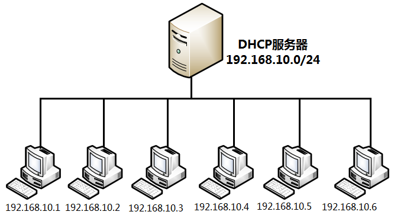

# DHCP

[TOC]

## 概述

动态主机配置协议（DHCP，Dynamic Host Configuration  Protocol），是一种基于 UDP 协议且仅限于在局域网内部使用的网络协议。该协议用于自动管理局域网内主机的 IP 地址、子网掩码、网关地址及 DNS 地址等参数，可以有效地提升 IP 地址的利用率，提高配置效率，并降低管理与维护成本。



## 常见术语

* 作用域：一个完整的 IP 地址段，DHCP 根据作用域来管理网络的分布、IP 地址的分配及其他配置参数。
* 超级作用域：用于管理处于同一个物理网络中的多个逻辑子网段，它包含了可以统一管理的作用域列表。
* 排除范围：把作用域中的某些 IP 地址排除，确保这些 IP 地址不会分配给 DHCP 客户端。
* 地址池：在定义了 DHCP 的作用域并应用了排除范围后，剩余的用来动态分配给客户端的 IP 地址范围。
* 租约：DHCP 客户端能够使用动态分配的 IP 地址的时间。
* 预约：保证网络中的特定设备总是获取到相同的IP地址。

## 工作过程

在正常情况下，DHCP的运作会经历4个过程：请求、提供、选择和确认。当客户端顺利获得一个IP地址及相关的网络信息后，就会发送一个ARP（Address Resolution  Protocol，地址解析协议）请求给服务器。在dhcpd服务程序收到这条信息后，也会再把这个IP地址分配给其他主机，从根源上避免了IP地址冲突的情况。

## 安装

dhcpd 是 Linux 系统中用于提供 DHCP 的服务程序。

```bash
# 安装DHCP
dnf install dhcp-server

# 参考配置文件： /usr/share/doc/dhcp-server/dhcpd.conf.example

vim /etc/dhcp/dhcpd.conf

ddns-update-style interim;
ignore client-updates;

subnet 192.168.10.0 netmask 255.255.255.0 {
     option subnet-mask      255.255.255.0;
     option domain-name-servers  192.168.10.10;
     range dynamic-bootp 192.168.10.100 192.168.10.200;
     default-lease-time      21600;
     max-lease-time          43200;
}

# 重启服务并开机启动
systemctl restart dhcpd
systemctl enable dhcpd
systemctl status dhcpd

# 添加防火墙对dhcpd服务允许的规则
firewall-cmd --zone=public --permanent --add-service=dhcp
firewall-cmd --reload
# 可以禁用防火墙。
```

## 配置

一个标准的配置文件应该包括：

* 全局配置参数

  用于定义dhcpd服务程序的整体运行参数。

* 子网网段声明

  用于配置整个子网段的地址属性。

* 地址配置选项以及地址配置参数。

```bash
# 定义 DNS 服务动态更新的类型，类型包括：
#  none   （不支持动态更新）
#  interim（互动更新模式）
#  ad-hoc （特殊更新模式）
ddns-update-style interim;
# 允许/忽略客户端更新DNS记录
#allow client-updates;
ignore client-updates;

subnet 192.168.10.0 netmask 255.255.255.0 {
     option subnet-mask      255.255.255.0;                     # 定义客户端的子网掩码
     option routers   192.168.10.1;                             # 定义客户端的网关地址
     option domain-name-servers  192.168.10.10;                 # 定义DNS服务器地址
     option domain-name "domain.org";                           # 定义默认的搜索域
     range 192.168.10.100 192.168.10.200;                       # 定义用于分配的IP地址池
     default-lease-time      21600;                             # 默认超时时间（s）
     max-lease-time          43200;                             # 最大超时时间（s）

	 # MAC 与 IP 绑定
     host hostname {
			hardware	ethernet;
			fixed-address	IP;
	 }
}


hardware 硬件类型 MAC地址;    # 指定网卡接口的类型与MAC地址
fixed-address IP地址;       # 将某个固定的IP地址分配给指定主机
time-offset 偏移差;      # 指定客户端与格林尼治时间的偏移差
ntp-server  ;       # 定义客户端的网络时间服务器（NTP）
nis-servers IP地址;     # 定义客户端的NIS域服务器的地址
server-name 主机名;# 向DHCP客户端通知DHCP服务器的主机名
broadcast-address                           # 定义客户端的广播地址
```