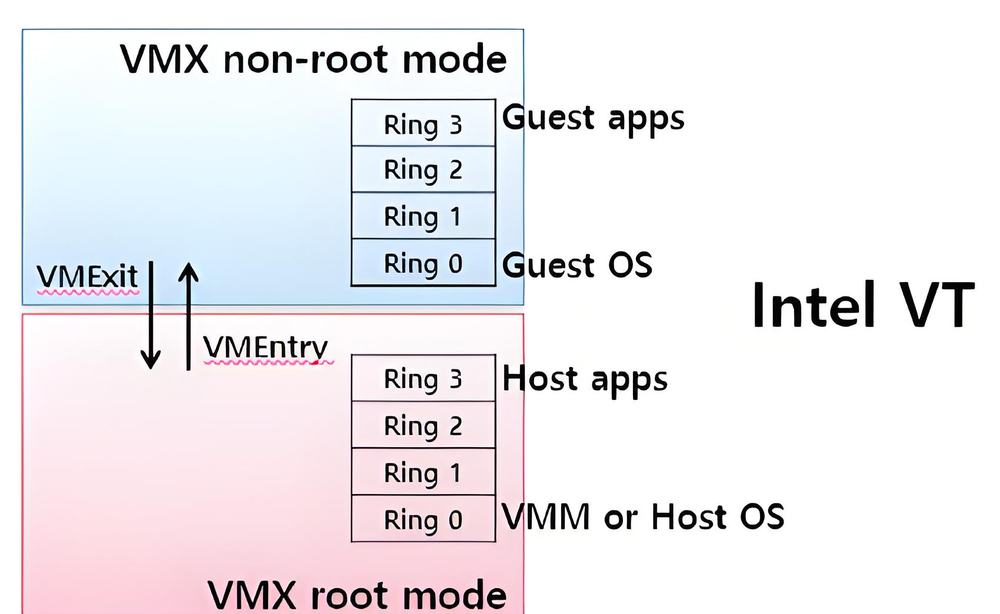

# 虚拟化

[TOC]

## 概述

Virtualization is a technology that allows you to create safe, isolated environments  on your server. For developers, this often means creating self-contained sandboxes for development and testing that cannot negatively affect the host machine. For systems administrators, it allows resources to be  scaled to meet changing demand, giving greater control and flexibility  in managing infrastructure.
虚拟化是一种允许您在服务器上创建安全、隔离的环境的技术。对于开发人员来说，这通常意味着为开发和测试创建独立的沙箱，而不会对主机产生负面影响。对于系统管理员来说，它允许扩展资源以满足不断变化的需求，从而在管理基础架构时提供更大的控制力和灵活性。 

The virtualization stack is made using layers of **abstraction**. Each layer hides some of the complexity of the layer (or layers)  beneath, presenting an increasingly high-level view of the technology.  This makes the underlying technology progressively easier to understand  and work with.
虚拟化堆栈是使用抽象层构成的。每一层都隐藏了其下一层（或多层）的一些复杂性，呈现了一个越来越高层次的技术视图。这使得底层技术越来越容易理解和使用。

* KVM
* Xen
* Red Hat RHEV

## CPU 虚拟化

简单来说，CPU 的虚拟化技术就是单 CPU 模拟多 CPU 并行，允许一个平台同时运行多个操作系统，并且应用程序可以在相互独立的空间内运行而互不影响，从而显著提高计算机的工作效率。

纯软件虚拟化解决方案存在很多限制。“客户”操作系统很多情况下通过虚拟机监视器（VirtualMachine Monitor，VMM) 来与硬件进行通信，由 VMM 来决定其对系统上所有虚拟机的访问。（注意，大多数处理器和内存访问独立于 VMM，只在发生特定事件时才会涉及 VMM，如页面错误。）在纯软件虚拟化解决方案中，VMM 在软件套件中的位置是传统意义上操作系统所处的位置（如处理器、内存存储、显卡和网卡等的接口）模拟硬件环境。这种转换必然会增加系统的复杂性。CPU 的虚拟化技术是一种硬件方案，支持虚拟技术的 CPU 带有特别优化过的指令集来控制虚拟过程，通过这些指令集，VMM 相比软件的虚拟实现方式能很大程度上提高性能。虚拟化技术可提供基于芯片的功能，借助兼容 VMM 软件能够改进纯软件解决方案。虚拟化硬件可提供全新的架构，支持操作系统直接在上面运行，从而无须进行二进制转换，减少了相关的性能开销，极大简化了 VMM 设计，进而使 VMM 能够按通用标准进行编写，性能更加强大。另外，目前在纯软件 VMM 中缺少对 64 位客户操作系统的支持，而随着 64 位处理器的不断普及，这一严重缺点也日益突出。而 CPU 的虚拟化技术除支持广泛的传统操作系统之外，还支持 64 位客户操作系统。

虚拟化技术是一套解决方案。完整的情况需要 CPU 、主板芯片组、BIOS 和软件的支持，如 VMM 软件或者某些操作系统本身。即使只有 CPU 支持虚拟化技术，在配合 VMM 的软件情况下，也会比完全不支持虚拟化技术的系统有更好的性能。CPU 虚拟化的典型就是 Intel 的 VT-x 虚拟化，VT-x 是 Intel 的 CPU 硬件虚拟化技术，但是在操作系统内部查看 CPU 的 Flag 时，是否支持硬件虚拟化的判断标准是是否有 VMX 。简单介绍 Intel 的 CPU 虚拟化几个基本概念：

1. VMM

   虚拟机监视器在宿主机上表现为一个提供虚拟机 CPU、内存以及一系列硬件虚拟的实体。这个实体在 KVM 体系中就是一个进程，如 Qemu-KVM 。VMM 负责管理虚拟机的资源，并拥有所有虚拟机资源的控制权，包括切换虚拟机的 CPU 上下文等。

2. Guest

   Guest 可能是一个操作系统（OS），也可能就是一个二进制程序。对于 VMM 来说，它就是一堆指令集，只需要知道入口（RIP 寄存器值）就可以加载。

   Guest 运行需要虚拟 CPU，当 Guest 代码运行的时候，处于 VMX Non-Root 模式。此模式下该用什么指令还是用什么指令，该用什么寄存器还用什么寄存器，该用 Cache 还是用 Cache，但是在执行到特殊指令的时候，CPU 控制权即被交给 VMM，由 VMM 来处理特殊指令，完成硬件操作。

3. CPU 运行级别

   CPU 支持 Ring0 ~ Ring3 四个等级，但是 Linux 只使用了其中的两个—— Ring0 和 Ring3 。当 CPU 寄存器标示当前 CPU 处于 Ring0 级别的时候，表示此时 CPU 正在运行的是内核的代码。而当 CPU 处于 Ring3 级别的时候，表示此时 CPU 正在运行的是用户级别的代码。当发生系统调用或者进程切换的时候，CPU 会从 Ring3 级别转到 Ring0 级别。Ring3 级别是不允许执行硬件操作的，所有硬件操作都需要内核提供的系统调用来完成。

4. VMX

   为了从 CPU 层面支持 VT 技术，Intel 在 Ring0 ~ Ring3 的基础上，扩展了传统的 X86 处理器架构，引入了 VMX 模式，VMX 分为 Root 和 Non-Root 。VMM 运行在 VMX Root 模；Guest 运行在 VMX Non-Root 模式。

   Intel VT-x 的架构图如图所示。

   

## 服务器虚拟化

服务器虚拟化能够通过区分资源的优先次序，并随时随地将服务器资源分配给最需要它们的工作负
载来简化管理和提高效率，从而减少为单个工作负载峰值而储备的资源。通过服务器虚拟化技术，用户可以动态启用虚拟服务器(又叫虚拟机)，每个服务器实际上可以让操作系统(以及在上面运行的任何应用程序)误以为虚拟机就是实际硬件。运行多个虚拟机还可以充分发挥物理服务器的计算潜能，迅速应对数据中心不断变化的需求。
目前，常用的服务器主要分为 UNIX服务器和 X86 服务器。对 UNIX服务器而言,IBM、HP、Sun各有自己的技术标准，没有统一的虚拟化技术。因此，目前 UNIX服务器的虚拟化还受具体产品平台的制约，不过其通常会用到硬件分区技术。而X86 服务器的虚拟化标准相对开放。下面介绍 X86 服务器的虚拟化技术。
1.全虚拟化
使用 Hypervisor 在 VM 和底层硬件之间建立一个抽象层，Hypervisor捕获 CPU指令，为指令访问硬件控制器和外设充当中介，也为虚拟机的配置提供了最大程度的灵活性。这种虚拟化技术几乎能让

## Virtual machines 虚拟机

Virtual machines (VMs) are essentially computers-within-computers. Every VM  includes its own operating system and simulated resources, making it  completely independent of the host machine (and any other VM). Although  more resource-intensive (and slower to boot) than a container, a VM  provides strong isolation and reduces the need for additional hardware  when running different operating system environments. To find out more,  see this overview of [the different VM tools and technologies](https://ubuntu.com/server/docs/vm-tools-in-the-ubuntu-space) available in the Ubuntu space.
虚拟机（VM）本质上是计算机中的计算机。每个虚拟机都包含自己的操作系统和模拟资源，使其完全独立于主机（和任何其他虚拟机）。虽然比容器更占用资源（并且靴子更慢），但VM提供了强大的隔离，并在运行不同的操作系统环境时减少了对额外硬件的需求。要了解更多信息，请参阅Ubuntu空间中可用的不同VM工具和技术的概述。

## Containers 容器

Containers, on the other hand, are a more lightweight virtualization technology.  They share the operating system of the host machine, so they are much  quicker to provision when demand for resources is high. They are often  used for packaging and running applications, since they contain  everything the application needs (including any required dependencies  and libraries). This ensures consistency across different environments.  Containers come in two main flavours: **system** containers, and **application** containers.
另一方面，容器是一种更轻量级的虚拟化技术。它们共享主机的操作系统，因此在资源需求高时，它们的配置速度要快得多。它们通常用于打包和运行应用程序，因为它们包含应用程序所需的一切（包括任何必需的依赖项和库）。这确保了不同环境之间的一致性。容器有两种主要类型：系统容器和应用程序容器。

### System containers 系统容器

System containers simulate a full machine in a similar way to a VM. However,  since containers run on the host kernel they don’t need to install an  operating system, making them quick to start and stop. They are often  used for separating user spaces.
系统容器以类似于VM的方式模拟完整的机器。然而，由于容器运行在主机内核上，它们不需要安装操作系统，因此可以快速启动和停止。它们通常用于分隔用户空间。 

### Application containers 应用容器

Application containers package all of the components needed for a specific  application or process to run, including any required dependencies and  libraries. This means the application can run consistently, even across  different environments, without running into problems of missing  dependencies. Application containers are particularly useful for running microservices.
应用程序容器将特定应用程序或进程运行所需的所有组件打包，包括任何必需的依赖项和库。这意味着应用程序可以一致地运行，即使在不同的环境中，也不会遇到缺少依赖项的问题。应用程序容器对于运行微服务特别有用。 

For more details about container tools available in the Ubuntu space, [take a look at this overview](https://ubuntu.com/server/docs/container-tools-in-the-ubuntu-space).
有关Ubuntu空间中可用的容器工具的更多详细信息，请查看此概述。