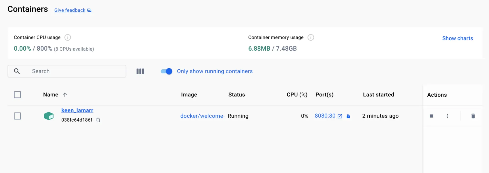

# 容器

[TOC]

## 运行容器

以下命令运行一个 `ubuntu` 容器，以交互方式附加到本地命令行会话，然后运行 `/bin/bash` 。

```bash
 docker run -i -t ubuntu /bin/bash
```

当运行此命令时，将发生以下情况（假设正在使用默认 registry 配置）：

1. 如果本地没有镜像 `ubuntu` ，Docker 会从配置的 registry 中拉取它，就像手动运行 `docker pull ubuntu` 一样。
2. Docker 会创建一个新容器，就像您手动运行了命令 `docker container create` 一样。
3. Docker 为容器分配一个读写文件系统，作为其最后一层。这允许正在运行的容器在其本地文件系统中创建或修改文件和目录。
4. Docker 会创建一个网络接口，用于将容器连接到默认网络，因为您没有指定任何网络选项。这包括为容器分配 IP 地址。默认情况下，容器可以使用主机的网络连接连接到外部网络。
5. Docker 启动容器并执行 `/bin/bash` 。由于容器以交互方式运行并连接到您的终端（由于 `-i` 和 `-t` 标志），因此可以使用键盘提供输入，而 Docker 将输出记录到您的终端。
6. 当运行 `exit` 以终止该 `/bin/bash` 命令时，容器会停止，但不会被删除。您可以重新启动它或删除它。

### 使用 Docker Desktop 运行容器

打开 Docker Desktop，然后在顶部导航栏上选择“搜索”字段。在搜索输入中指定， `welcome-to-docker` 然后选择“拉取”按钮。


成功拉取镜像后，选择“运行”按钮。

展开可选设置。

在“容器名称”中，指定 `welcome-to-docker` 。

在主机端口中，指定 `8080` 。

 

选择“运行”以启动容器。

### 使用 CLI 运行容器

打开 CLI 终端并使用 `docker run` 命令启动容器：

```bash
docker run -d -p 8080:80 docker/welcome-to-docker
```

此命令的输出是完整的容器 ID。

## 查看容器

可以通过转到 Docker 仪表板的 Containers 视图来查看所有容器。



此容器运行一个 Web 服务器，该服务器显示一个简单的网站。在处理更复杂的项目时，将在不同的容器中运行不同的部件。例如，可以为前端、后端和数据库运行不同的容器。

也可以使用 `docker ps` 命令验证容器是否已启动并正在运行：

```bash
docker ps
```

将看到如下所示的输出：

```bash
CONTAINER ID   IMAGE                      COMMAND                  CREATED          STATUS          PORTS                      NAMES
a1f7a4bb3a27   docker/welcome-to-docker   "/docker-entrypoint.…"   11 seconds ago   Up 11 seconds   0.0.0.0:8080->80/tcp       gracious_keldysh
```

> **Tip 提示**
> `docker ps` 命令将仅显示正在运行的容器。若要查看已停止的容器，请添加标志 `-a` 以列出所有容器： `docker ps -a` 

### 探索容器

通过 Docker Desktop，您可以探索容器的不同方面并与之交互。

1. 转到 Docker Dashboard 中的 Containers 视图。

2. 选择的容器。

3. 选择“文件”选项卡以浏览容器的隔离文件系统。


## 停止容器

1. 转到 Docker Dashboard 中的 Containers 视图。
   
2. 找到要停止的容器。
   
3. 在“操作”列中选择“停止”操作。
   
   

## 使用容器进行开发

具体来说，将执行以下操作：

1. 克隆并开始开发项目。
2. 对后端和前端进行更改。
3. 立即查看更改。

### 启动项目

首先，将项目克隆或下载为 [ZIP](https://github.com/docker/getting-started-todo-app/archive/refs/heads/main.zip) 文件到本地计算机。

```bash
git clone https://github.com/docker/getting-started-todo-app
```

克隆项目后，导航到克隆创建的新目录：

```bash
 cd getting-started-todo-app
```

获得项目后，使用 Docker Compose 启动开发环境。

要使用 CLI 启动项目，请运行以下命令：

```bash
 docker compose watch
```

将看到一个输出，其中显示容器镜像被拉下、容器启动等。在一两分钟内，事情应该稳定下来并结束。

打开浏览器，访问 http://localhost 以查看应用程序已启动并正在运行。应用可能需要几分钟时间才能运行。该应用程序是一个简单的待办事项应用程序，因此您可以随意添加一两个项目，将一些标记为已完成，甚至删除一个项目。

 

### 环境中有什么？

现在环境已经启动并运行，其中实际上是什么？概括地说，有几个容器（或进程）可以满足应用程序的特定需求：

- React frontend - 一个使用 [Vite](https://vitejs.dev/) 运行 React 开发服务器的 Node 容器。
- Node backend - 后端提供了一个 API，该 API 提供了检索、创建和删除待办事项的能力。
- MySQL database - 用于存储项目列表的数据库。
- phpMyAdmin - 一个基于 Web 的界面，用于与数据库交互，可通过 http://db.localhost 访问。
- Traefik proxy - [Traefik](https://traefik.io/traefik/) 是一个应用程序代理，可将请求路由到正确的服务。它将所有请求 `localhost/api/*` 发送到后端，将请求 `localhost/*` 发送到前端，然后将请求 `db.localhost` 发送到phpMyAdmin。这提供了使用端口 80（而不是每个服务的不同端口）访问所有应用程序的能力。

使用此环境，作为开发人员无需安装或配置任何服务、填充数据库架构、配置数据库凭据或任何内容。

### 对应用程序进行更改

在此环境启动并运行后，就可以对应用程序进行一些更改，并了解 Docker 如何帮助提供快速反馈循环。

页面顶部的问候语由位于 `/api/greeting` 的 API 调用填充。目前，它始终返回 “Hello world！” 。现在，将对其进行修改，以返回三个随机消息之一（您可以选择）。

打开文件 `backend/src/routes/getGreeting.js` 。此文件提供 API 端点的处理程序。

将顶部的变量修改为问候语数组。可以随意使用以下修改或根据自己的喜好进行自定义。

```js
const GREETINGS = [
    "Whalecome!",
    "All hands on deck!",
    "Charting the course ahead!",
]; 

module.exports = async (req, res) => { 
...
```

现在，通过进行以下更改，更新终结点以从此列表发送随机问候语：

```js
module.exports = async (req, res) => {
	res.send({ 
        greeting: GREETINGS[ Math.floor( Math.random() * GREETINGS.length )], 
    });
};
```

如果尚未保存，请保存该文件。如果刷新浏览器，应会看到新的问候语。如果继续刷新，应会看到所有消息都已显示。

 