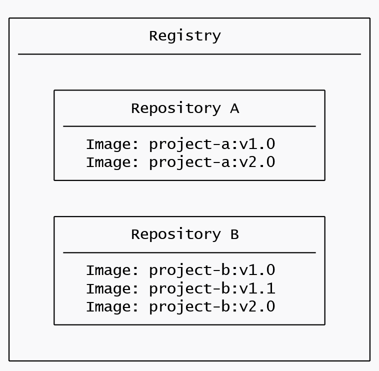

# Registry

[TOC]

## 概述

镜像仓库是用于存储和共享容器镜像的集中位置。它可以是公共的，也可以是私有的。Docker Hub 是一个任何人都可以使用的公共注册表，并且是默认注册表。
虽然 Docker Hub 是一个流行的选项，但目前还有许多其他可用的容器注册表，包括 [Amazon Elastic Container Registry(ECR)](https://aws.amazon.com/ecr/) 、[Azure Container Registry (ACR)](https://azure.microsoft.com/en-in/products/container-registry) 和 [Google Container Registry (GCR)](https://cloud.google.com/artifact-registry) 。甚至可以在本地系统或组织内部运行私有注册表。例如，Harbor 、JFrog  Artifactory 、GitLab Container registry 等。

## Registry vs. repository 注册表与存储库

While you're working with registries, you might hear the terms *registry* and *repository* as if they're interchangeable. Even though they're related, they're not quite the same thing.
在处理注册表时，您可能会听到注册表和存储库这两个术语，就好像它们是可以互换的一样。尽管它们是相关的，但它们并不完全是一回事。

A *registry* is a centralized location that stores and manages container images, whereas a *repository* is a collection of related container images within a registry. 注册表是存储和管理容器映像的集中位置，而存储库是注册表中相关容器映像的集合。将其视为一个文件夹，可以在其中根据项目组织镜像。每个存储库都包含一个或多个容器镜像。

下图显示了它们之间的关系：

 

## [Try it out 尝试一下](https://docs.docker.com/guides/docker-concepts/the-basics/what-is-a-registry/#try-it-out)

In this hands-on, you will learn how to build and push a Docker image to the Docker Hub repository.
在本实践实践中，您将学习如何构建 Docker 镜像并将其推送到 Docker Hub 存储库。

### [Sign up for a free Docker account 注册一个免费的 Docker 帐户](https://docs.docker.com/guides/docker-concepts/the-basics/what-is-a-registry/#sign-up-for-a-free-docker-account)

1. If you haven't created one yet, head over to the [Docker Hub](https://hub.docker.com)

1. page to sign up for a new Docker account.
   如果您尚未创建一个，请前往 Docker Hub 页面注册一个新的 Docker 帐户。

   

   You can use your Google or GitHub account to authenticate.
   您可以使用 Google 或 GitHub 帐户进行身份验证。

### [Create your first repository 创建您的第一个仓库](https://docs.docker.com/guides/docker-concepts/the-basics/what-is-a-registry/#create-your-first-repository)

1. Sign in to [Docker Hub](https://hub.docker.com)

2. .
   登录到 Docker Hub。

3. Select the **Create repository** button in the top-right corner.
   选择右上角的“创建存储库”按钮。

4. Select your namespace (most likely your username) and enter `docker-quickstart` as the repository name.
   选择您的命名空间（很可能是您的用户名）并输入 `docker-quickstart` 作为存储库名称。

   

5. Set the visibility to **Public**.
   将可见性设置为“公开”。

6. Select the **Create** button to create the repository.
   选择“创建”按钮以创建存储库。

That's it. You've successfully created your first repository. 🎉
就是这样。您已成功创建第一个仓库。🎉

This repository is empty right now. You'll now fix this by pushing an image to it.
此存储库现在是空的。现在，您将通过将图像推送到它来修复此问题。

### [Sign in with Docker Desktop 使用 Docker Desktop 登录](https://docs.docker.com/guides/docker-concepts/the-basics/what-is-a-registry/#sign-in-with-docker-desktop)

1. [Download and install](https://www.docker.com/products/docker-desktop/)

2. Docker Desktop, if not already installed.
   下载并安装 Docker Desktop（如果尚未安装）。
3. In the Docker Desktop GUI, select the **Sign in** button in the top-right corner
   在 Docker Desktop GUI 中，选择右上角的“登录”按钮

### [Clone sample Node.js code 克隆示例Node.js代码](https://docs.docker.com/guides/docker-concepts/the-basics/what-is-a-registry/#clone-sample-nodejs-code)

In order to create an image, you first need a project. To get you started quickly, you'll use a sample Node.js project found at [github.com/dockersamples/helloworld-demo-node](https://github.com/dockersamples/helloworld-demo-node)

. This repository contains a pre-built Dockerfile necessary for building a Docker image.
为了创建图像，您首先需要一个项目。为了让您快速入门，您将使用在 github.com/dockersamples/helloworld-demo-node 找到的示例Node.js项目。此存储库包含构建  Docker 镜像所需的预构建 Dockerfile。

Don't worry about the specifics of the Dockerfile, as you'll learn about that in later sections.
不要担心 Dockerfile 的细节，因为你将在后面的部分中了解这一点。

1. Clone the GitHub repository using the following command:
   使用以下命令克隆 GitHub 存储库：

   

```console
git clone https://github.com/dockersamples/helloworld-demo-node
```

Navigate into the newly created directory.
导航到新创建的目录。


```console
cd helloworld-demo-node
```

Run the following command to build a Docker image, swapping out `YOUR_DOCKER_USERNAME` with your username.
运行以下命令以构建 Docker 镜像， `YOUR_DOCKER_USERNAME` 并替换为您的用户名。


```console
docker build -t YOUR_DOCKER_USERNAME/docker-quickstart .
```

> **Note 注意**
>
> Make sure you include the dot (.) at the end of the `docker build` command. This tells Docker where to find the Dockerfile.
> 请确保在 `docker build` 命令的末尾包含点 （.）。这会告诉 Docker 在哪里可以找到 Dockerfile。

Run the following command to list the newly created Docker image:
运行以下命令以列出新创建的 Docker 镜像：

```console
docker images
```

You will see output like the following:
您将看到如下所示的输出：

```console
REPOSITORY                                 TAG       IMAGE ID       CREATED         SIZE
YOUR_DOCKER_USERNAME/docker-quickstart   latest    476de364f70e   2 minutes ago   170MB
```

Start a container to test the image by running the following command (swap out the username with your own username):
通过运行以下命令启动容器以测试映像（将用户名替换为您自己的用户名）：


```console
docker run -d -p 8080:8080 YOUR_DOCKER_USERNAME/docker-quickstart 
```

You can verify if the container is working by visiting http://localhost:8080

 with your browser.
您可以通过使用浏览器访问 http://localhost:8080 来验证容器是否正常工作。

Use the [`docker tag`](https://docs.docker.com/reference/cli/docker/image/tag/) command to tag the Docker image. Docker tags allow you to label and version your images.
使用该 `docker tag` 命令标记 Docker 映像。Docker 标签允许您对图像进行标记和版本控制。

```console
docker tag YOUR_DOCKER_USERNAME/docker-quickstart YOUR_DOCKER_USERNAME/docker-quickstart:1.0 
```

Finally, it's time to push the newly built image to your Docker Hub repository by using the [`docker push`](https://docs.docker.com/reference/cli/docker/image/push/) command:
最后，是时候使用以下 `docker push` 命令将新构建的映像推送到 Docker Hub 存储库了：


```console
docker push YOUR_DOCKER_USERNAME/docker-quickstart:1.0
```

Open [Docker Hub](https://hub.docker.com)

1. and navigate to your repository. Navigate to the **Tags** section and see your newly pushed image.
   打开 Docker Hub 并导航到您的存储库。导航到“标签”部分，然后查看新推送的图片。

   

In this walkthrough, you signed up for a Docker account, created your  first Docker Hub repository, and built, tagged, and pushed a container  image to your Docker Hub repository.
在本演练中，您注册了一个 Docker 帐户，创建了第一个 Docker Hub 存储库，并生成、标记了容器映像并将其推送到 Docker Hub 存储库。

## [Additional resources 其他资源](https://docs.docker.com/guides/docker-concepts/the-basics/what-is-a-registry/#additional-resources)

- [Docker Hub Quickstart Docker Hub 快速入门](https://docs.docker.com/docker-hub/quickstart/)
- [Manage Docker Hub Repositories
  管理 Docker Hub 存储库](https://docs.docker.com/docker-hub/repos/)

## [Next steps 后续步骤](https://docs.docker.com/guides/docker-concepts/the-basics/what-is-a-registry/#next-steps)

Now that you understand the basics of containers and images, you're ready to learn about Docker Compose.
现在，您已经了解了容器和映像的基础知识，可以学习 Docker Compose。

## 部署

1. 启动 registry 容器。

   ```bash
   docker run -d -p 5000:5000 -v /myregistry:/var/lib/registry registry:2
   ```

2. 调整本地镜像的tag

   ```bash
   docker tag kkkk/httpd:v1 registry.example.net:5000/kkkk/httpd:v1
   ```

3. 上传镜像

   ```bash
   docker push registry.example.net:5000/kkkk/httpd:v1
   ```

4. 下载镜像

   ```bash
   docker pull registry.example.net:5000/kkkk/httpd:v1
   ```

   

