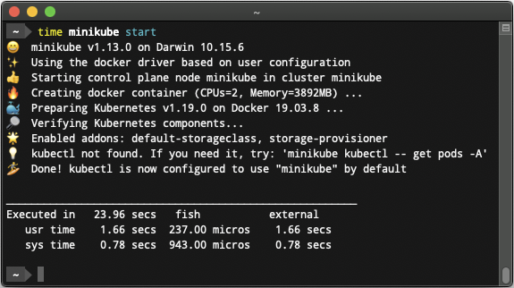

# minikube

[TOC]

## 概述		

minikube 可以在 macOS、Linux 和 Windows 上快速搭建本地 Kubernetes 集群。

 

## 优势

- 支持最新的 Kubernetes 版本（+6 个以前的次要版本）
- 跨平台（Linux、macOS、Windows）
- Deploy as a VM, a container, or on bare-metal
  部署为 VM、容器或裸机
- 多个容器运行时（CRI-O、containerd、docker）
- Direct API endpoint for blazing fast [image load and build](https://minikube.sigs.k8s.io/docs/handbook/pushing/)
  直接 API 端点，用于极快的图像加载和构建
- Advanced features such as [LoadBalancer](https://minikube.sigs.k8s.io/docs/handbook/accessing/#loadbalancer-access), filesystem mounts, FeatureGates, and [network policy](https://minikube.sigs.k8s.io/docs/handbook/network_policy/)
  LoadBalancer、文件系统挂载、FeatureGate 和网络策略等高级功能
- [Addons](https://minikube.sigs.k8s.io/docs/handbook/deploying/#addons) for easily installed Kubernetes applications
  用于轻松安装的 Kubernetes 应用程序的插件
- 支持常见的 CI 环境

## minikube 启动

只需要 Docker（或类似兼容的）容器或虚拟机环境，而 Kubernetes 只需一个命令即可： `minikube start` 

## 依赖

- 2 个或更多 CPU
- 2GB 可用内存
- 20GB 可用磁盘空间
- 互联网连接
- 容器或虚拟机管理器，例如：Docker、QEMU、Hyperkit、Hyper-V、KVM、Parallels、Podman、VirtualBox 或 VMware Fusion/Workstation 。

## 安装

### Linux

```shell
# Binary
# x86-64
curl -LO https://storage.googleapis.com/minikube/releases/latest/minikube-linux-amd64
sudo install minikube-linux-amd64 /usr/local/bin/minikube && rm minikube-linux-amd64
# ARM64
curl -LO https://storage.googleapis.com/minikube/releases/latest/minikube-linux-arm64
sudo install minikube-linux-arm64 /usr/local/bin/minikube && rm minikube-linux-arm64
# ARMv7
curl -LO https://storage.googleapis.com/minikube/releases/latest/minikube-linux-arm
sudo install minikube-linux-arm /usr/local/bin/minikube && rm minikube-linux-arm

# Debian
# x86-64
curl -LO https://storage.googleapis.com/minikube/releases/latest/minikube_latest_amd64.deb
sudo dpkg -i minikube_latest_amd64.deb
# ARM64
curl -LO https://storage.googleapis.com/minikube/releases/latest/minikube_latest_arm64.deb
sudo dpkg -i minikube_latest_arm64.deb
# ARMv7
curl -LO https://storage.googleapis.com/minikube/releases/latest/minikube_latest_armhf.deb
sudo dpkg -i minikube_latest_armhf.deb

# RPM
# x86-64
curl -LO https://storage.googleapis.com/minikube/releases/latest/minikube-latest.x86_64.rpm
sudo rpm -Uvh minikube-latest.x86_64.rpm
# ARM64
curl -LO https://storage.googleapis.com/minikube/releases/latest/minikube-latest.aarch64.rpm
sudo rpm -Uvh minikube-latest.aarch64.rpm
# ARM64
curl -LO https://storage.googleapis.com/minikube/releases/latest/minikube-latest.armv7hl.rpm
sudo rpm -Uvh minikube-latest.armv7hl.rpm
```

### macOS

```bash
# Binary
# x86-64
curl -LO https://storage.googleapis.com/minikube/releases/latest/minikube-darwin-amd64
sudo install minikube-darwin-amd64 /usr/local/bin/minikube
# ARM64
curl -LO https://storage.googleapis.com/minikube/releases/latest/minikube-darwin-arm64
sudo install minikube-darwin-arm64 /usr/local/bin/minikube

# Homebrew
# x86-64 ARM64
brew install minikube
#If which minikube fails after installation via brew, you may have to remove the old minikube links and link the newly installed binary
brew unlink minikube       
brew link minikube
```

### Windows

```powershell
# .exe
New-Item -Path 'c:\' -Name 'minikube' -ItemType Directory -Force
Invoke-WebRequest -OutFile 'c:\minikube\minikube.exe' -Uri 'https://github.com/kubernetes/minikube/releases/latest/download/minikube-windows-amd64.exe' -UseBasicParsing

$oldPath = [Environment]::GetEnvironmentVariable('Path', [EnvironmentVariableTarget]::Machine)
if ($oldPath.Split(';') -inotcontains 'C:\minikube'){
  [Environment]::SetEnvironmentVariable('Path', $('{0};C:\minikube' -f $oldPath), [EnvironmentVariableTarget]::Machine)
}

# Windows Package Manager
winget install Kubernetes.minikube

# Chocolatey
choco install minikube
```

## 启动集群

从具有管理员访问权限（但未以 root 身份登录）的终端中，运行：

```bash
minikube start
```

## 与集群交互

如果安装了 kubectl，可以使用它来访问新集群：

```bash
kubectl get po -A
```

Alternatively, minikube can download the appropriate version of kubectl and you should be able to use it like this:
或者，minikube 可以下载适当版本的 kubectl，您应该能够像这样使用它：

```shell
minikube kubectl -- get po -A
```

You can also make your life easier by adding the following to your shell config: (for more details see: [kubectl](https://minikube.sigs.k8s.io/docs/handbook/kubectl/))
您还可以通过将以下内容添加到您的 shell 配置中来让您的生活更轻松： （有关详细信息，请参阅：kubectl）

```shell
alias kubectl="minikube kubectl --"
```

Initially, some services such as the storage-provisioner, may not yet be in a  Running state. This is a normal condition during cluster bring-up, and  will resolve itself momentarily. For additional insight into your  cluster state, minikube bundles the Kubernetes Dashboard, allowing you  to get easily acclimated to your new environment:
最初，某些服务（如 storage-provisioner）可能尚未处于 Running 状态。这是集群启动期间的正常情况，并且会立即自行解决。为了更深入地了解您的集群状态，minikube 捆绑了 Kubernetes 仪表板，让您轻松适应新环境：

```shell
minikube dashboard
```

## **4**Deploy applications 部署应用程序

- [Service 服务](https://minikube.sigs.k8s.io/docs/start/?arch=%2Flinux%2Fx86-64%2Fstable%2Fbinary+download#Service)
- [LoadBalancer 负载均衡器](https://minikube.sigs.k8s.io/docs/start/?arch=%2Flinux%2Fx86-64%2Fstable%2Fbinary+download#LoadBalancer)
- [Ingress 入口](https://minikube.sigs.k8s.io/docs/start/?arch=%2Flinux%2Fx86-64%2Fstable%2Fbinary+download#Ingress)

Create a sample deployment and expose it on port 8080:
创建示例部署并在端口 8080 上公开它：

```shell
kubectl create deployment hello-minikube --image=kicbase/echo-server:1.0
kubectl expose deployment hello-minikube --type=NodePort --port=8080
```

It may take a moment, but your deployment will soon show up when you run:
这可能需要一些时间，但您的部署将很快在您运行时显示：

```shell
kubectl get services hello-minikube
```

The easiest way to access this service is to let minikube launch a web browser for you:
访问此服务的最简单方法是让 minikube 为您启动一个 Web 浏览器：

```shell
minikube service hello-minikube
```

Alternatively, use kubectl to forward the port:
或者，使用 kubectl 转发端口：

```shell
kubectl port-forward service/hello-minikube 7080:8080
```

Tada! Your application is now available at http://localhost:7080/.
多田！您的申请现在可以在 http://localhost:7080/ 上获得。

You should be able to see the request metadata in the application output.  Try changing the path of the request and observe the changes. Similarly, you can do a POST request and observe the body show up in the output.
您应该能够在应用程序输出中看到请求元数据。尝试更改请求的路径并观察更改。同样，您可以执行 POST 请求并观察正文在输出中显示。

## **5**Manage your cluster 管理集群

Pause Kubernetes without impacting deployed applications:
在不影响已部署应用程序的情况下暂停 Kubernetes：

```shell
minikube pause
```

Unpause a paused instance:
取消暂停的实例：

```shell
minikube unpause
```

Halt the cluster: 停止集群：

```shell
minikube stop
```

Change the default memory limit (requires a restart):
更改默认内存限制（需要重新启动）：

```shell
minikube config set memory 9001
```

Browse the catalog of easily installed Kubernetes services:
浏览易于安装的 Kubernetes 服务目录：

```shell
minikube addons list
```

Create a second cluster running an older Kubernetes release:
创建运行较旧 Kubernetes 版本的第二个集群：

```shell
minikube start -p aged --kubernetes-version=v1.16.1
```

Delete all of the minikube clusters:
删除所有 minikube 集群：

```shell
minikube delete --all
```